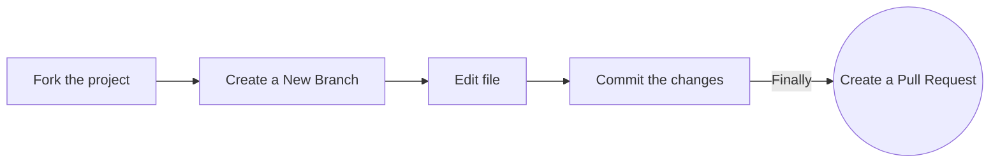

<!-- markdownlint-disable-next-line -->

**Note** **This repository is _not_ included in the Hacktoberfest event, as it is for practice only!**

We have other [repositories](https://github.com/orgs/EddieHubCommunity/repositories) in the organization that you can contribute to. If you would like to join our GitHub organisation, raise an [issue](https://github.com/EddieHubCommunity/support/issues/new?assignees=&labels=invite+me+to+the+organisation&template=invitation.yml&title=Please+invite+me+to+the+GitHub+Community+Organization) on this repo EddieHubCommunity-Support and you can also join the EddieHub [Discord](http://discord.eddiehub.org/) channel

---

## Hacktoberfest

What is it? Click on the poster below to watch the video for more details 📽

[](https://youtu.be/tjH6txTiC6E)

[](CODE_OF_CONDUCT.md) [](https://gitpod.io/#https://github.com/EddieHubCommunity/hacktoberfest-practice)

## Hacktoberfest Practice Pull Requests

Repository for you to raise a Pull Request to **practice** open-source! 🎉

### Add your name to the alphabetical list and, optionally, a link to your GitHub account (in alphabetical order below your letter too)

### Option 1. Complete this process in GitHub (in your browser)



**1. Fork the project:**

- Click the gray <kbd>Fork</kbd> button at the top right of this page. This creates your copy of the project and saves it as a new repository in your GitHub account.

**2. Create a New Branch:**

- On your new repository's page, click the gray main button in the upper left to reveal a dropdown menu.
- Enter the name of your new branch in the text box. (Branch names usually refer to what is being changed. Example: nameAdd).
  -Click on Create branch <new branch name>, which will automatically take you to your new branch. You can make edits on the main branch, but this may cause issues down the line. The best practice is to create a new branch for each separate issue you work on. That way your main branch remains in sync with Eddie's main branch.

**3. Edit:**

- On the top right of the Readme file, click on the pencil icon to edit the file by **adding your name to the section that matches your Initial in [this list](https://github.com/EddieHubCommunity/hacktoberfest-practice#hacktoberfest-community). Make sure that your name is in alphabetical order.**
- After editing the Readme file, add a commit message and click on the green button saying "Commit Changes". Make sure you have selected the branch you have created.

**4. Raise a Pull Request:**

- Click `Pull Requests` (which is the third option at the top of this page after the options `Code` and `Issues`).
- Click the green New Pull Request button. This will prep the new pull request for you by auto-filling the base repository: base with 'EddieGitHubCommunity: main' AND auto-filling your head repository: compare with your repository: main
- Click on your head repository's `compare` dropdown, and switch branches from your 'main' branch to `<new branch name>`.
- Finally, click the green `Create Pull Request` button. Great job! You did it!

You can ask questions by raising an [issue](https://github.com/EddieHubCommunity/hacktoberfest-practice/issues/new).

### Option 2. Complete this process on your computer (locally)

1. Fork the project:

- Click the gray Fork button at the top right of this page. This creates your copy of the project and saves it as a new repository in your GitHub account

2. Clone this project on your computer:

- Go to your profile. You will find forked repo named **_hacktoberfest-practice_**. go to the repo by clicking on it.
- Click on the green Code button, then either the HTTPS or SSH option, and, click the icon to copy the URL. Now you have a copy of the project. Thus, you can play around with it locally on your computer.

- Run the following commands into a terminal window (Command Prompt, Powershell, Terminal, Bash, ZSH). Do this to download the forked copy of this repository to your computer.

```bash
  git clone https://github.com/YOUR_GITHUB_USERNAME/hacktoberfest-practice.git
```

- Switch to the cloned folder. You can paste this command into the same terminal window.

```bash
  cd hacktoberfest-practice
```

3. Create a new branch:

- Your username would make a good branch because it's unique.

```bash
  git checkout -b <name-of-new-branch>
```

4. Edit:

- Open the `README.md` file

- **Add your name to the section that matches your Initial in [this list](https://github.com/EddieHubCommunity/hacktoberfest-practice#hacktoberfest-community), make sure that your name is in alphabetical order. Then save your changes.**

- For example
  `- [Full Name](https://github.com/your-username)`

5. Stage your changes:

```bash
  git add README.md
```

or

```bash
  git add .
```

6. Commit the changes:

```bash
  git commit -m "Add <your-github-username>"
```

- Check the status of your repository.

```bash
  git status
```

- The response should be like this:

```bash
On branch <name-of-your-branch>
nothing to commit, working tree clean
```

7. Pushing your repository to GitHub:

```bash
  git push origin <name-of-your-branch>
```

or

```bash
  git branch -M main
  git push -u origin main
```

> **Warning**: If you get an error message like the one below, you probably forgot to fork the repository before cloning it. It is best to start over and fork the project repository first.

```bash
ERROR: Permission to EddieHubCommunity/hacktoberfest-practice.git denied to <your-github-username>.
fatal: Could not read from remote repository.
Please make sure you have the correct access rights and that the repository exists.
```

8. Raise a Pull Request:

- On the GitHub website, navigate to your forked repo - on the top of the files section, you'll notice a new section containing a `Compare & Pull Request` button!

- Click on that button, this will load a new page, comparing the local branch in your forked repository against the main branch in the EddieHub Hacktoberfest repository. Do not make any changes in the selected values of the branches (do so only if needed), and click the green `Create Pull Request` button. After creating the PR (Pull Request), our GitHub Actions workflow will add a welcome message to your PR.
  Note: A pull request allows us to merge your changes with the original project repo.

- Your pull request will be reviewed and then eventually merged.

Hurray! You successfully made your first contribution! 🎉

---

## How can I fix a merge conflict?

A GitHub conflict is when people make changes to the same area or line in a file. This must be fixed before it is merged to prevent collision in the main branch.

- **To read more about this, go to [GitHub Docs - About Merge Conflicts](https://docs.github.com/en/github/collaborating-with-pull-requests/addressing-merge-conflicts/about-merge-conflicts)**

- **To find out about how to fix a Git Conflict, go to [GitHub Docs - Resolve Merge Conflict](https://docs.github.com/en/github/collaborating-with-pull-requests/addressing-merge-conflicts/resolving-a-merge-conflict-on-github)**

- You can also ask for help in our [Discord server](http://discord.eddiehub.org) or submit an issue in the [Support repository](https://github.com/EddieHubCommunity/support).

---

## `Hacktoberfest Community`

### **Contents**

| [A](#a) | [B](#b) | [C](#c) | [D](#d) | [E](#e) | [F](#f) | [G](#g) | [H](#h) | [I](#i) | [J](#j) | [K](#k) | [L](#l) | [M](#m) | [N](#n) | [O](#o)
| [P](#p) | [Q](#q) | [R](#r) | [S](#s) | [T](#t) | [U](#u) | [V](#v) | [W](#w) | [X](#x) | [Y](#y) | [Z](#z) |

- ### **A**

  - [Aabhirup Paul](https://github.com/paul-abhirup)
  - [Aakansha Priya](https://github.com/priyaaakansha)
  - [Aakarsh Teja](https://github.com/aakarshteja)
  - [Aakash Bansal](https://github.com/Aakashbansal837)
  - [Aakash Patel](https://github.com/itsaakashpatel)
  - [Aakash Shivanshu](https://github.com/aak-301/)
  - [Aakrut Dabhi](https://github.com/Aakrut)
  - [Aamir Shaikh](https://github.com/AamirShaikh7)
  - [Aaqib Javaid](https://github.com/aaqib605)
  - [Aaron Parsons](https://github.com/aarpardev)
  - [Aarul Mishra](https://github.com/Aarul14)
  - [Aaryaman Shah](https://github.com/AaryamanShah1)
  - [Aashish-cyber](https://github.com/Aashish-cyber)
  - [Aathira](https://github.com/aathirav06)
  - [Aathirajan](https://github.com/Aathirajan)
  - [Aayush Sharma](https://github.com/SuperAayush)
  - [Aba Jack](https://github.com/bellsofaba)
  - [Abbas Hussain Muzammil](https://github.com/Abbas-Hussain-Muzammil)
  - [Abbey Santos](https://github.com/AbbeyIT)
  - [Abderrahmane Et-tounani](https://github.com/ET-TOUNANI)
  - [Abdeslam Loukili](https://github.com/aslukili)
  - [Abdifatah Ahmed](https://github.com/ibnuahmed)
  - [Abdul Fatao Abdulrahman](https://github.com/Fatao)
  - [Abdul Rahaman Mohammed](https://github.com/Kaleem-abdull)
  - [Abdul Rosyid](https://github.com/ocitocit)
  - [Abdul Shaik](https://github.com/AbdulShaik786)
  - [Abdul Wahid Shaik](https://github.com/Abdulwahid7027)
  - [Abdulkadir Danazumi](https://github.com/Danazumi)
  - [Abdullah Sajid](https://github.com/abdullahsajid-ma)
  - [Abdullahi Musa](https://github.com/Abdullahi001)
  - [Abdulmalik Adekunle](https://github.com/Adekunle27)
  - [Abdulmumin Yaqeen](https://github.com/Abdulmumin1)
  - [Abdulrafiu Kehinde Lawal](https://github.com/kennie-larkson)
  - [Abdulramon Jemil](https://github.com/abdulramonjemil)
  - [Abdulsalam Abdulateef](https://github.com/abdulsalam030)
  - [Abdurahman jafer](https://github.com/its0beno/)
  - [Abdur Rahman Abid](https://github.com/Abid-dev)
  - [Abel Misiocha](https://github.com/Codedwells)
  - [Abhay H Kashyap](https://github.com/abhayhk2001)
  - [Abhay Raghuram](https://github.com/AbhayRaghuram)
  - [Abhay Rajbhar](https://github.com/abhay-astro)
  - [Abhay Shreevastava](https://github.com/abhay007kr)
  - [Abhay Taras](https://github.com/abhay-h)
  - [Abhick Dahal](https://github.com/abhick-dev)
  - [Abhigyan Mohanta](https://github.com/ABHIGYAN-MOHANTA)
  - [Abhijeet Basfore](https://github.com/abhijeet-26)
  - [Abhijeet Rana](https://github.com/TheMainManIND)
  - [Abhijeet Sharma](https://github.com/Abhijeet03s)
  - [Abhijit Singh](https://github.com/apschauhan03)
  - [Abhinai](https://github.com/Abhinai1395)
  - [Abhinandan Raj](https://github.com/abhinandanraj)
  - [Abhinandan Wadhwa](https://github.com/abhinandanwadwa)
  - [Abhinav](https://github.com/abhinav11234)
  - [Abhinav Achha](https://github.com/AbhinavAchha)
  - [Abhinav Raman](https://github.com/abhinav-raman)
  - [Abhinav Reddy](https://github.com/AbhinavReddy-Dev)
  - [Abhinav Saraswat](https://github.com/abhinavsaraswatt)
  - [Abhinav Vedmala](https://github.com/mrswagbhinav)
  - [Abhiraj Sinha](https://github.com/AbhirajSinha179)
  - [Abhiram P.V.](https://github.com/Abhiram970)
  - [Abhiram Sukala](https://github.com/themelomaniac01)
  - [Abhisek Panda](https://github.com/Panda-Abhisek)
  - [Abhishek Anand](https://github.com/abhirk247)
  - [Abhishek Bahukhandi](https://github.com/abrknine)
  - [Abhishek Kumar Roy](https://github.com/Adi-Abhishek)
  - [Abhishek Kumar](https://github.com/abh139)
  - [Abhishek Kumar](https://github.com/abhiraj-ku)
  - [Abhishek Kumar](https://github.com/Abhishek-569)
  - [Abhishek R](https://github.com/Abhi45765)
  - [Abhishek Sharma](https://github.com/AbhishekSharma6903)
  - [Abhishek Shinde](https://github.com/abhishinde24)
  - [Abhishek Shukla](https://github.com/AVI-SHUKLA1110)
  - [Abhishek Singh](https://github.com/isinghabhishek)
  - [Abhishek Soni](https://github.com/abhisheksonii)
  - [Abhisman Sarkar](https://github.com/abs007)
  - [Abhyudaya Agrawal](https://github.com/abhyudaya3)
  - [Abiodun Victoria](https://github.com/Vickyabiodun)
  - [Abiola Farounbi](https://github.com/Abiola-Farounbi)
  - [Abishek Reddy](https://github.com/Abishek-Reddy)
  - [Abrar Jamadar](https://github.com/AbrarJamadar)
  - [Abu Isaac](https://github.com/childerx)
  - [Abubakar Sadiq](https://github.com/ABuabakarsadiqq)
  - [Abukari Einus](https://github.com/blackdante101)
  - [Abuzer Asif](https://github.com/abuzerasif)
  - [Abyss Seeker](https://github.com/abyss-seeker)
  - [Ace Borja](https://github.com/Sandbox-AceBorja)
  - [Adarsh Jha](https://github.com/adarshjhaa100)
  - [Adarsh Navneet Sinha](https://github.com/geeky01adarsh)
  - [Adarsh V](https://github.com/Advarsh)
  - [Adebowale Ademola](https://github.com/fadebowaley)
  - [Adedeji Tobiloba](https://github.com/tobySolutions)
  - [Adedoyin Oluwakemi](https://github.com/KemiDoyin)
  - [Ademola Megbabi](https://github.com/Megapreneur)
  - [Aderline Gashugi](https://github.com/Aderline490)
  - [Adetayo Omotomiwa](https://github.com/Adetayo1999)
  - [Adewale Ogundiran Charles](https://github.com/adewalecharles)
  - [Adil Choudhury](https://github.com/achoudhury4927)
  - [Adil Rehman](https://github.com/adilwahla)
  - [Aditi Goyal](https://github.com/AditiGoyal05)
  - [Aditi Nimbarte](https://github.com/adinimbarte)
  - [Aditya Arpan Sahoo](https://github.com/arpanaditya)
  - [Aditya Bhattad](https://github.com/adityabhattad2021)
  - [Aditya D](https://github.com/ADITYADAS1999)
  - [Aditya Das](https://github.com/ThatOneBlodeKid)
  - [Aditya Dike](https://github.com/aadityadike)
  - [ADITYA DWIVEDI](https://github.com/ADITYADWIVEDI18)
  - [Aditya Gupta](https://github.com/adityaxcix)
  - [Aditya Joshi](https://github.com/AdityaJoshi304)
  - [Aditya Kadam](https://github.com/aditya10003)
  - [Aditya Mangal](https://github.com/adityamangal1)
  - [Aditya Mishra](https://github.com/this-Aditya)
  - [Aditya Ojha](https://github.com/aditya1ojha)
  - [Aditya Pachauri](https://github.com/AdityyaX)
  - [Aditya Palpattuwar](https://github.com/APalpattuwar7)
  - [Aditya Pandey](https://github.com/adityyaa-10)
  - [Aditya Patel](https://github.com/adityatheoctocatdev)
  - [Aditya Priyadarshi](https://github.com/foxy4096)
  - [Aditya Raute](https://github.com/adityaraute)
  - [Aditya Rawat](https://github.com/adityasp1)
  - [Aditya Simant](https://github.com/adityasimant)
  - [Aditya Singla](https://github.com/2802AdityA)
  - [Aditya Suyash Gupta](https://github.com/AdiSuyash)
  - [Adrian Goessl](https://github.com/mendax0110)
  - [Advik Gupta](https://github.com/Advik-Gupta)
  - [Adwait Kulkarni](https://github.com/AdwaitKulkarni58)
  - [Aécio Neto](https://github.com/aecio-neto)
  - [Afnan](https://github.com/afuu21)
  - [Afroz Chakure](https://github.com/afrozchakure)
  - [Aftab](https://github.com/aftabashraf003)
  - [Agatha Bahati](https://github.com/MoigeMatino)
  - [Agatha Chituwa](https://github.com/agatha-chituwa)
  - [Agbabiaka Damilare](https://github.com/AgbaD)
  - [Agnel Selvan](https://github.com/AgnelSelvan)
  - [Agung Sundoro](https://github.com/agung2001)
  - [Agus Richard](https://github.com/agusrichard)
  - [Ahamed Basha N](https://github.com/ahamedbasha-n)
  - [Ahd Ben Kheder](https://github.com/ahdbk)
  - [Ahmad Hassan](https://github.com/ahmadhassan7)
  - [Ahmad Lemine](https://github.com/ahmadlemine)
  - [Ahmed Alsonaffi](https://github.com/ahmed-Alsonaffi)
  - [Ahmed Muhammed Galadima](https://github.com/ApolloDev0)
  - [Ahtasham Ali](https://github.com/Ahtaxam)
  - [Aj Mendoza](https://github.com/ajmdotdev)
  - [Ajay Anuragi](https://github.com/ajayanuragi)
  - [Ajay Singh](https://github.com/AJcodes42)
  - [Ajiboso Adeola](https://github.com/Ajiboso-Adeola)
  - [Ajith P. Kumar](https://github.com/JOSHI-owo)
  - [Akanni Modupe](https://github.com/goketech)
  - [Akash Mishra](https://github.com/helloakash1701)
  - [Akash Raj](https://github.com/akashrajakku)
  - [Akash Raj](https://github.com/Akashraj161)
  - [Akash Rajak](https://github.com/akash435)
  - [Akerejola Emeduduna](https://github.com/Emedudu)
  - [Akhil Bisht](https://github.com/Akhilbisht798)
  - [Akhil Rathipelly](https://github.com/Akhil2707)
  - [Akhil Reddy Bollu](https://github.com/Akhil-123478)
  - [Akhil u](https://github.com/akhilullattil)
  - [Akhilesh Raturi](https://github.com/akhileshRaturi)
  - [Akhilesh Waghmare](https://github.com/akhilesh-w)
  - [Akhilesh Raturi](https://github.com/akhileshRaturi)
  - [Akindotuni Ademola](https://github.com/demolaemrick)
  - [Akintokun Pelumi Eyitimonwa](https://github.com/Timonwa)
  - [Akkireddy Muralidhar](https://github.com/Muralidhar22)
  - [Akogun Oyindamola](https://github.com/damoski2)
  - [Akriti Mangal](https://github.com/akritimangal)
  - [Akshat Kumar](https://github.com/KyloRen04)
  - [Akshat Kushwaha](https://github.com/Akshat-02)
  - [Akshat Mittal](https://github.com/akshatmittal61)
  - [Akshay Reddy S](https://github.com/Akshay1718)
  - [Akshaya Kulasekaran](https://github.com/AkshayaKulasekaran)
  - [Akshayan Sinha](https://github.com/hippyaki)
  - [Akshi Vasaniya](https://github.com/Akshi-Vasaniya)
  - [Akshita Gupta](https://github.com/akshitagupta15june)
  - [Alaba Olanrewaju](https://github.com/chryzcodez)
  - [Alabi Olalekan Emmanuel](https://github.com/Lekanjoy)
  - [Aldo Aranda](https://github.com/blackbriar-28)
  - [Aldrin Sean Pereira](https://github.com/AldrinSeanPereira)
  - [Aldy Andika](https://github.com/aldyadk)
  - [Aleksandr Morozov](https://github.com/aleksandr-mor)
  - [Aleksey Voko](https://github.com/Aleksey-Voko)
  - [Alex Facius](https://github.com/AlexOde)
  - [Alex Gorunescu](https://github.com/alexgorunescu97)
  - [Alex Hunt](https://github.com/alexh205)
  - [Alex Penado](https://github.com/jose-source)
  - [Alex Valdez](https://github.com/arevaldez)
  - [Alexandru Mihalache](https://github.com/AlexMihalache99)
  - [Alexis Ortiz](https://github.com/lexiortiz)
  - [AlexxTheCurator](https://github.com/AlexxTheCurator)
  - [Ali Fahed](https://github.com/AliFahed)
  - [Ali Jafri](https://github.com/AliJafriETH)
  - [Ali Mirrajei](https://github.com/alimirrajei)
  - [Ali Mora](https://github.com/AliMora83)
  - [Ali Murtuza Patrawala](https://github.com/CYBWEBALI)
  - [Ali Reza](https://github.com/AliReza1083)
  - [Allen Ponce de Leon](https://github.com/aoponcedeleon)
  - [Alok Kumar Verma](https://github.com/alokVerma749)
  - [Alok Mahapatra](https://github.com/AlokMahapatra26)
  - [Alpadmin](https://github.com/hasthamalp)
  - [Althaf Asharaf](https://github.com/Althaf66)
  - [Aman Arora](https://github.com/sheisAman)
  - [Aman Kuliyal](https://github.com/Iconic-It-Is)
  - [Aman Kumar](https://github.com/amansr18)
  - [Aman Negi](https://github.com/amannegi)
  - [Aman Raj](https://github.com/amanraj-iit)
  - [Aman Shrivastava](https://github.com/aman34503)
  - [Aman Singh](https://github.com/amansingh1999)
  - [Aman Upadhyay](https://github.com/AmanxUpadhyay)
  - [Aman Verma](https://github.com/amanpro1)
  - [Amandeep Singh Malhotra](https://github.com/amanmalh)
  - [Amanjot Singh](https://github.com/Amanjot-001)
  - [Amanjot Singh](https://github.com/AmanGit010)
  - [Amarjeet Kumar](https://github.com/amarjeetk06)
  - [Amay Jain](https://github.com/vrindavan)
  - [Amelia Hill](https://github.com/amehi0index)
  - [Amenuvor Edem Joel](https://github.com/JhayStark)
  - [Amir Hossain Zarei](https://github.com/Amihozar)
  - [Amir Movassaghi](https://github.com/movassaghi6)
  - [Amit Goyal](https://github.com/JhndaCoder)
  - [Amit Kumar Bera](https://github.com/itzwow)
  - [Amit Turare](https://github.com/amitturare)
  - [Amitesh Anand](https://github.com/Astrodevil)
  - [Amith Sulakhe](https://github.com/amithsulakhe)
  - [Amrutha C.K.](https://github.com/Amrutha1101)
  - [Amzad Hossain](https://github.com/bdamzad)
  - [Ana Carrillo](https://github.com/acarrillo3)
  - [Anadya Nair](https://github.com/AnadyaNair)
  - [Anant Luthra](https://github.com/AnantLuthra)
  - [Ananya Banerjee](https://github.com/aspiringananya)
  - [Anas Bashir](https://github.com/an4s911)
  - [Anastestia Onyekaba](https://github.com/Ann-design-max)
  - [Anchal Singh](https://github.com/anchalsinghrajput)
  - [Anchita Arora](https://github.com/Anchita)
  - [Andreas Janzen](https://github.com/aojanzen)
  - [Andres Court](https://github.com/alcb1310)
  - [Andrew Cunliffe](https://github.com/andrew-cunliffe)
  - [Andrew Smith](https://github.com/ajsmith421/)
  - [Andrew Southern](https://github.com/whoamihealay)
  - [Angel Dhakal](https://github.com/angeldhakal)
  - [Anh Tran](https://github.com/longqua69)
  - [Aniesh Kumar](https://github.com/anieshak)
  - [Anietie Akpanumoh](https://github.com/anietieakpanumoh)
  - [Aniket Jha](https://github.com/aniketjha9179)
  - [Aniket Kumar](https://github.com/aniket-24)
  - [Aniket Kumar Ghosh](https://github.com/ak7550)
  - [Aniket Prabhakar](https://github.com/aniketprabhakar)
  - [Aniket Roy](https://github.com/Aniketroy2003)
  - [Aniket Samaddar](https://github.com/s1997aniket)  
  - [Aniket Shitole](https://github.com/AniketNS)
  - [Aniket Singh](https://github.com/aniketsingh98571)
  - [Animesh Pathak](https://github.com/sonichigo)
  - [Aniruddha Inge](https://github.com/Aniruddha-Inge)
  - [Anirudh](https://github.com/aspiringDev22)
  - [Anirudh Eyyani](https://github.com/AnirudhEyyani)
  - [Anish Dubey](https://github.com/AnishDubey27)
  - [Anita de San Miguel](https://github.com/neetnet200)
  - [Anitha subramanian](https://github.com/anithasubramanian19)
  - [Anitya Sharma](https://github.com/AnityaSharma)
  - [Anjali](https://github.com/anjali)
  - [Anjali Goswami](https://github.com/anjaligoswami)
  - [Anjan Diyora](https://github.com/Anjan50)
  - [Ankit Jaiswal](https://github.com/Ankit4j)
  - [Ankit Ojha](https://github.com/ankitojha07)
  - [Ankit Singh](https://github.com/ankitsingh241)
  - [Ankit Tamboli](https://github.com/ankit-jds)
  - [Ankit Warbhe](https://github.com/ankitwarbhe)
  - [Ankit Zore](https://github.com/ZoreAnkit)
  - [Ankush Tripathi](https://github.com/ankushtripathii)
  - [Anmol Guragain](https://github.com/Anmol2059)
  - [annu](https://github.com/annu12340)
  - [Ansa Zanjbeel](https://github.com/ansa-zanjbeel)
  - [Ansh Dhingra](https://github.com/anshdhinhgra47)
  - [Ansh Tripathi](https://github.com/Anshtripathi079)
  - [Anshdeep Shrivastav](https://github.com/ansh-d23)
  - [Anshu Pathak](https://github.com/AnshuPathak-88825)
  - [Anshul Singh](https://github.com/anshulsc)
  - [Anshul Suresh](https://github.com/devilsaint99)
  - [Anthony Beckett](https://github.com/anthonybeckett)
  - [Anthony Chinwe](https://github.com/anthonychinwe)
  - [Anthony Madia](https://github.com/AnthonyMadia)
  - [Anthony Oyakhilome Justice](https://github.com/oyakhilomee)
  - [Antoine Gauthier](https://github.com/gantoin)
  - [Anton Samper Rivaya](https://github.com/antonsamper)
  - [Antonio Riccelli](https://github.com/Antonio-Riccelli)
  - [Anubhav Gupta](https://github.com/anubhav06)
  - [Anubhav Purohit](https://github.com/Anubhav-byte)
  - [Anubhav Singhal](https://github.com/anu-sin)
  - [Anuj Bisht](https://github.com/bishtanuj)
  - [Anuj Chourasia](https://github.com/anujchourasia15)
  - [Anuj Kumar](https://github.com/R3v3rb3)
  - [Anuj Tiwari](https://github.com/ANUJTIWARI007)
  - [Anunay Kumar](https://github.com/anunayandkumar)
  - [Anup Haldar](https://github.com/haldaranup)
  - [Anupama Dhir](https://github.com/anupamadh)
  - [Anurag Kumar](https://github.com/halfway-there1)
  - [Anurag Kumar](https://github.com/kranurag7)
  - [Anurag Pathak](https://github.com/AnuragThePathak)
  - [Anurag Pradhan](https://github.com/4nur4g)
  - [Anurag Sharma](https://github.com/Anurag30112003)
  - [Anurag Singh](https://github.com/AnuragProg)
  - [Anusha Chaturvedi](https://github.com/anusha-c18)
  - [Anusha Hiremath](https://github.com/AnushaHiremath)
  - [Anusha S](https://github.com/anushas-dev)
  - [Anushka Bhowmick](https://github.com/Anushka-Bhowmick)
  - [Anushka Raj](https://github.com/Anushka-codergirl)
  - [Anushka Shrivastava](https://github.com/anushka00)
  - [Anusha SP](https://github.com/AnushaSP07)
  - [Aparna Soneja](https://github.com/aparna2071)
  - [Apoorv Raj Saxena](https://github.com/apoorvraj2000)
  - [Appygal](https://github.com/appygal)
  - [APT96](https://github.com/APT96)
  - [Aqib Javid Bhat](https://github.com/aqib-m31)
  - [Ar Rakin](https://github.com/virtual-designer)
  - [Arefat](https://github.com/arefathi)
  - [Areola John](https://github.com/johnnyteck)
  - [Arghya Das](https://github.com/itsarghyadas)
  - [Arhen Santiago](https://github.com/rhen99)
  - [Arijit](https://github.com/arijitgupta42)
  - [Arin Rana](https://github.com/arexnnnn)
  - [Arindam Maiti](https://github.com/Arindam01gi)
  - [Arindam Majumder](https://github.com/Arindam200)
  - [Aritra Barik](https://github.com/aritrabarik)
  - [Arjun Hegde](https://github.com/izzarzn)
  - [Arjun Kadam](https://github.com/arjun-kadam)
  - [Arjun Pathak](https://github.com/Arjuniest)
  - [Arka Raha](https://github.com/softdevarka)
  - [Arkell Kenney](https://github.com/adkenney)
  - [Arlene Nacion](https://github.com/pastaChaeng)
  - [Arman Ali Khan](https://github.com/Arman-ali-khan-786)
  - [Armel Munyaneza](https://github.com/munyanezaarmel)
  - [Arnav Jyotshi](https://github.com/ArnavJyo)
  - [Arnav Sharma](https://github.com/arnav1776)
  - [Aronmwan Dave](https://github.com/d-a-ve)
  - [Arpeet Chandane](https://github.com/Abeey04)
  - [Arpit Yadav](https://github.com/arpitgenius489)
  - [Arranyak Kar](https://github.com/realrohankar)
  - [Arsalan Rashid Khan](https://github.com/ArsalanRashid-K)
  - [Arsenic](https://github.com/Arsenic-ATG)
  - [Arshdeep Singh](https://github.com/Arshdeep-0509)
  - [Arsheel](https://github.com/arsheelsheikh)
  - [Arslaan Shaikh](https://github.com/s-arslaan)
  - [Arti Awasthi](https://github.com/nbkju9b)
  - [Arun Kumar](https://github.com/ArunKumar-07)
  - [Arunima Chaudhuri](https://github.com/tinniaru3005)
  - [Arunkumar Loganathan](https://github.com/logan-exe)
  - [ArunKumar Nadikattu](https://github.com/mastrero)
  - [Aryabhatta](https://github.com/mrbuddhu)
  - [Aryan](https://github.com/ARYANis0001)
  - [Aryan Agarwal](https://github.com/agarwal-aryan)
  - [Aryan Deshpande](https://github.com/Aryan-Deshpande)
  - [Aryan Jain](https://github.com/coolAryan)
  - [Aryan Kathawale](https://github.com/kiritocode1)
  - [Aryan Maini](https://github.com/Aryan-Maini)
  - [Aryan Raj](https://github.com/aryaraj132)
  - [Aryan Srivastava](https://github.com/Aryan-Srivastava)
  - [Aryex](https://github.com/Aryex82)
  - [Aseem](https://github.com/AseemsGit)
  - [Ash Mudra](https://github.com/AshMudra)
  - [Asha Gabriel](https://github.com/Zeemonk-pixel)
  - [Ashad](https://github.com/Ashad001)
  - [Asharib Ahmed](https://github.com/Asharib90)
  - [Ashika Jain](https://github.com/ashika-git)
  - [Ashim Devnath](https://github.com/Ashimdevnath)
  - [Ashipala Sandra](https://github.com/sandramsc)
  - [Ashish Chavan](https://github.com/AshishChavan98)
  - [Ashish Gupta](https://github.com/AshishGupta11011)
  - [Ashish Khanagwal](https://github.com/Ashish-khanagwal)
  - [Ashish Nagar](https://github.com/Ashish-Nagar-027)
  - [Ashish Prasad](https://github.com/coolashishpt)
  - [Ashish Rai](https://github.com/juustAsh)
  - [Ashish Thakur](https://github.com/ashishMECHA)
  - [Ashmit Ranjan](https://github.com/Ash-mit17)
  - [Ashriel](https://github.com/rielAsh24)
  - [Ashutosh Biswal](https://github.com/ashutosh0022)
  - [Ashwani Kumar Singh](https://github.com/aksingh-codes)
  - [Ashwin B](https://github.com/ahn1305)
  - [Ashwin Kumar Uppala](https://github.com/ashwinexe)
  - [Ashwini](https://github.com/ashwini524)
  - [Asmit Kumar Sirohi](https://github.com/asmitsirohi)
  - [Aswin Asok](https://github.com/AswinAsok)
  - [Aswin Kumar P V](https://github.com/Aswin-Kumar-P-V)
  - [Atharv Bidwe](https://github.com/Atharv-777)
  - [Atharv Bobade](https://github.com/Atharv181)
  - [Atharv Patil](https://github.com/Atharvp01)
  - [Atharva Chandwadkar](https://github.com/atharav21-stack)
  - [Atharva Hinge](https://github.com/36atharva)
  - [Atharva Ikhar](https://github.com/iatharva)
  - [Atharva Mogade](https://github.com/atharvamogade)
  - [Atharva Pingale](https://github.com/atharva0300)
  - [Atharva Pise](https://github.com/itsEobard2025)
  - [Atharva Raut](https://github.com/AtharvaRaut2002)
  - [Atharva Waghchoure](https://github.com/AtharvaWaghchoure)
  - [Athul Suresh](https://github.com/athulmekkoth)
  - [Atif Equbal](https://github.com/I88T77)
  - [Atif Moin](https://github.com/iamatifmoin)
  - [Atif Shaik](https://github.com/AtifShaik-47)
  - [Atul Kumar Awasthi](https://github.com/kumaratul60)
  - [Atul Nirbhavane](https://github.com/underager)
  - [Atulya Singh](https://github.com/oreo-gif)
  - [Audrey Mengue](https://github.com/audreymengue)
  - [Augustin Lima](https://github.com/augustinlima)
  - [Augustine Onyebuchi](https://github.com/Cesargrandeur)
  - [AvidCoder101](https://github.com/AvidCoder101)
  - [Avinash Prasad](https://github.com/avionmission)
  - [Avinash Singh](https://github.com/avisatna)
  - [Avinash Verma](https://github.com/AVINASH-VERMA-contributor)
  - [Aviral Sharma](https://github.com/aviralsharma07)
  - [Avneesh Agarwal](https://github.com/avneesh0612)
  - [Awosola Tobi](https://github.com/olatocode)
  - [Ayan Das](https://github.com/a-y-a-n-das)
  - [Ayan Raza](https://github.com/ayan878)
  - [Ayesha Gull](https://github.com/ayeshag7)
  - [Ayomikun Wahab](https://github.com/Mkzay)
  - [Ayondip Jana](https://github.com/detronetdip)
  - [AyoOluwa Israel Adeleke](https://github.com/AyoOluwa-Israel)
  - [Aysha Hakeem](https://github.com/AyshaHakeem)
  - [Ayush Chamoli](https://github.com/AyushChamoli961)
  - [Ayush Chaudhari](https://github.com/ayush-3516)
  - [Ayush Chaudhary](https://github.com/YushChaudhary)
  - [Ayush Goley](https://github.com/backlogAK)
  - [Ayush Gupta](https://github.com/Ayushhgupta39)
  - [Ayush Kanduri](https://github.com/ayush-kanduri)
  - [Ayush K.S.](https://github.com/ayushdotdev)
  - [Ayush Kumar](https://github.com/Ayush7614)
  - [Ayush Kumar Shaw](https://github.com/Ak-Shaw)
  - [Ayush Lohmod](https://github.com/ayushlohmod)
  - [Ayush Luthra](https://github.com/Ayushluthra2001)
  - [Ayush Mishra](https://github.com/ayush-sleeping)
  - [Ayush Rai](https://github.com/ayush1rai)
  - [Ayush Rai](https://github.com/Rai-Ayush)
  - [Ayush Sarode](https://github.com/AyushSarode)
  - [Ayush Raj](https://github.com/imyoungsparda)
  - [Ayush](https://github.com/ayushsgithub)
  - [Ayushi Vamne](https://github.com/Ayushi15-Vamne)
  - [Azim](https://github.com/Sultan-Ubiquitous)
  - [Aziz Prabowo](https://github.com/azizp128)

| [Back To Top](#contents) |

- ### **B**

  - [Babin Bohora](https://github.com/nibab-boo)
  - [Baihaki Tanjung](https://github.com/BaihakiTanjung)
  - [Balaji Sigamani](https://github.com/balajisa09)
  - [Balikis Oyeleye](https://github.com/Qreamville)
  - [Baraa Baba](https://github.com/baraa-baba)
  - [Barath T](https://github.com/Barath-T)
  - [Barkatul Mujauddin](https://github.com/barkatul)
  - [Baroon Jha](https://github.com/baroonjha)
  - [Barphie](https://github.com/barphie)
  - [Barsha Das](https://github.com/thebarshablog)
  - [Beidi Beer](https://github.com/beydiB)
  - [Belal Ahmad](https://github.com/belaletech)
  - [Ben Everman](https://github.com/beverm2391)
  - [Benjamin Ackerman](https://github.com/ackerm17)
  - [Benjamin Duffield-Harding](https://github.com/ben-dh3)
  - [Benjamin Kiarie](https://github.com/Benmuiruri)
  - [Benjamin Rukundo](https://github.com/rukundob451)
  - [Benjamin Ughegbe](https://github.com/Ljr777)
  - [Benson Arafat](https://github.com/realArafatBen)
  - [Bentaleb Sami](https://github.com/sami-29)
  - [Bentil Shadrack](https://github.com/qbentil)
  - [Bereket Lemma](https://github.com/Bereky)
  - [Bhagesh Ghuge](https://github.com/bhageshghuge)
  - [Bhakti Sharma](https://github.com/bhaktisharma26)
  - [Bharat Sharma](https://github.com/BharatSharma29)
  - [Bharath](https://github.com/bharathyes)
  - [Bhargav Avinash](https://github.com/bhargav794)
  - [Bhargavi V](https://github.com/Bhar-02)
  - [Bhavanshu Jain](https://github.com/bhavanshu-1112)
  - [Bhavneet singh](https://github.com/Bhavneet-singh)
  - [Bhavsagar Chaudhary](https://github.com/itsbhavsagar)
  - [Bhavya Giri](https://github.com/bhavya-giri)
  - [Bhupal](https://github.com/bhupal9032)
  - [Bhushan Chindarkar](https://github.com/Bhushan0010)
  - [Bhuvanesh Hingal](https://github.com/BhuvaneshHingal)
  - [Bhuvnesh Sharma](https://github.com/Bhuvnesh875)
  - [Bikram Ghuku](https://github.com/Bikram-ghuku)
  - [Bikrant Jajware](https://github.com/bikrantjajware)
  - [Binay Pal](https://github.com/Binay1510)
  - [Bineet Naidu](https://github.com/bineetNaidu)
  - [Biresh Biswas](https://github.com/Billa05)
  - [Bisesh Adhikari](https://github.com/Biseshadhikari)
  - [Bishal Das](https://github.com/bishal7679)
  - [Bishow Thapa](https://github.com/Bishow-Thapa)
  - [Bismeet Singh](https://github.com/BismeetSingh)
  - [bitM1ke](https://github.com/cryptome)
  - [BK Pecho](https://github.com/bkpecho)
  - [Blake](https://github.com/magic990619)
  - [Blessing Udiong](https://github.com/budiong054)
  - [Blevin Boret](https://github.com/boretkiterie)
  - [Boby](https://github.com/bobychaudhary)
  - [Bony](https://github.com/bonysureliya)
  - [Boppa Sri Satya Sai Hruday](https://github.com/20481A1219)
  - [Boyapati Saikumar](https://github.com/saikumarb12345)
  - [Brandon Thomas](https://github.com/BThomas22tech)
  - [Brian Buddhadasa](https://github.com/brianbud)
  - [Brian Kepha](https://github.com/AngelofVerdant)
  - [Brian Kiarie Mwaniki](https://github.com/BrianKiarieMwaniki)
  - [Brian Nduhiu](https://github.com/Brian-Nduhiu)
  - [Brijesh Pramanik](https://github.com/Brijesh1963)
  - [Brown Chinta](https://github.com/2brownc)
  - [Bryan Parmelee](https://github.com/bryanparmelee)
  - [Bryson M.](https://github.com/Bryson69)
  - [Buddhadeb Chhetri](https://github.com/Buddhad)
  - [Bui Bao Long](https://github.com/longbuibao)
  - [Bunde Uji](https://github.com/bunde-uji)
  - [Bupendra Dhyan](https://github.com/BupendraDhyan)
  - [Burak Taner](https://github.com/BurakTaner)
  - [Burhanuddin Raja](https://github.com/BurhanRaja)

| [`Back To Top`](#contents) |

- ### **C**

  - [Caden Parker](https://github.com/Ne0nWinds)
  - [Cahllagerfeld](https://github.com/Cahllagerfeld)
  - [Calista Ifenkwe](https://github.com/TechyStarr)
  - [Carlie Hope](https://github.com/carliemaria)
  - [Carlos Herrera](https://github.com/cahema)
  - [Carmen Chow](https://github.com/cchow33)
  - [Cayden Burns](https://github.com/SudoCee)
  - [CeeKay](https://github.com/CeeKayTech)
  - [Céline Le Corvaisier](https://github.com/ocsiddisco)
  - [Chaitanya Shetty](https://github.com/chaitanyashetty47)
  - [Chakroun Elias](https://github.com/Yushi5058)
  - [Chamberlain Ezigbo](https://github.com/Chamberezigbo)
  - [Chandan Gupta](https://github.com/chandanpc)
  - [Chandra Reddy](https://github.com/chandrareddy7)
  - [Chandraprakash Darji](https://github.com/Chandraprakash-Darji)
  - [Chandula Janith](https://github.com/RedEdge967)
  - [Charlian Imoisili](https://github.com/CharlyAnne)
  - [Charlotte Jewer](https://github.com/Charlotte990)
  - [Cherish Sachdeva](https://github.com/csachdeva83)
  - [Chetan Pal](https://github.com/chetanpal230)
  - [Chibogu Chisom](https://github.com/raeeceip)
  - [Chinmay Javalagi](https://github.com/ChinmayJavalagi)
  - [Chinmay Khanna](https://github.com/chinmay3)
  - [Chinmay Mhatre](https://github.com/ChinmayMhatre)
  - [Chinmay Mulay](https://github.com/cmulay)
  - [Chinwendu Enyinna](https://github.com/wendeee)
  - [Chiobi Jason](https://github.com/ChiobiJason)
  - [Chirag Gupta](https://github.com/devChirag01)
  - [Chiranjeev Thomas](https://github.com/code0monkey1)
  - [Chris Imade](https://github.com/Chris-Imade)
  - [Chris Moreton](https://github.com/chris-moreton)
  - [Chris Niedermayer](https://github.com/Chris-N)
  - [Chris Schubert](https://github.com/C-Schubert94)
  - [Christine Belzie](https://github.com/CBID2)
  - [Cissokho Pape Moussa](https://github.com/ciskoinch8)
  - [Clifford Mapesa](https://github.com/droffilc1)
  - [CodesbyUnnati](https://github.com/CodesbyUnnati)
  - [CodingSpecies](https://github.com/CodingSpecies)
  - [Collins Nge'no](https://github.com/yrncollo)
  - [Confident Meerkat](https://github.com/confidentmeerkat)
  - [Conor O Shea](https://github.com/conoroshea1996)
  - [Cory Dorfner](https://github.com/dorf8839)
  - [Crislana Rafael](https://github.com/crislanarafael)
  - [Crystal Okedi](https://github.com/crystalokd)
  - [Cux Sabrina](https://github.com/theflucs)
  - [Cynthia Peters](https://github.com/digicynthia)
  - [Cynthia Teeters](https://github.com/cynthiateeters)

| [`Back To Top`](#contents) |

- ### **D**

  - [Daawood](https://github.com/thewoodchadli)
  - [Dadapeer Shaik](https://github.com/DaduDev)
  - [Dagim Cherinet Biftu](https://github.com/dagim-cherinet)
  - [Daim Bin Khalid](https://github.com/daimbk)
  - [Dalpat Rathore](https://github.com/dalpatrathore)
  - [Damilola Oladele](https://github.com/activus-d)
  - [Danella Patrick](https://github.com/danellapatrick)
  - [Daniel Ayia Adamu](https://github.com/ayiaware)
  - [Daniel de la Torre Chapell](https://github.com/Danypooh)
  - [Daniel Hart](https://github.com/thedannydarko)
  - [Daniel Johnson](https://github.com/danjohnson77)
  - [Daniel Lawrence](https://github.com/DanLawrence91)
  - [Daniel Mutwiri](https://github.com/gitonga123)
  - [Daniel Perkins](https://github.com/PerkinsDan)
  - [Danilo Parra Jr](https://github.com/daniloparrajr)
  - [Danyal Ahmad](https://github.com/danyalahmad04)
  - [Dapo Adedire](https://github.com/dapoadedire)
  - [Darsh Gupta](https://github.com/DarshGupta1910)
  - [Darshan Jain](https://github.com/darshanjain-entrepreneur)
  - [Darshan R](https://github.com/Darshan-R-2003)
  - [Darvesh Chauhan](https://github.com/darvesh29)
  - [Dave Bhandari](https://github.com/Davekibh)
  - [David Centurion](https://github.com/Parzivalcen)
  - [David Clinton](https://github.com/daveclinton)
  - [David Erivona](https://github.com/rivondave)
  - [David Guerrero](https://github.com/DaGuerGom)
  - [David Langner](https://github.com/langnerdavid)
  - [David Leal](https://github.com/Panquesito7)
  - [David Okononfua](https://github.com/Vinyl-Davyl)
  - [David Raigoza](https://github.com/DavidRaigozaJ)
  - [Davin S](https://github.com/davin2020)
  - [Davis Xuy](https://github.com/toomsie)
  - [DavvSakib](https://github.com/devvsakib)
  - [Debaditya Som](https://github.com/Debaditya-Som)
  - [Debajyoti Dhar](https://github.com/Debajyoti111)
  - [Debanjana Sarkar](https://github.com/debanjana-a11y)
  - [Debasish Dutta](https://github.com/debasish-dutta)
  - [Debbie D](https://github.com/hellodeborahuk)
  - [Deborshi Chakrabarti](https://github.com/deborshikun)
  - [Deepak B](https://github.com/sbdeepu09)
  - [Deepak Chowdary](https://github.com/deepakchowdary19)
  - [Deepak Hagadur Bheemaraju](https://github.com/deepakhb2)
  - [Deepak Khattar](https://github.com/deepakkhattar26o2)
  - [Deepak Kumar](https://github.com/kumar-rocks)
  - [Deepak Paul](https://github.com/deepakrudrapaul)
  - [Deepak Sirohiwal](https://github.com/deepaksirohiwal)
  - [Deepanshu](https://github.com/deepanshudaksh77)
  - [Deepanshu Anand](https://github.com/Deepanshu0810)
  - [Deepanshu kumar](https://github.com/deepanshu1334)
  - [Deepanshu Midha](https://github.com/deepanshumidha5140)
  - [Deependra Kumar](https://github.com/deepu178)
  - [Denis Cabrera](https://github.com/denisCabrera)
  - [Dennie Chan](https://github.com/Oculareo)
  - [Dennis Quinlan](https://github.com/denquinlan)
  - [Dev Jain](https://github.com/889-dj)
  - [Devansh Tiwari](https://github.com/Devansh-365)
  - [Devesh RB](https://github.com/Deveshb15)
  - [Devin Droddy](https://github.com/ThePyroTF2)
  - [Devkant Swargiary](https://github.com/Devkant21)
  - [Devyanshi Srivastava](https://github.com/devyanshiiii21)
  - [Dhairya Ostwal](https://github.com/dhairyaostwal)
  - [Dhananjay Mahajan](https://github.com/Dhananjaymahajan2001)
  - [Dhanush](https://github.com/ydhanush8)
  - [Dharmik Hingu](https://github.com/dharmik48)
  - [Dhaval Dudhat](https://github.com/dudhatdhavalm)
  - [Dhayal Ram](https://github.com/dhayalramk)
  - [Dheeman Pati](https://github.com/sayan99614)
  - [Dheeraj Khushalani](https://github.com/DheerajKhush)
  - [Dhrumi Shah](https://github.com/dhrumishah)
  - [Dhruv Adavadkar](https://github.com/adavadkardhruv13)
  - [Dhruv Bhatia](https://github.com/dhruvbhatia1)
  - [Dhruv Gajjar](https://github.com/Dhruv-Gajjar)
  - [Dhruv Sachaniya](https://github.com/DhruvSachaniya)
  - [Dhruva Srinivas](https://github.com/carrotfarmer)
  - [Dhruvrajsinh Gohil](https://github/dhruvrajsinh-7)
  - [Dibyajit Tripathy](https://github.com/DibyajitTripathy)
  - [Diego Nieto](https://github.com/diego-nieto-pena)
  - [Dieubon Louima](https://github.com/dlouima/)
  - [Diksha Chaudhari](https://github.com/dikshachaudhari4)
  - [Diksha Rai](https://github.com/diksharai9)
  - [Diksha Tomar](https://github.com/dikshatomarr)
  - [Dikshant](https://github.com/pingu-73)
  - [Dimo Ivanov](https://github.com/divanoff)
  - [Dinesh Sharma](https://github.com/dk-talks)
  - [Dinki Yaduwanshi](https://github.com/anonymousdaisy5)
  - [Dipesh Babu](https://github.com/dipeshbabu)
  - [Disha vig](https://github.com/vigdisha)
  - [Dishon Kadoh](https://github.com/realestdon)
  - [Ditiro Rampate](https://github.com/ditirodt)
  - [Divakar R](https://github.com/rexdivakar)
  - [Divash Gupta](https://github.com/Divxsh)
  - [Divlo](https://github.com/Divlo)
  - [Divy](https://github.com/divyKS)
  - [Divya Raichura](https://github.com/divya-raichura)
  - [Divya](https://github.com/d-coder111)
  - [Divy Parekh](https://github.com/Divy97)
  - [Divyam](https://github.com/rockboy987)
  - [Divyank](https://github.com/divyankMishra)
  - [Divyanshu](https://github.com/TilteD24)
  - [Diwakar Singh](https://github.com/thakurdiwakar)
  - [Dixit Vora](https://github.com/vd89)
  - [Dmitrii Kilishek](https://github.com/mentalclear)
  - [Dnyanada Nimbalkar](https://github.com/dnyanadavn)
  - [Domeh John Kelvin Tetteh](https://github.com/JhohannesK)
  - [Donkeshwar KavyaSree](https://github.com/kavyasree-2020)
  - [Dorian Emenir](https://github.com/doriandevtech)
  - [Douglas Franklin Idamezhim](https://github.com/Idamezhim)
  - [Drew Long](https://github.com/drewlong314)
  - [Drishika Chauhan](https://github.com/drishika2002)
  - [Drishtant Dubey](https://github.com/DRISHTANT-DUBEY)
  - [Droken26](https://github.com/Seble01)
  - [Dror Nathan](https://github.com/DrorsCodingAdventures)
  - [Durgesh Kumar Prajapati](https://github.com/Durgesh4993)
  - [Durvesh Kumar Pal](https://github.com/DurveshKumarPal)
  - [Dušan Tanasić](https://github.com/Duk4)
  - [Dushmanta](https://github.com/dushmanta05)
  - [Dywa VaraPrasad](https://github.com/dywa-varaprasad)

| [`Back To Top`](#contents) |

- ### **E**

  - [E Asai](https://github.com/easai)
  - [Ebenezer R.](https://github.com/Itsfoss0)
  - [Eddie Jaoude](https://github.com/eddiejaoude)
  - [Edgar Ray Tuyor](https://github.com/edray28)
  - [Edgar Ssensalo](https://github.com/ssensalo)
  - [Edilson Matola](https://github.com/edilsonmatola)
  - [Edoye Ogoba David](https://github.com/DoyeDesigns)
  - [Edson Sooraj Dsouza](https://github.com/edson-sooraj)
  - [Eduard Schwarzkopf](https://github.com/EduardSchwarzkopf)
  - [Edward Vielmetti](https://github.com/vielmetti)
  - [Efa-iwa Eleng](https://github.com/efaeleng)
  - [Efereyan Karen Simisola](https://github.com/KarenEfereyan)
  - [Ejaj Ahmed](https://github.com/aeejaz)
  - [Elida Kirigo](https://github.com/elidakirigo)
  - [Emi Gomez](https://github.com/emigl)
  - [Emily Marie Ahtunan](https://github.com/Emmarie-Ahtunan)
  - [Emmanuel Adom](https://github.com/Emmanuel-Adom)
  - [Emmanuel Asiamah Saka](https://github.com/easaka)
  - [Emmanuel Engelbert](https://github.com/EmmanuelEngelbert)
  - [Emmanuel Obiechina](https://github.com/chibuike-19)
  - [Emmy Steven](https://github.com/emmysteven)
  - [Emore Ogheneyoma Lawrence](https://github.com/devyoma)
  - [Enn Dee](https://github.com/enn-dee)
  - [Eric Obeng](https://github.com/Eric-Obeng)
  - [Eric Thomas D. Cabigting](https://github.com/ecabigting)
  - [Ese Monday](https://github.com/ESE-MONDAY)
  - [Eshan Sharma](https://github.com/Eshan-Sharma)
  - [essarrgee](https://github.com/essarrgee)
  - [Ethan Cox](https://github.com/MasterReach1)
  - [Eugene Song](https://github.com/EugenSong)
  - [Eugenia](https://github.com/JaneMoroz)
  - [Euhid Aman](https://github.com/euhidaman)
  - [Evandro Rodrigues](https://github.com/evnrodr)
  - [Evans Cheruiyot](https://github.com/gamer-snave)
  - [Ewa Augustine](https://github.com/Ewaaugustine)
  - [Ezinne Anne Emilia](https://github.com/ezinneanne)

| [Back To Top](#contents) |

- ### **F**

  - [Fahad Masood](https://github.com/fahad-masood)
  - [Faheem](https://github.com/Eclipse175)
  - [Fahim Bin Amin](https://github.com/FahimFBA)
  - [Fais Edathil](https://github.com/E-fais)
  - [Faraaz Khan](https://github.com/faraaznx)
  - [Farhan Alam](https://github.com/farhandotdev)
  - [Farhan Ali](https://github.com/Farhan-Ali2002)
  - [Farjad Ahmed Khan](https://github.com/farjad-akhan)
  - [Farzad Esmaeil Beygi](https://github.com/Farzad-ES)
  - [Fathima Farwin](https://github.com/farwiinm)
  - [Fathima Zulaikha](https://github.com/zul132)
  - [Fatma](https://github.com/fatmab28)
  - [Favour Arua](https://github.com/favalcodes)
  - [Favour Timothy] (https://github.com/wyenelle)
  - [Fawad Sheikh](https://github.com/fawad-sh)
  - [Fawaz Sullia](https://github.com/fawazsullia)
  - [Fayas Noushad](https://github.com/FayasNoushad)
  - [Fayouz](https://github.com/Fayouzz)
  - [Fazil Khan](https://github.com/comfazil)
  - [Felix Akinloye](https://github.com/flexzy2011)
  - [Femi Oluwadamilola](https://github.com/femiOluwadamilola)
  - [Fidal Mathew](https://github.com/FidalMathew)
  - [FitriRibbit](https://github.com/FitriRibbit)
  - [Fiyinfoluwa Fatuase](https://github.com/Fiiyinfoluwa)
  - [Flynn Salbenblatt](https://github.com/Skagra42)
  - [Fitri Ribbit](https://github.com/FitriRibbit)
  - [Fran Pérez](https://github.com/franpersanchez)
  - [Fran Pérez F](https://github.com/FranPerezFolgado)
  - [Franklin Ohaegbulam](https://github.com/frankiefab100)
  - [Frazier Mark](https://github.com/FrazierMark)
  - [Frazier Odhiambo](https://github.com/frazie)
  - [Fredrick Simi](https://github.com/fredricksimi)
  - [Furkan Emin Can](https://github.com/femincan)
  - [Furkan Mutlu](https://github.com/furkanmutlu)
  - [Furqan Abid](https://github.com/heyyfurqan)

| [`Back To Top`](#contents) |

- ### **G**

  - [Gabriel Isuekebho](https://github.com/Conradgabe)
  - [Gabriel Tengey](https://github.com/littygabby)
  - [Gabriela Proszowska](https://github.com/gabrysia694)
  - [Gagan Gaur](https://github.com/gagangaur)
  - [Gagan V](https://github.com/gagan95)
  - [Ganapathi Subramanyam Jayam](https://github.com/ganapathi12)
  - [Ganesh Balaji Radhakrishnan](https://github.com/Ganesh-Balaji-Radhakrishnan)
  - [Ganesh Patil](https://github.com/ganeshpatil386386)
  - [Ganivada Mouli](https://github.com/vishnu-mouli-102408)
  - [Gathin](https://github.com/Gathin23)
  - [Gaurav](https://github.com/itstheanurag)
  - [Gaurav p](https://github.com/Gauravvpnd)
  - [Gaurav Burande](https://github.com/GauravBurande)
  - [Gaurav Kanwat](https://github.com/gauravkanwat)
  - [Gaurav Kulkarni](https://github.com/kulkarnigaurav38)
  - [Gaurav Mishra](https://github.com/gauravmishra2123)
  - [Gaurav Pandey](https://github.com/gaurtvin)
  - [Gaurav Singh](https://github.com/gavksingh)
  - [Gauri Tripathi](https://github.com/GauriTr)
  - [Gautam Goyal](https://github.com/Gautam1302)
  - [Gautam Raj](https://github.com/GautamRaj-12)
  - [Gavin Crowley](https://github.com/gavin-crowley)
  - [Gayatri Dunakhe](https://github.com/GayatriDunakhe)
  - [Gekko Wrld](https://github.com/gekkowrld)
  - [Genesis Gabiola](https://github.com/genesisgabiola)
  - [Geremsa Narzary](https://github.com/BoneNzy)
  - [Gethushan Ravichandran](https://github.com/gethushan)
  - [Geya Sahithi](https://github.com/Geya-Sahithi)
  - [Ghada A.Saleh](https://github.com/ghadasaleh3)
  - [Gianluca Galota](https://github.com/ThorOnTheRocks)
  - [Gideon Idoko](https://github.com/IamGideonIdoko)
  - [Giri Prasath V](https://github.com/giriprasath1012)
  - [Gitanshu Talwar](https://github.com/gitatractivo)
  - [Given Kibanza](https://github.com/givenkiban1)
  - [Gizem Andreae](https://github.com/Gigi-theandreae)
  - [Gladson Sethiel](https://github.com/gsonly)
  - [Glyn Knight](https://github.com/GLYNKNIGHT)
  - [Godfred Doe](https://github.com/FredDoe)
  - [Gokulraj Puviyarasu](https://github.com/gokulrajpuviyarasu)
  - [Goodness Ezeh](https://github.com/GoodnessEzeh)
  - [Gourish Narang](https://github.com/gourishnarang)
  - [Gowtham E](https://github.com/gowthae)
  - [Gowtham P B](https://github.com/GowthamPB)
  - [Grace Valerie Anyango](https://github.com/ValGrace)
  - [Grawish Sachdeva](https://github.com/grawish)
  - [Guan Zhi Wang](https://github.com/joe94113)
  - [Gulshan Jakhon](https://github.com/gulshanjakhon)
  - [Gulshan Kumar Prasad](https://github.com/gulshanpr)
  - [Gunjan Gupta](https://github.com/gunjan-g)
  - [Gurjeet Singh Virdee](https://github.com/gurjeetsinghvirdee)
  - [Gurpartap Singh](https://github.com/Gurpartap335)
  - [Gustavo Santos](https://github.com/gefgu)
  - [Gustavo Zitto](https://github.com/zittogustavo)
  - [Guy Guidona](https://github.com/Guidona)
  - [Gyan Dev Mishra](https://github.com/gyan9427)
  - [Gyau Boahen Elvis](https://github.com/gyauelvis)

| [`Back To Top`](#contents) |

- ### **H**

  - [Haafizz Ismail](https://github.com/haafizzismail)
  - [Habeeb B. Oyesile](https://github.com/badbatunde)
  - [Habib Sellami](https://github.com/SellamiHabib)
  - [Habibur Rahman](https://github.com/habib33-3)
  - [Hammad Azam](https://github.com/hammadhz)
  - [Hamza Jassar](https://github.com/iJassar)
  - [Hamzat EngineerHamziey](https://github.com/EngineerHamziey)
  - [Hana Aliyah Mufidah](https://github.com/aliyanamu)
  - [Hana Shah](https://github.com/hanashah-01)
  - [Hanyel Chamon](https://github.com/hanyelC)
  - [Hardik Ralhan](https://github.com/hardikralhan)
  - [Hardikk kamboj](https://github.com/hady68)
  - [Hari Hara Sudhan S](https://github.com/HariSuriya520)
  - [Hariket Sukesh Kumar Sheth](https://github.com/hariketsheth)
  - [Haris Khan](https://github.com/harisdev-netizen)
  - [Harish Kumar S](https://github.com/Harish-Kumar-S1993)
  - [Harish Neel](https://github.com/rustybatmobile)
  - [Harish Sheoran](https://github.com/sheoranharis)
  - [Harish Srinivasan](https://github.com/Harish2930)
  - [Harmeet Singh](https://github.com/harmeetsingh11)
  - [Harsh Deep](https://github.com/HarshDeep61034)
  - [Harsh Dhariwal](https://github.com/harsh-dhariwal)
  - [Harsh Kapoor](https://github.com/Harsh-Kapoorr)
  - [Harsh Kumar Jha](https://github.com/Harsh-kumar-jha)
  - [Harshal Yadav](https://github.com/Harshalyadav)
  - [Harshil Bhatia](https://github.com/harshilbhatia7)
  - [Harshil Hirpara](https://github.com/harshil202)
  - [Harshit Aditya](https://github.com/HarshitAditya27)
  - [Harshit Chadha](https://github.com/harshit0571)
  - [Harshit Mishra](https://github.com/harshit-senpai)
  - [Harshit Parwal](https://github.com/harshitparwal)
  - [Harshit Singh Mahara](https://github.com/HarshitMahara)
  - [Harshvardhan Singh](https://github.com/HarshSingh-hue)
  - [Harsit Agarwalla](https://github.com/harsitagarwalla187)
  - [Hartato Cipta Jaya](https://github.com/DHCJS)
  - [Haseeb Yousuf](https://github.com/haseebyousuf)
  - [Haseena Nissar](https://github.com/haseenanissar)
  - [Hassan Rahim](https://github.com/HassanRahim26)
  - [Hassan Tahir](https://github.com/thehassantahir)
  - [Hebron Panam Praise](https://github.com/panam-py)
  - [Heetesh Kumar Pradhan](https://github.com/HeeteshSimon)
  - [Hello Faizan](https://github.com/hellofaizan)
  - [Heloise Viegas](https://github.com/heloise-viegas)
  - [Hemang Ranjan](https://github.com/Hemang417)
  - [Hemant](https://github.com/hemantwasthere)
  - [Hemant Bajaj](https://github.com/ORKO06)
  - [Hemanth Sai Garladinne](https://github.com/HemanthSai7)
  - [Hemant Sharma](https://github.com/hemant-sw)
  - [Henry Taiwo](https://github.com/devhnry)
  - [Hernando Guzmán](https://github.com/hernandoagf)
  - [Himangshu Kalita](https://github.com/himangskalita)
  - [Himanshi Sharma](https://github.com/HIMANSHIKSHARMA)
  - [Himanshu Parihar](https://github.com/Pariharx7)
  - [Himat Singh](https://github.com/singhimat99)
  - [Hitesh Pal](https://github.com/Hs809)
  - [Hizqeel Nizamani](https://github.com/ezekielnizamani)
  - [Honey Patel](https://github.com/honeykpatel)
  - [Hrishikesh Tule](https://github.com/Hrishi5111998)
  - [Hrithik Chauhan](https://github.com/Hrithik5)
  - [Hsiang Nianian](https://github.com/HsiangNianian)
  - [Huluvu424242](https://github.com/huluvu424242)
  - [Hulya Karakaya](https://github.com/hulyak)
  - [Hussain Shariff](https://github.com/hussain-shariff)

| [`Back To Top`](#contents) |

- ### **I**

  - [Ian Luciano](https://github.com/ianskie26)
  - [Ibrahim Raimi](https://github.com/ibrahimraimi)
  - [Ibrahim Ramadhan](https://github.com/ibby360)
  - [Ibrahim Rehman](https://github.com/ibrahimrehman1)
  - [Ibrahim Shittu](https://github.com/Dbest2018)
  - [Ibtihel Ouni](https://github.com/Ibtihel-ouni)
  - [Idahosa Osaze Joshua](https://github.dev/sazzy-josh)
  - [IfeanyiChukwu Ndubuizu Michael](https://github.com/thrila)
  - [Ignas Kavaliauskas](https://github.com/ignaskavaliauskas)
  - [Igwesi Samuel](https://github.com/SamuelIgwesi)
  - [Ihtisham](https://github.com/ihtishamKhan)
  - [Ikko Ashimine](https://github.com/eltociear)
  - [Ikra P](https://github.com/ikraP)
  - [Ilyas Rafiq Filali](https://github.com/Nayetwolf)
  - [Ilyas Rufai](https://github.com/rufilboy)
  - [Imad Bg](https://github.com/imadbg01)
  - [Imran Ahmad](https://github.com/imranah10)
  - [Imtiyaz Ali](https://github.com/imtiyaz786)
  - [Inaolaji Taofeek (aladdin)](https://github.com/aladdin4u)
  - [Indu Rupi](https://github.com/indurupi)
  - [Ines Guerrero](https://github.com/inesgs12)
  - [Ioana Tiplea](https://github.com/ioanat94)
  - [Irfana Sulaiman](https://github.com/irfanariyaz)
  - [Iria Elvis](https://github.com/elviscoly)
  - [Irom Ibe](https://github.com/iromIbe)
  - [Isaac Kuria](https://github.com/kabszac)
  - [Isaac Ubani](https://github.com/ubaniIsaac)
  - [Ish Kapoor](https://github.com/ishkapoor2000)
  - [Isha Kapoor](https://github.com/Isha988)
  - [Isha Mehta](https://github.com/isha614)
  - [Ishan Kotian](https://github.com/Ishan-Kotian)
  - [Ishan Velle](https://github.com/foss2cyber)
  - [Ishaan Choubey](https://github.com/1sh22)
  - [Ishika Ishani](https://github.com/ishani-1255)
  - [Israel Itaman](https://github.com/Israel-dev5)
  - [Israel Mitolu](https://github.com/israelmitolu)
  - [Ivan Pavicic](https://github.com/ivpavici)
  - [Ivo Iliev](https://github.com/Iwi4a)

| [`Back To Top`](#contents) |

- ### **J**

  - [Jacob Dunn](https://github.com/dunnjacoba)
  - [Jacob Lepler](https://github.com/leplerjacob)
  - [Jade Kneen](https://github.com/jadekneen)
  - [Jafa Codes](https://github.com/jafacodes)
  - [Jagan](https://github.com/J-CODE07)
  - [Jagan Sekaran](https://github.com/JAG-010)
  - [Jagath S M](https://github.com/JagathSM)
  - [Jaime Jones](https://github.com/jaime-lynn)
  - [jain Patel](https://github.com/jainpatel25)
  - [Jainish Shah](https://github.com/Jainish-shah)
  - [Jaish M](https://github.com/BooptyBapty)
  - [Jake Damon](https://github.com/JakeDamon)
  - [Jalil Dendane](https://github.com/dendane-jalil)
  - [Jamal Park](https://github.com/mapstonepark)
  - [James Cunningham](https://github.com/JamesCunningham304)
  - [James Midzi](https://github.com/Psypher1)
  - [Janet Dornan](https://github.com/janet-dev)
  - [Jangili Sai Nishit](https://github.com/jangilisai)
  - [Jarek Pacocha](https://github.com/jarek-pacocha)
  - [Jashan Mago](https://github.com/Coding-Hashira)
  - [Jasmeet Singh](https://github.com/jasmeetsinghbhatia)
  - [Jasmin Carter](https://github.com/sleepykanguru22)
  - [Jason Dsouza](https://github.com/Jsn99)
  - [Jason Mellan](https://github.com/TopWebFullDev)
  - [Jaswanth Ch](https://github.com/jaswanth187)
  - [Jaswinder Singh](https://github.com/jaswindersingh2601)
  - [Jatin Rao](https://github.com/jatin2003)
  - [Jay Chawla](https://github.com/chawlajay)
  - [Jay Sudani](https://github.com/jaysudani)
  - [Jayanth Trilok Shankar](https://github.com/TriJayDore)
  - [Jayvir Rathi](https://github.com/Jayvirrathi)
  - [Jeevan Muthu](https://github.com/Jeevan2305)
  - [Jeferson Cardoso](https://github.com/cardosource)
  - [Jeff Mitchell](https://github.com/sentinel1909)
  - [Jeremiah Igrami](https://github.com/jegrami)
  - [Jeremy Thomas](https://github.com/saucebox11)
  - [Jerome Lalunio](https://github.com/grrom)
  - [Jess Mathews](https://github.com/jessmathews)
  - [Jessica Salbert](https://github.com/jessicasalbert)
  - [Jessica Teo](https://github.com/jessicateocw)
  - [Jessie Auguste](https://github.com/jessiebelle)
  - [JesusGerardoAguiar](https://github.com/JesusGerardoAguiar)
  - [Jigneshvray](https://github.com/jigneshvray)
  - [Jisan Mia](https://github.com/Jisan-mia)
  - [Jivthesh](https://github.com/jivthesh)
  - [Joachim Chisom](https://github.com/joachimchisom1)
  - [Joel Aliyu](https://github.com/joelali5)
  - [Joel Chully Godly](https://github.com/joelchully)
  - [Joel James](https://github.com/Lyon03)
  - [Johanna](https://github.com/Johanna-hub)
  - [John Daniel](https://github.com/johndanny98)
  - [John E](https://github.com/JohnE10)
  - [John Moren](https://github.com/jmdinela)
  - [John Muriu](https://github.com/john-muriu)
  - [John Proodian](https://github.com/johnproodian)
  - [John Tran](https://github.com/johntran1203)
  - [Jome Favourite](https://github.com/jomefavourite)
  - [Jon Christie](https://github.com/mathcodes)
  - [Jonathan Llemit Jr.](https://github.com/jcljr00)
  - [Jonathan Niklasson Godar](https://github.com/JonathanGodar)
  - [Jose Angel Munoz](https://github.com/imjoseangel)
  - [Jose Luis Gallego](https://github.com/jgalesp)
  - [Joseph Ibochi](https://github.com/JosephJohncross)
  - [Joseph Jose](https://github.com/josephjosedev)
  - [Joseph Martin](https://github.com/sejosephmartin)
  - [Josh Callahan](https://github.com/joshcallahan)
  - [Joshik Roshan](https://github.com/JOSHIK27)
  - [Joshua Edo](https://github.com/joshuaedo)
  - [Joshua Hernandez](https://github.com/josh-hrnndz)
  - [Joshua Mayowa O.](https://github.com/mjosh51)
  - [Joshua Nweze](https://github.com/Joshua-Nweze)
  - [Joshua Olorunnipa](https://github.com/JoshuaRotimi)
  - [Josiah Morris](https://github.com/gnik-snrub)
  - [Joykishan Sharma](https://github.com/JoykishanSharma)
  - [João Barreiros](https://github.com/j-barreiros)
  - [João Marcelo Dantas](https://github.com/jmgrd98)
  - [João Paulo Pereira](https://github.com/andradjp)
  - [JR Rogacion](https://github.com/jrogaciondev)
  - [Jubin Soni](https://github.com/jubinsoni)
  - [Julia Furst Morgado](https://github.com/juliafmorgado)
  - [Julia Rodriguez Ligero](https://github.com/juliarl22)
  - [Julian Piasecki](https://github.com/piaseckijulian)
  - [Julie Belfor](https://github.com/JulieB16)
  - [Justin Benito](https://github.com/JustinBenito)
  - [Justin Braun](https://github.com/justin-braun)
  - [Justin Carter](https://github.com/Justinmemphis)
  - [Justine Syde Bulacito](https://github.com/celesica)
  - [Jyoti KM](https://github.com/JyotiKM29)
  - [Jyotiraditya](https://github.com/Jyotiraditya24)

| [`Back To Top`](#contents) |

- ### **K**

  - [Kabelo Maswanganye](https://github.com/kabeloM06)
  - [Kabir](https://github.com/kabir0x23)
  - [Kabir Jain](https://github.com/kkkkkabir)
  - [Kabronero](https://github.com/kabronero)
  - [Kader Sarikaya](https://github.com/kadersarikaya)
  - [Kai Bechdel](https://github.com/therealkai)
  - [Kaiwalya Koparkar](https://github.com/kaiwalyakoparkar)
  - [Kajal Jaiswal](https://github.com/kajal1801)
  - [Kaleb P](https://github.com/Devarite)
  - [Kam Cherhesa](https://github.com/KazChe)
  - [Kamalika Ghora](https://github.com/doesnots)
  - [Kanhaiya Bhatt](https://github.com/kb-s)
  - [Kanish Bodhwani](https://github.com/kanishbodhwani)
  - [Kanishk Pachauri](https://github.com/Mr-Sunglasses)
  - [Kano Dekou Billy Brown](https://github.com/BillyBrown237)
  - [Kanupriya Basoya](https://github.com/kanupriyabasoya)
  - [Kapil Kumar](https://github.com/KapilKumar7)
  - [Karan Chandekar](https://github.com/KaranChandekar)
  - [Karan Kulshrestha](https://github.com/karankulshrestha)
  - [Karan Pawar](https://github.com/kdp-alpha)
  - [Karnika Gupta](https://github.com/tokyo3001)
  - [Karthik M](https://github.com/mjkarthik01)
  - [Karthik Muraliprasad](https://github.com/karthikmurali60)
  - [Kartik Suthar](https://github.com/kartikgajjar7)
  - [Kartikey Dubey](https://github.com/KartikeyDubeyKD)
  - [Kartikey Vaish](https://github.com/kartikeyvaish)
  - [Kartikey Verma](https://github.com/kartikver15gr8)
  - [Kashish Lakhara](https://github.com/KashishLakhara04)
  - [Katalyst Kat](https://github.com/katalystkat)
  - [Kate Blake](https://github.com/YayoKB)
  - [Kaushal Powar](https://github.com/kaushalpowar)
  - [Kaushik Dey](https://github.com/kaushikdey647)
  - [Kawish Qayyum](https://github.com/kawishqayyum)
  - [Kedar Makode](https://github.com/kedar1998)
  - [Keerthishankar Punchithaya](https://github.com/KeerthishankarPunchithaya)
  - [Kehinde Adeleke](https://github.com/adeleke5140)
  - [Kehinde Bobade](https://github.com/BobadeKenny)
  - [Kelvin Abella](https://github.com/kelvinabella)
  - [Kelvin Nyadzayo](https://github.com/Nyadzayo)
  - [Kelvin Parmar](https://github.com/kelvinparmar)
  - [KellynCodes](https://github.com/KellynCodes)
  - [Kememgne Tchassem Johan](https://github.com/johan237)
  - [Ken Mwangi](https://github.com/kenmwangi)
  - [Ketan Parmar](https://github.com/KetanParmar07)
  - [Ketan Uppal](https://github.com/ketanuppal)
  - [Kevin Helliwell](https://github.com/kevin-helliwell)
  - [Kevin Patel](https://github.com/Kevinkp09)
  - [Khadijah Amusat](https://github.com/Khadeeejah)
  - [Khalid Bayan](https://github.com/khalidbayan)
  - [Khalid Khan](https://github.com/pablochocobae)
  - [Khalid Khan-569](https://github.com/khalid569)
  - [Khawaja Usama Yasir](https://github.com/khusamayasir)
  - [Khushaal Choithramani](https://github.com/khushxxl)
  - [Khushal Arora](https://github.com/khushalarora)
  - [Khushal Chugh](https://github.com/khushalchugh)
  - [Khushal Sachdeva](https://github.com/CodeKhushal)
  - [Khushi Jain](https://github.com/693KHUSHI)
  - [Khushi Shukla](https://github.com/khushi818)
  - [Khushii Sharmaa](https://github.com/Khushisharma23)
  - [Kibet Immanuel](https://github.com/iamkibeh)
  - [Kidus Solomon](https://github.com/kidussolo)
  - [Kimberly Pangilinan](https://github.com/kimberlypangilinan)
  - [Kimberly Rodriguez](https://github.com/kimmiethecoder)
  - [Kirtan Chandak](https://github.com/kirtanchandak)
  - [Kirtan Patel](https://github.com/kirtankp)
  - [Kirti Jain](https://github.com/kirtijain627)
  - [Kirtiraj Thakor](https://github.com/kirtiraj22)
  - [Kiruba Muthupalani](https://github.com/kiruba48)
  - [Kishan Singh Thakur](https://github.com/KISHAsingh43)
  - [Kodjo-Sarso Tetteh](https://github.com/Reggeditt)
  - [Kofi Quist](https://github.com/guytito)
  - [Kohei Leung](https://github.com/kohei0802)
  - [Kotaprolu Hemanth](https://github.com/hemanthkotaprolu)
  - [Kotesh Arya](https://github.com/kotesh-arya)
  - [Krish](https://github.com/krishdevdb)
  - [Krish Chopra](https://github.com/krishchopra22)
  - [Krish Gupta](https://github.com/krishguptadev)
  - [Krishna Agarwal](https://github.com/MrKrishnaAgarwal)
  - [Krishna Choudhary](https://github.com/krishnak2c)
  - [Krishna G](https://github.com/krishnagupta1543)
  - [Krishna Gupta](https://github.com/krishnazest)
  - [Krishna Khajuria](https://github.com/krish40786)
  - [Krishna Kumar](https://github.com/Krishnapro)
  - [Krishna R](https://github.com/Krishna-Ravi)
  - [Krishnal Panara](https://github.com/killshotroxs)
  - [Krishnansh Agarwal](https://github.com/krishnanshagarwal112)
  - [Kriti Gupta](https://github.com/kritigupta45)
  - [Krishna Pathak](https://github.com/Krishna-Ji)
  - [Krunal Darekar](https://github.com/KrunalDarekar)
  - [Krupali Trivedi](https://github.com/krupalitrivedi)
  - [Kshitiz Mahato](https://github.com/Kshitiz-Mhto)
  - [Kshitiz Rana](https://github.com/KshitizRana)
  - [Kuldeep Singh Rathore](https://github.com/KSRATHORE761)
  - [Kumaran T](https://github.com/synackred)
  - [Kumari Astha Rani](https://github.com/astha2412)
  - [Kumar Prince](https://github.com/thekrprince)
  - [Kumar Shanu](https://github.com/Kr-Shanu)
  - [Kunal Mondal](https://github.com/Im-Kunal-13)
  - [Kunal Patil](https://github.com/Kunal0007)
  - [Kunal Rai](https://github.com/ho-dor)
  - [Kunal Ranjan](https://github.com/kunalranjan19)
  - [Kunal Sangtiani](https://github.com/Kunals131)
  - [Kuwar Kapur](https://github.com/kuwarkapur)
  - [Kyrios Heylel](https://github.com/lucky-chap)

| [`Back To Top`](#contents) |

- ### **L**

  - [Lakshay Sachdeva](https://github.com/sachdevlaksh)
  - [Lakshay Tyagi](https://github.com/imlakshay08)
  - [Lakshmi Shree A](https://github.com/lakshmishreea122003)
  - [Lalit Dhane](https://github.com/lalitdhane)
  - [Latgit](https://github.com/latgit)
  - [Laura Parra](https://github.com/lparmar)
  - [Lavakush Biyani](https://github.com/lavakush07)
  - [Laxman Gupta](https://github.com/laxman-gupta1006)
  - [Lazeeez](https://github.com/Lazeeez)
  - [Legendary Phoenix](https://github.com/phoenixdevguru)
  - [Leila Kaltouma](https://github.com/leilakaltouma)
  - [Lennox Charles](https://github.com/lennyAiko)
  - [Leo Rajan](https://github.com/leo7736)
  - [Leonel Leon](https://github.com/Leon2610)
  - [Lerato Makhasane](https://github.com/leratomakhasane)
  - [Letam Davidson](https://github.com/Yagazie-davidson)
  - [Lethu Nsibande](https://github.com/LethuNsibande)
  - [Lex Garey-Fernandez](https://github.com/lexlucid)
  - [Lhoussaine Ouarhou](https://github.com/lhousaine)
  - [Likhith K](https://github.com/likhith4)
  - [Lilla Csanaky](https://github.com/cslylla)
  - [Lishu Gupta](https://github.com/lishugupta652)
  - [Liza Bhutani](https://github.com/liza-bhutani)
  - [Lloyd Lobo](https://github.com/lloydlobo)
  - [Logan Lassiter](https://github.com/lmlassiter)
  - [Lohit Yarra](https://github.com/lohityarra)
  - [Lokeshwaran M](https://github.com/Lokeshwaran-M)
  - [Lordson Fernando](https://github.com/lordsonfernando)
  - [Lovakush](https://github.com/Lovakush)
  - [Lovkush](https://github.com/LOVKUSH9888))
  - [Lubna Fathima N](https://github.com/lubnafathima)
  - [Luciano Pinheiro](https://github.com/lucianopinheiro)
  - [Luis Felipe Ceballos Caicedo](https://github.com/Felipeceballos12)
  - [Luis Suarez](https://github.com/suarezluis)
  - [Luiz Barreto](https://github.com/luizpgb)
  - [Lukasz Przybylka](https://github.com/l-przybylka)
  - [Lundbyit](https://github.com/Lundbyit)

| [`Back To Top`](#contents) |

- ### **M**

  - [Murtaza Bohra](https://github.com/m-bohra8999)
  - [Maemreyo](https://github.com/maemreyo)
  - [Mahamat Abdelkerim Abakar](https://github.com/mahamat-abdelkerim-abakar)
  - [Maharshi Sinha](https://github.com/maharshi-sinha)
  - [Mahaveer Singh Barhath](https://github.com/its-mavi-dev)
  - [Mahek Unnisa](https://github.com/MahekUnnisa)
  - [Mahendra Bishnoi](https://github.com/MahendraBishnoi29)
  - [Mahendra Kolhe](https://github.com/Mahikolhe23)
  - [Mahesh Nikam](https://github.com/nikam14)
  - [Mahesh Pawar](https://github.com/maheshvpawar)
  - [Mahfuz Ronnie](https://github.com/mahfuztbt)
  - [Mahnoor Anwar](https://github.com/Mahnoor-Anwar)
  - [Maksim Zayakin](https://github.com/hirotasoshu)
  - [Mallika Alai](https://github.com/MallikaAlai)
  - [Manan Shukla](https://github.com/MananShukla7)
  - [Manash Roy](https://github.com/Man0sh-r0y)
  - [Manasi Mulay](https://github.com/manasi-mulay)
  - [Maneshwar Mehra](https://github.com/maneshwar-mehra)
  - [Manik Acharya](https://github.com/Manikkk3)
  - [Manish Gambhirrao](https://github.com/Manish5121)
  - [Manish Rawat](https://github.com/R11manish)
  - [Manjunath Naik](https://github.com/Manu1ND)
  - [Manmeet kaur](https://github.com/Manmeetkaur1525)
  - [Mano Bharathi](https://github.com/ManoBharathi93)
  - [Manoj Kumar](https://github.com/themanoz)
  - [Manu B M](https://github.com/ManuBM555)
  - [Manu Gupta](https://github.com/ManuGupta9780)
  - [Manu S Rao](https://github.com/MANUSRAO)
  - [Marcial John](https://github.com/John121904)
  - [Mariam Adeyemi](https://github.com/mariamadeyemi)
  - [Marie Sallaberry](https://github.com/MarieTKD)
  - [Marios Georgiou](https://github.com/MariosGeorgiou)
  - [Marisa Brantley](https://github.com/marisabrantley)
  - [Marius Gravningsmyhr](https://github.com/mariusgrHiof)
  - [Mark Murray](https://github.com/mark-d-murray)
  - [Markus Eicher](https://github.com/MarkusEicher)
  - [Marlon Esparza](https://github.com/marlonaesparza)
  - [Martin Fernandez](https://github.com/TinF9)
  - [Martin Parker](https://github.com/RasPiPkr)
  - [Martins Olumide](https://github.com/Martins100-Tmd)
  - [Maryam Farshbafi](https://github.com/MaryamFarshbafi)
  - [Masete Nicholas](https://github.com/masete)
  - [Matt Oliver](https://github.com/mattyocode)
  - [Matthew Topping](https://github.com/Gr8OdinsBeard)
  - [Matthias Maier](https://github.com/NukeTheFridge)
  - [Max Base](https://github.com/basemax)
  - [Mayank Bansal](https://github.com/MayankBansal12)
  - [Mayank Gupta](https://github.com/mayank-cse)
  - [Mayank Kumar Sharma](https://github.com/Mayank-KS)
  - [Mayank Mahajan](https://github.com/mayank2002-jpg)
  - [Mayar Abuzahra](https://github.com/Mayar-Abuzahra)
  - [Mayowa Adeboye](https://github.com/mayo7e)
  - [Mayur Gupta](https://github.com/Mayurmg)
  - [Mayuresh Deolekar](https://github.com/deolekarmayuresh)
  - [Mayuri Kothari](https://github.com/MAYURIKOTHARI299)
  - [Mazhar Ansari](https://github.com/MJCoder15)
  - [Md. Al-Junaed Islam](https://github.com/AJBrohi)
  - [Md Moinuddin](https://github.com/Blaize15)
  - [Md. Musfiqur Rahaman](https://github.com/musfiqdehan)
  - [MD Soyeb](https://github.com/soyeb01)
  - [Meadow](https://github.com/nurulhnani)
  - [Medha KM](https://github.com/Medhakambli)
  - [Meenal Jain](https://github.com/meenal21)
  - [Meet Popat](https://github.com/meetpopat03)
  - [Megalous](https://github.com/megalous-lab)
  - [Melah Ghislain](https://github.com/MelahGhislain)
  - [Melvin Ng](https://github.com/melvincwng)
  - [Merwin Mathew](https://github.com/merwinmathew33)
  - [Michael Akintomo (@MadeByM1KE)](https://github.com/Makintomo04)
  - [Michael Godfrey](https://github.com/michagodfrey)
  - [Michael Liendo](https://github.com/Michael-Liendo)
  - [Michael Muogboh](https://github.com/mobo07)
  - [Michael Ochei](https://github.com/MichaelFED)
  - [Michael Otieno](https://github.com/Michael-Otieno)
  - [Micheal Aderinto](https://github.com/ad3rinto)
  - [Miguel VR](https://github.com/MiguelVR)
  - [Mikal Laane](https://github.com/goobric)
  - [Mike Hatch](https://github.com/mikeshatch)
  - [Mike Ogbo](https://github.com/mikeyxx)
  - [Milena Brito](https://github.com/srcmilena)
  - [Milind Mishra](https://github.com/thatbeautifuldream)
  - [MingYu Zhang](https://github.com/yoctoyu)
  - [Miniyahil Kebede](https://github.com/hmhard)
  - [Misba bagban](https://github.com/mishba-ai)
  - [Mitansh Kayathwal](https://github.com/Mitanshk01)
  - [Mitanshi Kshatriya](https://github.com/MitanshiKshatriya)
  - [Mitesh Chaudhari](https://github.com/meet931)
  - [Mithin Dev](https://github.com/mithindev)
  - [Mithun K](https://github.com/Mithun-windows-linux)
  - [mkbhru](https://github.com/mkbhru)
  - [Moeen Ul Islam](https://github.com/moeen-ul-islam)
  - [Moeez Mustafa](https://github.com/moezmustafa)
  - [Mohamed A.M](https://github.com/Mohamed1756)
  - [Mohamed Abdul Wajeed](https://github.com/wajid281)
  - [Mohamed Aissaoui](https://github.com/Juba1806)
  - [Mohamed Al-Rifay](https://github.com/alrifay)
  - [Mohamed Mehdi Gara](https://github.com/mohamedmehdigara)
  - [Mohamed Naufal A](https://github.com/Naufal2511)
  - [Mohamed Shamir](https://github.com/mshamir11)
  - [Mohamed Yasser](https://github.com/mohamedy72)
  - [Mohammad Ghorbani](https://github.com/ghorbani-mohammad)
  - [Mohammad Reza Salemi](https://github.com/reza-salemi)
  - [Mohammad Tanvir Hasan](https://github.com/tanvircr7)
  - [Mohammed Arbazuddin Qureshi](https://github.com/mohammedarbaz119)
  - [Mohammed Asadullah Sayeed](https://github.com/asdsyd)
  - [Mohammed Imdad S](https://github.com/MohammedImdadS)
  - [Mohammed Muddassir](https://github.com/mohammed-muddassir)
  - [Mohammed Saif](https://github.com/Mohammed-Saif0)
  - [Mohammed Salman Shaikh](https://github.com/Mohammed-Salman-Shaikh)
  - [Mohammed Shoaib](https://github.com/sho687)
  - [Mohan Thilak](https://github.com/mohanthilak)
  - [Mohannad Hamdy](https://github.com/MohannadHamdy)
  - [Mohanth](https://github.com/Mohanth/)
  - [Mohasin Haque](https://github.com/Mohasin-Haque)
  - [Mohd Amaan](https://github.com/mhdamaan79)
  - [Mohd Imran](https://github.com/stark255)
  - [Mohd Saquib Mansoori](https://github.com/MohdSaquib114)
  - [Mohd Sultan](https://github.com/MohdSultanGit)
  - [Mohd Tanzeel](https://github.com/MohdTanzeel)
  - [Mohit Chakraverty](https://github.com/mohitchakraverty)
  - [Mohit Chandel](https://github.com/mohitchandel)
  - [Mohit Deshwal](https://github.com/mohit01-beep)
  - [Mohith Gadireddy](https://github.com/Mohith234)
  - [Moizuddin Qureshi](https://github.com/imoizuddin)
  - [Molese](https://github.com/m0lese)
  - [Molly Vanessa](https://github.com/molly460)
  - [Monish VR](https://github.com/Monish-VR)
  - [Mridul Birla](https://github.com/Mridulbirla13)
  - [Mrinaal Arora](https://github.com/aroramrinaal)
  - [Mrkarstrom](https://github.com/mrkarstrom)
  - [Mrutunjay Singh](https://github.com/Mrityunjay1)
  - [Msizi Mthembu](https://github.com/msizi5-eth)
  - [Mubarak Yahaya](https://github.com/lilmubby)
  - [Mudit Garg](https://github.com/Minkowski104)
  - [Muhammad Abdulaleem](https://github.com/aleemaheer)
  - [Muhammad Ademola](https://github.com/muhahahmad68)
  - [Muhammad Adnan Yousaf](https://github.com/ma593y)
  - [Muhammad Ali](https://github.com/malicodes2)
  - [Muhammad Essa](https://github.com/imuhammadessa)
  - [Muhammad Iqbal Aulia](https://github.com/mas-iybaz)
  - [Muhammad Raza](https://github.com/illusiveCode)
  - [Muhammed Fayad](https://github.com/Nyctophilus)
  - [Muhammed Musaddique](https://github.com/zmusaddique)
  - [Muhid Abid](https://github.com/muhidabid)
  - [Muiruriscode](https://github.com/Muiruriscode)
  - [Mujahid Ali](https://github.com/MujahidAli954)
  - [Mukesh Mahato](https://github.com/mukeshmahato18)
  - [Mukhtar Abdulfatai](https://github.com/DevMukhtarr)
  - [Muktar Aliyu](https://github.com/zenoftech)
  - [Mukul Sharma](https://github.com/mukulbamn)
  - [Mukul Sharma](https://github.com/mukul98s)
  - [Mullaivanaraj Anbu](https://github.com/mullaivanaraj)
  - [Mulyadi](https://github.com/Urcane)
  - [Muneeb Illahi](https://github.com/muneeb-i-khan)
  - [Musa Opaluwa](https://github.com/musaa99)
  - [Musab Habeeb](https://github.com/Musab1258)
  - [Musibau Anifowose Bolaji](https://github.com/adigson)
  - [Muskan Singh](https://github.com/Radiosnack)
  - [Muthu Annamalai V.](https://github.com/muthuannamalai12)
  - [Mwangi Gregory](https://github.com/MwangiGregory)

| [`Back To Top`](#contents) |

- ### **N**

  - [Nabajyoti Bharali](https://github.com/nabadev)
  - [Nabhag Motivaras](https://github.com/Nabhag8848)
  - [Nabin Sharma](https://github.com/Nav-33n)
  - [Nafi Rashid Rahim](https://github.com/NafiRahim)
  - [Nagapriya Dhoddi](https://github.com/Nagapriya-D)
  - [Nagulvali Shaik](https://github.com/nagulvali555)
  - [Nainish Rai](https://github.com/nainish-rai)
  - [Najib Doukkani](https://github.com/sessionkiller)
  - [Naman Garg](https://github.com/naman-ng)
  - [Naman Mittal](https://github.com/Namanmittal0007)
  - [Naman Tiwari](https://github.com/naman-tiwari)
  - [Namya LG](https://github.com/Namyalg)
  - [Nancy Kasaudhan](https://github.com/nancyKasaudhan20)
  - [Nandan Bilagi](https://github.com/nandanpytech)
  - [Nandan Upadhyay](https://github.com/NandanUpadhyay2611)
  - [Nandini](https://github.com/nandini040)
  - [Nathan Byrne](https://github.com/naefun)
  - [Naveenchand](https://github.com/Naveenchand06)
  - [Navjot Singh](https://github.com/NavjotSingh13)
  - [Nayan M.K](https://github.com/threesquaree)
  - [Nayana Kumari](https://github.com/nk7608)
  - [Nazeeya Azeem](https://github.com/naz2001)
  - [Nazimudheen TI](https://github.com/nazimudheen267)
  - [Neeraj Kumar Singh](https://github.com/neerajsingh869)
  - [Neetesh Kumar Sharma](https://github.com/Neeteshking21)
  - [Neha Koppikar](https://github.com/NehaKoppikar)
  - [Neha Patil](https://github.com/NehaPatil03)
  - [Nelson Uprety](https://github.com/nelsonuprety1)
  - [Nesar Ahmad Patwary](https://github.com/nesarptr)
  - [Newton Brian Ampomah](https://github.com/CozyBrian)
  - [Ngozi Okwuosa](https://github.com/zeelyha)
  - [Nicholas Pitt](https://githib.com/WelshKaibigan)
  - [Nicolas Marsan](https://github.com/NicoooM)
  - [Nicolas Matheus](https://github.com/NicolasMatheus)
  - [Nicole Witherall](https://github.com/nicoleww)
  - [Nidhi Kumari](https://github.com/Nidhikumari-4)
  - [Nikhil Dhariwal](https://github.com/404Nikhil)
  - [Nikhil Huirem](https://github.com/nikhilhuirem)
  - [Nikhil Shanbhag](https://github.com/Nikhil-1503)
  - [Nikhil Sharma](https://github.com/NikhilSharma03)
  - [Nikhil T](https://github.com/Nikhilfy)
  - [Nikita Babko](https://github.com/nikitababko)
  - [Nikki Eke](https://github.com/nikkieke)
  - [Niku Singh](https://github.com/NIKU-SINGH)
  - [Nitish Singh](https://github.com/Singh26Nitish)
  - [Ninad Patil](https://github.com/Ninad-Patil)
  - [Nipun Mehndiratta](https://github.com/nipun-mehndiratta)
  - [Niranjan](https://github.com/niranjantuty)
  - [Nirav Prajapati](https://github.com/Niravprajapati1)
  - [Nirban Chakraborty](https://github.com/nirban256)
  - [Nirvana](https://github.com/nirvana-vibes)
  - [Nisha Singhal](https://github.com/nishaYO)
  - [Nishant Giri](https://github.com/raptor4444)
  - [Nishant-Jangid](https://github.com/1010nishant)
  - [Nishant Shrivastva](https://github.com/shrinishant)
  - [Nishant Siddh](https://github.com/nishant-siddh)
  - [Nitesh Mishra](https://github.com/Nitesh232)
  - [Nithin](https://github.com/Nithin108)
  - [Nitin Jerome](https://github.com/nitinrjn)
  - [Nitin Sharma](https://github.com/nitin-787)
  - [Nitish Kumar](https://github.com/NitishKumar06)
  - [Nkanmuo Vera Chioma](https://github.com/chiomavera)
  - [Nonso Ugbodu](https://github.com/Arndy345)
  - [Nook Danger](https://github.com/nookdanger)
  - [Noshin Nawar Neha](https://github.com/nehanawar025)
  - [Nouman Syed](https://github.com/noumxn)
  - [Ntandoyenkosi Mendu](https://github.com/ntandoyenkosi1)
  - [Numan Javed](https://github.com/numanjvd82)
  - [Nur Akmal Mohd Nordi](https://github.com/nurakmal920207)
  - [Nwoke Emmanuella](https://github.com/Ellah120)
  - [Nworie Chikwado Emmanuel](https://github.com/chikwado17)

| [`Back To Top`](#contents) |

- ### **O**

  - [Obakeng Mosadi](https://github.com/obakeng-develops)
  - [Obi Sammy](https://github.com/obi-sammy)
  - [Odin May](https://github.com/odinmay)
  - [Odohofre Bright](https://github.com/Odohofre)
  - [Ogbansiegbe Daniel](https://github.com/Danogbans)
  - [Ogechi Osondu](https://github.com/amaadioha)
  - [Ogunmola Emmanuel](https://github.com/OGEmanuel)
  - [Ojas Dubey](https://github.com/ojninja16)
  - [Okechukwu Chukwude](https://github.com/okeychukwude)
  - [Okunoye David](https://github.com/Drex72)
  - [Okute Wonah](https://github.com/okutewonah)
  - [Olabintan Ibraheem](https://github.com/highfrezh)
  - [Oladimeji Momoh](https://github.com/oladee)
  - [Oladunni Waters](https://github.com/OladunniWaters)
  - [Olaoluwa Ajanaku](https://github.com/0laolu)
  - [Olowomeye David](https://github.com/greatdaveo)
  - [Oluwatobi Sofela](https://github.com/oluwatobiss)
  - [Om Kumar](https://github.com/new-thang)
  - [Om Soni](https://github.com/OmSoni-1)
  - [Omariba Collins](https://github.com/Collins-Omariba)
  - [Omaro Grant](https://github.com/ogeeDeveloper)
  - [Omer Maki](https://github.com/omer358)
  - [Omkar Bhoir](https://github.com/omkar787)
  - [Omkar Dhamdhere](https://github.com/iMandarin)
  - [Omkar Jadhav](https://github.com/omkar342)
  - [Omkar Kulkarni](https://github.com/Omkar0114)
  - [Omkar Ramishte](https://github.com/omk-coder)
  - [Omm Pani](https://github.com/Omm-Pani)
  - [Omosaye Moses Iseoluwa](https://github.com/theselaw)
  - [Onkar Dighe](https://github.com/onkardighe)
  - [Onyekwelu Uzochukwu](https://github.com/Uzo-Felix)
  - [Orah, Psalm Chiemenam](https://github.com/orahpsalm)
  - [Oreoluwa Alaba](https://github.com/SanDiego2049)
  - [Osae-Addo](https://github.com/OsaeAddo)
  - [Osoraa Nwankwo](https://github.com/Osoraa)
  - [Owen Fiber](https://www.github.com/ofiber)
  - [Oyebolade Oladokun](https://github.com/Oyebolade)

| [`Back To Top`](#contents) |

- ### **P**
  - [Pablo Lorenzo](https://github.com/Ll2NZ)
  - [Palak Bhawsar](https://github.com/palakbhawsar98)
  - [Panuwat Boonrod](https://github.com/newzpanuwat)
  - [Paras Nagpal](https://github.com/PARASnagpal99)
  - [Paritosh Singh](https://github.com/proparitoshsingh)
  - [Parmeet Singh](https://github.com/parm234)
  - [Parth Gupta](https://github.com/parth-gpt)
  - [Parth Madhvani](https://github.com/ParthMadhvani2)
  - [Parthiv Sarma](https://github.com/sarmaparthiv)
  - [Patel Prabhu Teja](https://github.com/patelprabhuteja)
  - [Patricia Diaz](https://github.com/devPatricia)
  - [Patrick Reinhold Bergstroem](https://github.com/prb01)
  - [Paula Isabel](https://github.com/paulaxisabel)
  - [Payal Sasmal](https://github.com/PayalSasmal10)
  - [Peeyush Guleria](https://github.com/peeyushguleria)
  - [Peter Havlena](https://github.com/phavlena)
  - [Philip Brown](https://github.com/PhilipBDev)
  - [Philip Daudu](https://github.com/philipD21)
  - [Philip Mbadugha](https://github.com/philling1)
  - [Phurba Gyalzen Sherpa](https://github.com/PhurbaGyalzen)
  - [Pierizvi](https://github.com/pierizvi)
  - [Piethon](https://github.com/Pyth0nHere)
  - [Piyush Athawale](https://github.com/piyush519)
  - [Piyush Chouhan](https://github.com/Piyush142)
  - [Piyush Dhir](https://github.com/piyushdhir1)
  - [Piyush Kulkarni](https://github.com/kulkarni-piyush)
  - [Piyush Mishra](https://github.com/piyush280599)
  - [Piyush Sharma](https://github.com/piyushsh25)
  - [Pooja Sharma](https://github.com/poojasharma097)
  - [Pooja Thakkar](https://github.com/pathakkar01)
  - [Poonam Pawar](https://github.com/poonam1607)
  - [Poorvi J Nayak](https://github.com/poorvijn)
  - [Prabin Gurung](https://github.com/Soltee)
  - [Pradhumn Dave](https://github.com/davedevelopers)
  - [Pradumna Saraf](https://github.com/Pradumnasaraf)
  - [Prajna Pahari](https://github.com/Prajna-Pahari)
  - [Prajwal Jaiswal](https://github.com/prajwalj27)
  - [Prakhar Goyal](https://github.com/0xPrakharG)
  - [Prakhar Pandey](https://github.com/prakhar-1005)
  - [Pramod Naik](https://github.com/pramodvnaik)
  - [Pranav Joshi](https://github.com/PranavJoshi18)
  - [Pranav Kotak](https://github.com/pranavkotak8)
  - [Pranav Pratap Singh](https://github.com/Pranav108)
  - [Pranay Gupta](https://github.com/thepranaygupta)
  - [Pranay Kharabe](https://github.com/pranay202)
  - [Praneeth](https://github.com/18praneeth)
  - [Pranit Patil](https://github.com/PranitPatil03)
  - [Pranita Dane](https://github.com/pranita28Dane)
  - [Pranith Pashikanti](https://github.com/pranith7)
  - [Pranjal Agarwal](https://github.com/Pranjal360Agarwal)
  - [Pranjal Jaiswal](https://github.com/pranjaljaiswal10)
  - [Pranjay Poddar](https://github.com/pranjay-poddar)
  - [Pranoti Durugkar](https://github.com/PranotiPD)
  - [Prasad Asabe](https://github.com/prasadasabe22)
  - [Prasad Jivane](https://github.com/prasadjivane)
  - [Prasanna Bisen](https://github.com/prasannabisen)
  - [Prasanna Ramesh](https://github.com/prasannarames)
  - [Prasansha Paudel](https://github.com/paudelpr1)
  - [Prasanta Chettri](https://github.com/prasanta10)
  - [Prashansa Parwal](https://github.com/op-amateur)
  - [Prashant Shukla](https://github.com/prashantlv)
  - [Prateek Singh](https://github.com/psb27)
  - [Prateek singh](https://github.com/prateek041)
  - [Pratham Chellani](https://github.com/AESiR-0)
  - [Prathamesh Borse](https://github.com/viraldevpb)
  - [Prathamesh Giri](https://github.com/Pratham31)
  - [Prathamesh Thombre](https://github.com/pratham022)
  - [Pratik Biswas](https://github.com/Pratt2762)
  - [Pratik Dey](https://github.com/PratikDey)
  - [Pratik Korgaonkar](https://github.com/pratik2630)
  - [Pratik Kumare](https://github.com/Pratikkumare)
  - [Pratik Mahajan](https://github.com/Pratik-Mahajan257)
  - [Pratik Sabata](https://github.com/pratiksabat/pratiksabat)
  - [Pratish Shrivastava](https://github.com/PratishShrivastava)
  - [Pratyush Pahari](https://github.com/PRATYUSHPAHARI)
  - [Praveen K Mathapati](https://github.com/PKM777)
  - [Praveen Kumar Purushothaman](https://github.com/praveenscience)
  - [Pravin M D](https://github.com/pravintargaryen)
  - [Pre-123](https://github.com/Pre-123)
  - [Precious Adedibu](https://github.com/Preshy-Jones)
  - [Preethi S](https://github.com/Preethi-Dev)
  - [Presley Tieman](https://github.com/ptieman)
  - [Prince Patel](https://github.com/prince02765)
  - [Prit Yadav](https://github.com/Prit33)
  - [Pritam Hore](https://github.com/Pritam1812)
  - [Pritam Panda](https://github.com/Pritam0077)
  - [Pritam Roy](https://github.com/Pritam1136)
  - [Pritam Saha](https://github.com/Saha-7)
  - [Pritam Sarbajna](https://github.com/PritamSarbajna)
  - [Prithviraj Biswas](https://github.com/prithvirajbytes)
  - [Priyadharshini](https://github.com/Priyadharshini1301)
  - [Priyansh Mehta](https://github.com/Priyansh61)
  - [Priyanshu Ahlawat](https://github.com/PriyanshuAhlawat)
  - [Priyanshu Patel](https://github.com/priyanshu096)
  - [Priyanshu Raj](https://github.com/itsPriyanshuRaj)
  - [Priyansu Sahoo](https://github.com/Priyansusahoo)
  - [Priyanshu Sharma](https://github.com/Priyanshusharmaaa)
  - [Prudhvi Keshav](https://github.com/prudvikeshav)
  - [Pulkit Bhargava](https://github.com/Pulkit007)
  - [Puneeth P Gowda](https://github.com/puneeth-techie)
  - [Punit Bathija](https://github.com/punitbathija)
  - [Puppala Venkata Bhaskar](https://github.com/venkatabhaskar3000)
  - [Purneswar Prasad](https://github.com/PurneswarPrasad)
  - [Pushkar Dave](https://github.com/lynx1902)
  - [Pushkar Roy](https://github.com/roy2pushkar)
  - [Pushkaraj Kulkarni](https://github.com/pushkaraj2007)

| [`Back To Top`](#contents) |

- ### **Q**

| [`Back To Top`](#contents) |

- ### **R**

  - [R Rushikesh Gandhmal](https://github.com/RushikeshGandhmal)
  - [R Varshith Kumar](https://github.com/codefromrvk)
  - [Rachita Goyal](https://github.com/rachita2000)
  - [Rafael Maurício](https://github.com/r-mauricio)
  - [Rafiul Hasan](https://github.com/rafidoth)
  - [Raghav Kavimandan](https://github.com/Raghav2305)
  - [RAGHU S](https://github.com/raghu-007)
  - [Raheem Amer](https://github.com/RaheemAmer)
  - [Rahman Haroon](https://github.com/rahmanharoon)
  - [Rahul Aggarwal](https://github.com/rahul-aggarwal000005)
  - [Rahul Karda](https://github.com/rahulkarda)
  - [Rahul Kumar](https://github.com/rahulbaran)
  - [Rahul Kumar(@iamrahul8)](https://github.com/iamrahul8)
  - [Rahul Kumar Roy](https://github.com/mRahulRoy)
  - [Rahul Kumar Yadav](https://github.com/itzrahulyadav)
  - [Rahul Patel](https://github.com/Patelrahul4884)
  - [Rahul Prasad](https://github.com/Rahul-Prasad-07)
  - [Rahul Singh](https://github.com/rahulsingh3526)
  - [Rahul Soni](https://github.com/RahulSoni0)
  - [Rahul Sood](https://github.com/DireWolf707)
  - [Rahul](https://github.com/kohli6010)
  - [Raj Pawan Shukla](https://github.com/RajShukla1)
  - [Raj Vaya](https://github.com/rajvaya)
  - [Raja Muhammad Asher](https://github.com/raja-muhammad-asher)
  - [Rajan Kumar Sharma](https://github.com/SharmaRajan)
  - [Rajaponpriya](https://github.com/Rajaponpriya)
  - [Rajat Mehra](https://github.com/rajat-mehra05)
  - [Rajnish](https://github.com/Rajnish17)
  - [Raju Ghorai](https://github.com/coderj001)
  - [Rakesh Deka](https://github.com/rakeshdeka)
  - [Rakesh Mahato](https://github.com/rakeshmahato)
  - [Rakesh](https://github.com/RakeshPotnuru)
  - [Rakhi shrivastava](https://github.com/Rakhi-Shrivastava)
  - [Rakshit Gupta](https://github.com/rakshitgupta23)
  - [Ram Pandey](https://github.com/ram2510)
  - [Ramakrushna Mohapatra](https://github.com/Ramakm)
  - [Raman Singh](https://github.com/ramansingh189)
  - [Ramandeep Singh Saini](https://github.com/raman1710)
  - [Ramsha Urooj](https://github.com/Ramsha626)
  - [Rana Muskan](https://github.com/theranamuskan)
  - [Randhir Shaw](https://github.com/randhirshaw)
  - [Rashmi Wijesekara](https://github.com/Rashmi-Wijesekara)
  - [Ratnesh Puri Goswami](https://github.com/ratneshpuri)
  - [Raveena Bhasin](https://github.com/RaveenaBhasin)
  - [Ravi Babu V C](https://github.com/ravibabuvadde)
  - [Ravi Raj](https://github.com/raviraj-github)
  - [Ravi Solanki](https://github.com/rdsol)
  - [Ravi Vishwakarma](https://github.com/A-ravi)
  - [Ravi Yadav](https://github.com/RaviYadav369)
  - [Rayan Abid](https://github.com/RayanAbid)
  - [Rayan Haroon](https://github.com/1rayanharoon)
  - [Rayees Ahmad Rather](https://github.com/rayeesrather99)
  - [Remco Halman](https://github.com/remcohalman)
  - [Remus Muthomi](https://github.com/Remusmt)
  - [Remy Dale](https://github.com/theremyd)
  - [Revati Deshmukh](https://github.com/revati-deshmukh)
  - [Rhythm Saini](https://github.com/Rhythm483)
  - [Riadh Laabidi](https://github.com/riadh26)
  - [Ricardo Castro](https://github.com/soyRicardoCastro)
  - [Riccardo Zichittella](https://github.com/zodraccir)
  - [Richard Bacon](https://github.com/RichardJonBacon)
  - [Richard Jeremy Githuba](https://github.com/githubarj)
  - [Rick Flores](https://github.com/RICK-FLORES)
  - [Rico Putra P](https://github.com/ricoputrap)
  - [Riddhi Goswami](https://github.com/Secret-Ambush)
  - [Ridhima](https://github.com/ridz0326)
  - [Rifki Rahmattullah](https://github.com/Rahmattullah13)
  - [Rik Chatterjee](https://github.com/Bluetoothworks)
  - [Riser Larenss](https://github.com/rcarmen-btc)
  - [Rishabh Dhawad](https://github.com/RishabhDhawad)
  - [Rishabh Rathore](https://github.com/rishabhrathore055)
  - [Rishabh Singh](https://github.com/Rishabh-Singh-Codes)
  - [Rishabh Singhal](https://github.com/rish-singhal)
  - [Rishi Chaudhari](https://github.com/rishi9393)
  - [Rishi Pandey](https://github.com/rishipandey2)
  - [Rishi Srivastva](https://github.com/sri-rishi)
  - [Rishika Vishnoi](https://github.com/Rishikavishnoi)
  - [Rishikesh Yadav](https://github.com/RishikeshYadav95)
  - [Rita Mwangi](https://github.com/RitaMwas)
  - [Ritam Samanta](https://github.com/RitamSamant)
  - [Ritek Rounak](https://github.com/RITEKROUNAK)
  - [Rithish](https://github.com/SRithish2003).
  - [Ritik Bhardwaj](https://github.com/Ritik-Bhardwaj-007)
  - [Ritik Bharti](https://github.com/Ritik4388)
  - [Ritik Chourasiya](https://github.com/theritikchoure)
  - [Ritika Pandey](https://github.com/Ritika-Pandey01)
  - [Ritvij Kumar Sharma](https://github.com/ritvij14)
  - [Ritvik Shukla](https://github.com/includestdlibrary)
  - [Ritwik Sinha](https://github.com/Ritwik880)
  - [Riya Rai](https://github.com/riya1511)
  - [Robert C Cline Sr](https://github.com/rccline)
  - [Robert Kay Jr](https://github.com/RobertKayJr)
  - [Robert Kimaiyo](https://github.com/robert5313)
  - [Robert Palmer](https://github.com/RJPalmer)
  - [Roberto Jr. Restituyo](https://github.com/juniorrestituyo)
  - [Robertus Bagaskara](https://github.com/robertusbagaskara)
  - [Rodrigo Avila](https://github.com/rodrigo398)
  - [Rohan Hari](https://github.com/rohan-hari)
  - [Rohan Hazari](https://github.com/Rohan-Hazari)
  - [Rohan Nair](https://github.com/rohan9454)
  - [Rohan Sharma](https://github.com/rohansx)
  - [Rohan Singh](https://github.com/singh1475)
  - [Rohan Wandre](https://github.com/rohan9024)
  - [Rohinish K Singh](https://github.com/rohinish404)
  - [Rohit Gurav](https://github.com/realrohitgurav)
  - [Rohit Kumar](https://github.com/rohitverse)
  - [Rohit Kumar Dey](https://github.com/rohits-web03)
  - [Rohit Multani](https://github.com/rohitmultani)
  - [Rohit Nimangre](https://github.com/rohit465)
  - [Rohit Rajvaidya](https://github.com/RohitRajvaidya5)
  - [Rohit Tewari](https://github.com/rtewari056)
  - [Rohit Vuppuluri](https://github.com/rohitv-dev)
  - [Roi Sela](https://github.com/roiSela)
  - [Romel Williams](https://github.com/omerome83)
  - [Ron Jean-Francois](https://github.com/ronthetech)
  - [Ron Waller](https://github.com/RonWaller)
  - [Roshan Sharma](https://github.com/imrosun)
  - [Roshan Singh](https://github.com/roshan2152)
  - [Rotimi Olaoluwa](https://github.com/Rolexero)
  - [Rounak Kumbhakar](https://github.com/Rounak-28)
  - [Ruben Cliford Gomes](https://github.com/cl507iff)
  - [Ruchir Dixit](https://github.com/RuchirDixit)
  - [Rugved Rajandekar](https://github.com/RugvedR)
  - [Rui Batista](https://github.com/BellamyPT)
  - [Rupali Haldiya](https://github.com/rupali-codes)
  - [Rupankar Das](https://github.com/rupnkrdas)
  - [Rupesh Dubey](https://github.com/rupeshexe)
  - [Rupesh Piwal](https://github.com/Rupesh-Piwal)
  - [Russ Perry](https://github.com/rperry99)
  - [Rutam Bhagat](https://github.com/RutamBhagat)
  - [Rutik Bhoyar](https://github.com/Rutikab12)
  - [Rwitesh Bera](https://github.com/rwiteshbera)
  - [Ryan Pierce](https://github.com/rep-pierce)
  - [Ryga](https://github.com/ryga9)
  - [Rishikesh kupala](https://github.com/RISHIKESHk07)

| [`Back To Top`](#contents) |

- ### **S**
  
  - [Saadat Badgujar](https://github.com/Saadat-B)
  - [Sabir Khan](https://github.com/DroidMystic)
  - [Sabrina Chacon](https://github.com/sabrinalzbh)
  - [Sachin Kant](https://github.com/sachin-404)
  - [Sachin Parihar](https://github.com/sachinparihar)
  - [Sadeedpv](https://github.com/Sadeedpv)
  - [Saeem Ahmed](https://github.com/saeem92)
  - [Safa Abidi](https://github.com/safa-abidi)
  - [Safeer Al Ehsan](https://github.com/safeeralehsan)
  - [Safil Badarudeen](https://github.com/safil-badarudeen)
  - [Safiq Lodi](https://github.com/modeware)
  - [Sagar Eknath Bangade](https://github.com/sagarbangade)
  - [Sagar Parshuram Biradar](https://github.com/sagar1621)
  - [Sagar Sharma](https://github.com/SagarSharma2809)
  - [Sagnik Das](https://github.com/sagnik3788)
  - [Sagnik Pramanik](https://github.com/sagnik-p)
  - [Sahil Chopra](https://github.com/sash9696)
  - [Sahil Gajjar](https://github.com/sahilgajjar)
  - [Sahil Kaler](https://github.com/Sahilkaler)
  - [Sahil Jain](https://github.com/imsahiljain)
  - [Sahil Khandelwal](https://github.com/sahilcode17)
  - [Sahil Maheshwari](https://github.com/bluzeey)
  - [Sahil Vaidya](https://github.com/sahilvaidya13)
  - [Sahitya Roy](https://github.com/SahityaRoy)
  - [Sai Durga Kamesh Kota](https://github.com/ksdkamesh99)
  - [Sai Durga Prasad Gundarapu](https://github.com/SAI-DURGA-PRASAD)
  - [Sai Kiran J](https://github.com/SKsaikiran)
  - [Sai Ram Pendyala](https://github.com/ps1854)
  - [Sai Saatvik](https://github.com/SaiSaatvik31)
  - [Saifur Rahman Tamim](https://github.com/sr-tamim)
  - [Saikalyan Akunuri](https://github.com/saikalyan15)
  - [Saira Abdulla](https://github.com/saira512dev)
  - [Sajad Hussain](https://github.com/sajjadcodes)
  - [Sajal Sharma](https://github.com/Sajal24)
  - [Sajid305](https://github.com/Sajid305)
  - [Sajjad Rahman](https://github.com/Sajjad-njr)
  - [Saketh Kudupudi](https://github.com/SakethKudupudi)
  - [Saksham Sharma](https://github.com/SakshamSharma09)
  - [Sakshum Gadyal](https://github.com/sxsmg)
  - [Sakthi Meenakshi Anandan](https://github.com/Sakthi511)
  - [Sam Gomez](https://github.com/SNGomez)
  - [Sam Sharma](https://github.com/javascript-spec)
  - [Samarth Saxena](https://github.com/SamarthSaxena10)
  - [Sambhav Rana](https://github.com/sambhavrana27)
  - [Saminda P](https://github.com/zaminda)
  - [Samuel Adu](https://github.com/theadusamuel)
  - [Samuel Kalu](https://github.com/eskayML)
  - [Samuel Okello](https://github.com/Okellosam21)
  - [Samuel Z. Bouye](https://github.com/zamblebi)
  - [Samuele Simeone](https://github.com/S4muele)
  - [Samwel Chege](https://github.com/samwel-chege)
  - [Samyak Jain](https://github.com/samyakjain10)
  - [Sanajit Jana](https://github.com/sanajitjana)
  - [Sanchit Arora](https://github.com/sanchitarorra)
  - [Sandeep Kumar](https://github.com/sandeepkhr)
  - [Sandeep Kumar Lenka](https://github.com/sandeeplenka)
  - [Sandeep Kushwaha](https://github.com/Sandeep277)
  - [Sandeep Pal](https://github.com/Pal-Sandeep)
  - [Sandipan Mukherjee](https://github.com/SandipanIO)
  - [Sandra Duran](https://github.com/Erynoa)
  - [Sangamesh s](https://github.com/sangu143)
  - [Sangy K](https://github.com/sansk)
  - [Sanidhya Vijaivargia](https://github.com/Sanidhya0077)
  - [Sanjay K V](https://github.com/sanjay-kv)
  - [Sanjay R](https://github.com/sanjay78632)
  - [Sanjay Sathyanarayanan](https://github.com/Sanjay-S17)
  - [Sanjeeban Mukhopadhyay](https://github.com/sanjeeban5644)
  - [Sanjeev Soni](https://github.com/Sanjeev1z)
  - [Sankalp gupta](https://github.com/sankalpg0)
  - [Sanket Pol](https://github.com/sanketmp)
  - [Sanskar Khandelwal](https://github.com/Sanskar-khandelwal)
  - [Sanskriti Gupta](https://github.com/sanskritigupta5)
  - [Santiago Roussineau](https://github.com/roussineau)
  - [Sanyam Gupta](https://github.com/sanyam19)
  - [Sanyam Singh](https://github.com/sanyamx)
  - [Sapatarshi Das](https://github.com/SD007CSE)
  - [Saptarshi Sarkar](https://github.com/SaptarshiSarkar12)
  - [Sara MCClelland] (https://github.com/saram7619)
  - [Sarabjeet Sodhi](https://github.com/Sarabjeet108)
  - [Saran Sinha](https://github.com/saran1522)
  - [Saravana Kumar](https://github.com/Saravana-PS)
  - [Sarthak Dhonchak](https://github.com/SarthakDhonchak)
  - [Sarthak Majorwar](https://github.com/Majorwar)
  - [Sarthak Mallick](https://github.com/Sarthakm17)
  - [Sarthak Rajput](https://github.com/rsarthak)
  - [Sarvesh Kumar Dwivedi](https://github.com/sarvesh4396)
  - [Sarvesh Patil](https://github.com/sarveshspatil111)
  - [Sarwar Ahmed](https://github.com/SarwarAhmed)
  - [Sattyam Samania](https://github.com/SattyamSamania)
  - [Satya Abhishek](https://github.com/kashek85)
  - [Satya Sai Nandigam](https://github.com/satyasainandigam)
  - [Satyadeep](https://github.com/satyaRF)
  - [Satyam Gadekar](https://github.com/07Satyam)
  - [Satyam Kale](https://github.com/satyamkale27)
  - [Satyam Singh](https://github.com/Satyxm)
  - [Saugat Rajbhandari](https://github.com/saugatrajbhandari)
  - [Saujanya Raj](https://github.com/saujanyaraj07)
  - [Saul Gonzalez](https://github.com/xsaul)
  - [Saurabh Joshi](https://github.com/iamSJ191)
  - [Saurabh Kr](https://github.com/seikhchilli)
  - [Saurabh Kumar](https://github.com/Saurabhkr952)
  - [Saurabh Martande](https://github.com/Martande8055)
  - [Saurabh S](https://github.com/Saurabh-Suchak)
  - [Saurabh Sharma](https://github.com/sou127)
  - [Saurabh Yadav](https://github.com/oyeSAURABH)
  - [Sauradip Sengupta](https://github.com/sauradip007)
  - [Saurav Kumar](https://github.com/Saurav1-2)
  - [Saurav Mukherjee](https://github.com/SauravMukherjee44)
  - [Savio Martin](https://github.com/saviomartin)
  - [Sayed Mohammed Nouman](https://github.com/Skyhero-admin)
  - [schmelto](https://github.com/schmelto)
  - [Sean Michael Motale](https://github.com/mainfunktion)
  - [Sebastian Alexander](https://github.com/seb-lex)
  - [Sebastian Henao Madrigal](https://github.com/sebashmh)
  - [Sebastian Moreno Olivera](https://github.com/sebasmoreno-dev)
  - [Sebastian V](https://github.com/fullstackseb)
  - [Sebasttian Daza](https://github.com/SebasttianDaza)
  - [Sefat Siddiquea Sifa](https://github.com/sifa123)
  - [Sejal Zambare](https://github.com/Sejal-16)
  - [Sergio Lucas](https://github.com/SergioLucter)
  - [Sergio Ortiz Paz](https://github.com/alucardthefish)
  - [Shabi Kaushal](https://github.com/msbuddhu)
  - [Shadman Ali](https://github.com/shadmanhere)
  - [Shadrack Mwelwa](https://github.com/shadrack-mwelwa)
  - [Shafaq Israil](https://github.com/shafaq-here)
  - [Shah Shabbir Ahmmed](https://github.com/shabbir23ah)
  - [Shahan](https://github.com/shahan007)
  - [Shahid Hussain](https://github.com/shahidhussain07)
  - [Shaik Abdul Khalid](https://github.com/khalid827)
  - [Shaik Mohammad Abdullah](https://github.com/ShaikMoAbdullah)
  - [Shaik Shahbaaz Alam](https://github.com/ShahbaazX786)
  - [Shaikh Mohammad Danish](https://github.com/SMD-1)
  - [Shailesh Kumar](https://github.com/shaileshkumar007)
  - [Shalini Muskula](https://github.com/Shalini469717)
  - [Shambashib Majumdar](https://github.com/shambashib20)
  - [Sham Vijay V](https://github.com/iamvbenz49)
  - [Shanmuganathanb](https://github.com/Shanmuganathanb)
  - [Shanmukhi Kairuppala](https://github.com/ShanmukhiKairuppala)
  - [Shantanu Sahay](https://github.com/Shan0720-creator)
  - [Shantha Adi](https://github.com/ShanthaAdi)
  - [Sharan C M](https://github.com/CM-Sharan)
  - [Sharat Katwa](https://github.com/sharatkatwa)
  - [Shariq](https://github.com/cosmicqbit)
  - [Shashank Bhat G S](https://github.com/shashankbhatgs)
  - [Shashank Dahake](https://github.com/ShashankDahake7)
  - [Shashank Deshpande](https://github.com/Shashankzz0007)
  - [Shashwat Shivhare](https://github.com/shashwatshiv)
  - [Shatakshi Gupta](https://github.com/Shatakshi0805)
  - [Shaun Fitzgibbon](https://github.com/Sfitzg)
  - [Shaurya Gupta](https:github.com/shauryag2002)
  - [shaurya sharma](https://github.com/shaurya074)
  - [Shawon Krishna Saha](https://github.com/hira-saha)
  - [Sheharyar Khan](https://github.com/Sheharyark)
  - [Sheheer Ali](https://github.com/sheheeralizx)
  - [Shejilrahman](https://github.com/shejilrahman)
  - [Sherelle Scott](https://github.com/Sherelle-S)
  - [Shibin C Reji](https://github.com/shibincreji)
  - [Shiladitya Bose](https://github.com/shiladityab24)
  - [Shivam](https://github.com/Shivam-090)
  - [Shiv Bhadaniya](https://github.com/shiv-bhadaniya)
  - [Shivam Choudhary](https://github.com/Shivam-opensrc2002)
  - [Shivam Katare](https://github.com/Shivam-Katare)
  - [Shivam Kumar](https://github.com/rhinoxD)
  - [Shivam Kumar](https://github.com/shivamsinghydv)
  - [Shivam Sharma](https://github.com/shivam-sharma7)
  - [Shivang Gupta](https://github.com/Shivang20k)
  - [Shivang Parmar](https://github.com/Shivang143)
  - [Shivankur Singh](https://github.com/Shivankur25)
  - [Shivanshu Sarin](https://github.com/Shivanshu-09)
  - [Shivaraj M](https://github.com/Shivaraj21)
  - [Shiva Sai](https://github.com/Shiva-Sai-ssb)
  - [Shivendra K Jha](https://github.com/skjha1)
  - [Shivendu Kumar](https://github.com/Shivendu-Kumar)
  - [Shivesh Ranjan](https://github.com/shivesh-ranjan)
  - [Shobhit Gupta](https://github.com/shobhitexe)
  - [Shorunke Gbenga](https://github.com/ShorunTech)
  - [Shoumyadeep Narayan](https://github.com/CoffeeGeek101)
  - [Shravan Kumar](https://github.com/shravankumar-fs)
  - [Shreyaans Jain](https://github.com/shreyaansjain06)
  - [Shreyam Maity](https://github.com/ShreyamMaity)
  - [Shreya Sarker](https://github.com/shreyasarker)
  - [Shreyam Sarkar](https://github.com/darkhorse-2000)
  - [Shreyash Bhardwaj](https://github.com/letitbesb)
  - [Shreyashi Dabral](https://github.com/shreyashidabral)
  - [Shridhar Kapshikar](https://github.com/shridharkapshikar)
  - [Shrikant Wankhade](https://github.com/Shrikant-Wankhade)
  - [Shrinath Pawar](https://github.com/ShrinathPawar)
  - [Shrishti Shreya](https://github.com/shrishti076)
  - [Shubh Mittal](https://github.com/ShubhmiTTaL02)
  - [Shubham](https://github.com/shivsubh)
  - [Shubham Ayush](https://github.com/shubhamayush12)
  - [Shubham Baghel](https://github.com/shubhambaghel34)
  - [Shubham Giri](https://github.com/xshubhamg)
  - [Shubham Gupta](https://github.com/Shubhcs01)
  - [Shubham Hadake](https://github.com/Shubham714)
  - [Shubham Kshetre](https://github.com/shubham-kshetre)
  - [Shubham Kukreti](https://github.com/KukretiShubham)
  - [Shubham Kumar Singh](https://github.com/shubham2-ctrl/)
  - [Shubham Pandey](https://github.com/shubhampandey18)
  - [Shubham Prakash](https://github.com/Shub4am)
  - [Shubham Samanta](https://github.com/Sam8239)
  - [Shubham Sigdar](https://github.com/shubhamsigdar1)
  - [Shubham Singh](https://github.com/shubham-singh-748)
  - [Shubham Vyas](https://github.com/Wishy-S)
  - [Shubham Yadav](https://github.com/ShubhamYadav7063)
  - [Shubhankar Sharma](https://github.com/shubhankarsharma876)
  - [Shubhra Suman](https://github.com/ShubhraSuman)
  - [Shweta Ranjan Anand](https://github.com/Shweta200126)
  - [Shyam](https://github.com/XShyam)
  - [Shyam Sutar](https://github.com/shyamsutar)
  - [Shyamsundar Gadde](https://github.com/ShyamGadde)
  - [Shyamu Yadav](https://github.com/Shyamu431)
  - [Siddarth Gundu](https://github.com/siddarth2810)
  - [Siddartha Pullakhandam](https://github.com/siddartha-10)
  - [Siddhant Khare](https://github.com/Siddhant-K-code)
  - [Siddhant Khisty](https://github.com/SiddhantKhisty)
  - [Siddhant Kumar Keshri](https://github.com/quantavoid11)
  - [Siddhant Ota](https://github.com/sid00100)
  - [Siddharth Bihani](https://github.com/siddharthbihani)
  - [Siddharth Sabale](https://github.com/siddharth-sable)
  - [Siddharth Shankar](https://github.com/sid-shnkar)
  - [Siddharth Singh Chouhan](https://github.com/Sid672)
  - [Siddharth Singh Tanwar](https://github.com/SiddharthSinghTanwar)
  - [siddharth verma](https://github.com/sidharthviz)
  - [Siddhiprada Mohapatro](https://github.com/Siddhipradamohapatro120503)
  - [Sideon Kaves](https://github.com/Radiant690)
  - [Sidra Waseem](https://github.com/sidramwaseem)
  - [Sienna Lind](https://github.com/siennalind)
  - [Silas Omurunga](https://github.com/Simbadeveloper)
  - [Simon Shurety](https://github.com/SimonjShurety)
  - [simonlkch](https://github.com/simonlkch)
  - [Simran Biswas](https://github.com/simranbiswas)
  - [Sivuyile Mene](https://github.com/sivuyilemene)
  - [Sk Elaf Ahmed](https://github.com/Elu007)
  - [slvler](https://github.com/slvler)
  - [SMak06](https://github.com/SMak06)
  - [smir45](https://github.com/smir45)
  - [Snehal Senapati](https://github.com/snehalsenapati23)
  - [Soham Bhattacharjee](https://github.com/Rust-soham)
  - [Soham Purohit](https://github.com/soham117)
  - [Soham Roy](https://github.com/SohamRoy-01)
  - [Sohan Shetty](https://github.com/sohan9819)
  - [Sojin Samuel](https://github.com/SojinSamuel)
  - [Solomon Chukwu](https://github.com/TechyCredeski)
  - [solomon-onwuasoanya](https://github.com/dybran)
  - [Somesh Bhandare](https://github.com/someshbhandare)
  - [Somesh Santra](https://github.com/Someshftw156)
  - [Somnath Golui](https://github.com/somu-code)
  - [Somya Agrawal](https://github.com/SomyaAgr)
  - [Sonakshi Chauhan](https://github.com/SonakshiChauhan)
  - [Sonu Kumar Kushwaha](https://github.com/flyingsonu122)
  - [Sooraj Hoysal](https://github.com/hoysal08)
  - [Soumava Das](https://github.com/Soumava-221B)
  - [Soumil Singh](https://github.com/soumil1)
  - [Soumitra Saha](https://github.com/SOUMITRO-SAHA)
  - [Soumya Banerjee](https://github.com/banerjeesoumya15)
  - [Soumya Kushwaha](https://github.com/Soumya-Kushwaha)
  - [Soumya Ranjan Pratap](https://github.com/soumya-ranjan-pratap)
  - [Soumya Sharma](https://github.com/soumyaa1804)
  - [Soumyadeep Das Bhowmick](https://github.com/SoumyadeepOSD)
  - [Soundarya K](https://github.com/sounsrk)
  - [Souparna Dutta](https://github.com/souparnadutta)
  - [Sourabh Kumar](https://github.com/sourabhkumar47)
  - [Sourav Kumar](https://github.com/souravsk)
  - [Sourav Samant](https://github.com/souravsam0)
  - [Sourjaya Das](https://github.com/Sourjaya)
  - [Souvik Mandal](https://github.com/8-bit-souvik)
  - [Spencer Damon](https://github.com/SpencerDamon)
  - [Sreejit Sengupto](https://github.com/Sreejit-Sengupto)
  - [Sreekar Tammana](https://github.com/Sreekar-Tammana)
  - [Sreevidya B](https://github.com/Sreevidya181)
  - [Sri Nivas](https://github.com/sri-nivas1227)
  - [Sri Venkat](https://github.com/srivenkat13)
  - [Sridhar M](https://github.com/sridharm01)
  - [Sridhar Vadla](https://github.com/SridharVadla45)
  - [Srihari S](https://github.com/Liri-s29)
  - [Srihari S (SSHSRN)](https://github.com/SSHSRN)
  - [Srijoy Paul](https://github.com/srijoy-paul)
  - [Srinath](https://github.com/srinath1412001)
  - [Srinika](https://github.com/Srinika99)
  - [Srinivas](https://github.com/Mrdecent08)
  - [Srinivasan T](https://github.com/Srinivasant97)
  - [Sriparno Roy](https://github.com/Sriparno08)
  - [Srujan Gowda D M](https://github.com/Sruja10)
  - [Stefan Grbic](https://github.com/Kazuya1988)
  - [Stefan Taitano](https://github.com/codewithfan)
  - [Stefano Frontini](https://github.com/StefanoFrontini)
  - [Stephanie Kui](https://github.com/stephanie-kuihg)
  - [Stephen Cahillane](https://github.com/StephenCahillane)
  - [Stephen Mount](https://github.com/stemount)
  - [Steve Beecheno](https://github.com/Hacktinium)
  - [Stevie Gill](https://github.com/caffeinated-pixels)
  - [STILLWATER](https://github.com/ST1LLWATER)
  - [SUBASH THAKUR](https://github.com/Subash212021)
  - [Subhadeep](https://github.com/subhodynamics)
  - [Subhangini](https://github.com/Subhangini)
  - [Subhojoy Bhattacharjee](https://github.com/subho19)
  - [Subhrajit Dutta](https://github.com/Subhrajit-Dutta)
  - [Subhranshu Patra](https://github.com/Subhranshu07)
  - [Success Ezeh](https://github.com/OgeHub)
  - [Sudarshan T](https://github.com/Sudarshan-t-1999)
  - [Sudeepta Giri](https://github.com/SudeeptaGiri)
  - [Sudhansu](https://github.com/the-lazy-learner)
  - [Sudochain](https://github.com/sudochain)
  - [Sugam50](https://github.com/Sugam50)
  - [Sugata Sarkar](https://github.com/Sugata23)
  - [Suhaas](https://github.com/suhaaskataria)
  - [Suhail Khan](https://github.com/suhail34)
  - [SuhasA](https://github.com/suhasamaresh)
  - [Sujal Goswami](https://github.com/sujal-goswami)
  - [Sujana Kamasany](https://github.com/sujana-kamasany)
  - [Sujansinh Thakor](https://github.com/Sujansinh-thakor)
  - [Sujay Patil](https://github.com/sujay26p)
  - [Suman Ghosh](https://github.com/Sumanbitw)
  - [Suman Sahoo](https://github.com/suman-somu)
  - [Suman Sourabh](https://github.com/Sumansourabh14)
  - [Sumanth M)(https://github.com/sumanthsumu1418)
  - [Sumanth Palla](https://github.com/sumanthpalla)
  - [Sumeet Naik](https://github.com/sumeetweb)
  - [Sumeet](https://github.com/LegendSumeet)
  - [Sumit Gaur](https://github.com/Sumit3301)
  - [Sumit Kumar Das](https://github.com/sumitNITS)
  - [sumit kushwaha](https://github.com/kushvahasumit)
  - [Sumit Mukharjee](https://github.com/sumitmukharjeeeeee)
  - [Sumit Singh](https://github.com/Sin-Sumit)
  - [Sumit Sourav](https://github.com/sumit03-as)
  - [Sumit Thakur](https://github.com/Sumit-Thakur1)
  - [Sunil Kurapati](https://github.com/Sunil4510)
  - [Sunrit Jana](https://github.com/janaSunrise)
  - [Sunyog Lodhi](https://github.com/sunyogg)
  - [Supraja Manda](https://github.com/Manda-supraja26)
  - [Supriya Rudroju](https://github.com/supriya855)
  - [Sura Karthikeya](https://github.com/abhinit21)
  - [Suraj Kumar](https://github.com/skmodi649)
  - [Suraj Kumar](https://github.com/suraj-996)
  - [Suraj Sanganbhatla](https://github.com/iamssuraj)
  - [Surbhi Pathak](https://github.com/surbhiahuja)
  - [Surya Tej Nimmakayala](https://github.com/CodeLapseLogger)
  - [Surya Teja](https://github.com/Surya-Teja-Sankuri)
  - [Suryanshu Tomar](https://github.com/SuryanshuTomar)
  - [Sushant B](https://github.com/SUSHANT731)
  - [Susmita Dey](https://github.com/Susmita-Dey)
  - [Swapna Devi](https://github.com/Swapna804)
  - [Swapnil Mane](https://github.com/SwapnilMane141)
  - [Swapnil Shekhar](https://github.com/Swapnil-programmer7)
  - [Syed Sibteali Baqar](https://github.com/sibteali786)
  - [syedareehaquasar](https://github.com/syedareehaquasar)

| [`Back To Top`](#contents) |

- ### **T**

  - [Tabassum Fatima](https://github.com/tab21)
  - [Tadi](https://github.com/mtrill47)
  - [Taha Hameed](https://github.com/TahaHameed23)
  - [Taha Latief](https://github.com/iStaha)
  - [Taher Patrawala](https://github.com/Taherpatrawala)
  - [Taimoor Ahmad](https://github.com/taimoorahmadta)
  - [Talha Momin](https://github.com/momintlh)
  - [Tamal Anwar Chowdhury](https://github.com/tamalchowdhury)
  - [Tamal Das](https://github.com/IAmTamal)
  - [Tamal Kundu](https://github.com/tamal-kundu)
  - [Tamanna Sharma](https://github.com/Tamanna-S)
  - [Tanaya Wankar](https://github.com/tanaya123-comp)
  - [Tanbir Ali](https://github.com/tanbirali)
  - [Taneem Jan](https://github.com/taneemishere)
  - [Tanish Mishra](https://github.com/Tanish-Mishra)
  - [Tanmay Sankpal](https://github.com/tanmay-S12)
  - [Tannu Daral](https://github.com/tannudaral)
  - [Tanvi Singh](https://github.com/tanvi2104)
  - [Tanya Powell](https://github.com/tanyapowell)
  - [Tara](https://github.com/tharakadoo)
  - [Tarannum](https://github.com/tarannum-2002)
  - [Tarun Mankar](https://github.com/tarunmankar)
  - [Tatwansh Jaiswal](https://github.com/Tatwansh)
  - [Tawfik Yasser](https://github.com/TawfikYasser)
  - [Tawia-Mante Godswill](https://github.com/yourTechieWill)
  - [Taye-Vaughn Jones](https://github.com/tvjones)
  - [Tayyab Ilyas](https://github.com/tayyab-ilyas)
  - [Teddy Maina](https://github.com/plusted)
  - [Teja Tadepalli](https://github.com/TejaTadepalli)
  - [Tejas Shah](https://github.com/Hero4440)
  - [Tejas Tank](https://github.com/136tejas)
  - [Temitope Sam](https://github.com/Temitopesam1)
  - [TenTraicion](https://github.com/TenTraicion)
  - [Tesfamariam Teshome](https://github.com/Tesfamariam12)
  - [Thanga Mariappan](https://github.com/thangamariappan19)
  - [Tharaka Bandara](https://github.com/Ttecs)
  - [Thirosh Madhusha](https://github.com/ThiroshMadhusha)
  - [Thirumalesh Chinna](https://github.com/ThisaruD)
  - [Thisaru Dilshan](https://github.com/ThisaruD)
  - [Thomas Pritchard](https://github.com/tpritchard843)
  - [Thushara Supun](https://github.com/tskarunasena)
  - [Tibebe Solomon](https://github.com/sapencio)
  - [Tierra Barrow](https://github.com/tcodes27)
  - [Tijani Hussein](https://github.com/Shield01)
  - [Tikeshwar Sahu](https://github.com/Tiku24)
  - [Timothy Tyler DeHof](https://github.com/timDeHof)
  - [Tinashe Murambinda](https://github.com/Draxeytina)
  - [Tirtharaj Sinha](https://github.com/tirtharajsinha)
  - [Tisha Soumya](https://github.com/Tishasoumya-02)
  - [Tommy L](https://github.com/TheCodedJourney)
  - [Tomo Bones](https://github.com/tomobones)
  - [Triman Kaur](https://github.com/Trimankaur)
  - [Tsipporah Christopher](https://github.com/tsipporahc)
  - [Tung Pham](https://github.com/TungPhamQ)
  - [Tushar jagi](https://github.com/Tusharjagi)
  - [Tushar Kashyap](https://github.com/tusharkashyap11)
  - [Tushar Pathak](https://github.com/tushar54594)
  - [Twinkle](https://github.com/twinkletrivaan)

| [`Back To Top`](#contents) |

- ### **U**

  - [Udayan Singh](https://github.com/Udayan-Singh)
  - [Udokaku Ugochukwu](https://github.com/UdokaVrede)
  - [Ugochukwu Benjamin](https://github.com/Benji918/)
  - [Ujjwal Gupta](https://github.com/UG-SEP)
  - [Ujjwal Gupta](https://github.com/ujjwalgupta91250)
  - [Ujjwal Rastogi](https://github.com/UJJWAL-1711)
  - [Umanah David](https://github.com/Davethadev)
  - [Umang Bansal](https://github.com/Umang-Bansal)
  - [Umar Khatab](https://github.com/umaresso)
  - [Umar Sulaiman Mailafiya](https://github.com/reality-farouqk)
  - [Umesh Sharma](https://github.com/Omeshcoding)
  - [Umesh Singh](https://github.com/Umesh-01)
  - [Urmil Rupareliya](https://github.com/urmil89)
  - [Ushna Khan](https://github.com/ushnak-tech)
  - [Usman Ali](https://github.com/ussmaan-aali)
  - [Usman Tatla](https://github.com/iTatla1)
  - [Utkarsh Bhatnagar](https://github.com/utkarsh95-dev)
  - [Utkarsh Mathur](https://github.com/MathurUtkarsh)
  - [Utkarsh Maurya](https://github.com/utkarsh1311)
  - [Utkarsh Mishra](https://github.com/Utkarsh1504)
  - [Utkarsh Pathak](https://github.com/utkarsh0308)
  - [Utkarsh Singh](https://github.com/Utkarsh299-tech)
  - [Utkarsh Tomar](https://github.com/Utkarsh736)
  - [Utpal Prajapati](https://github.com/Utpal29)
  - [Uttam Kumar](https://github.com/helper-uttam)

| [`Back To Top`](#contents) |

- ### **V**

  - [Vaibhav Lakhera](https://github.com/vaibhav-init)
  - [Vaibhav Malhotra](https://github.com/vaibhavmalhotra002)
  - [Vaibhav Sharma](https://github.com/AlphaVS-76)
  - [Vaibhav Tiwari](https://github.com/vteam27)
  - [Vaibhav Wani](https://github.com/Vaibhavwani11)
  - [Vaibhavi Jha](https://github.com/vaibhavijha)
  - [Vaishnav Shyam](https://github.com/vaishnav-sh)
  - [Vaishnavi Bholane](https://github.com/vaishnavi-bholane)
  - [Vaishnavi Rastogi](https://github.com/Navi68?)
  - [Vallabh Tiwari](https://github.com/vallabhtiwari)
  - [Vamsi Ravi](https://github.com/vamsi963601)
  - [Vandit Singh](https://github.com/Vandit1604)
  - [Vansh Gandhi](https://github.com/vansh2552)
  - [Vansh Gandhi](https://github.com/VanshVg)
  - [Vanshika Sharma](https://github.com/Vanshika2063)
  - [Vanya Rastogi](https://github.com/VanyaRastogi)
  - [Vardaan Aggarwal](https://github.com/VardaanAggarwal)
  - [Varghese Jose](https://github.com/varghesejose2020)
  - [Vasu Jhawar](https://github.com/vasujhawar2001)
  - [Ved Prakash Nautiyal](https://github.com/vedprakashnautiyal)
  - [Vedamruta Udavant](https://github.com/vedamruta)
  - [Vedanshi Prajapati](https://github.com/Vedanshi555)
  - [Vedant Manjrekar](https://github.com/Vedant-Manjrekar)
  - [Vedant Pandya](https://www.github.com/pandyaved98)
  - [Veerpal Kaur](https://github.com/Vee339)
  - [Venkata Mouli](https://github.com/mouli3029)
  - [Venkatesh Vilas Nikam](https://github.com/nikamvenkatesh)
  - [Venu Kaushik Varrey](https://github.com/vvenukaushik)
  - [Vicky Gupta](https://github.com/viki4545)
  - [Vicky Kimani](https://github.com/vickykimani)
  - [Vicolas Akoh](https://github.com/Vicolas11)
  - [Victor Gomenza](https://github.com/Viguitars)
  - [Victoria Cheng](https://github.com/victoriacheng15)
  - [Victory Chiamaka Wekwa](https://github.com/VictoryWekwa)
  - [Vidhya Lakshmi](https://github.com/vid-27)
  - [Vijay Kv](https://github.com/Vijaykv5)
  - [Vikas Bhalla](https://github.com/vikasbhalla05)
  - [Vikas Ganiga](https://github.com/vikasganiga05)
  - [Vikas Kumar](https://github.com/vikaskumar2703)
  - [Vikas Singh](https://gihub.com/vikasdfghjl)
  - [Vikash Kaushik](https://github.com/vikash232)
  - [Vikhyath HRS](https://github.com/vhrs6)
  - [Viktor Kovacs](https://github.com/victorsonet)
  - [Vinay Kumar Uppala](https://github.com/vinay-kumar-uppala)
  - [Vinayaka Iyer](https://github.com/vinayaka-iyer)
  - [Vinayak Raj](https://github.com/vinayak0127)
  - [Vince Y](https://github.com/vmyu)
  - [Vincent Kashaka](https://github.com/vincekashaka)
  - [Vincent Taneri](https://github.com/tanerijun)
  - [Vinicius Ramos](https://github.com/redrookie)
  - [Viraj Shukla](https://github.com/VirajS00)
  - [Vishal Chaudhary](https://github.com/vishal100)
  - [Vishal M](https://github.com/Mvishal123)
  - [Vishal Rathore](https://github.com/vishalcoder139)
  - [Vishal Rathore](https://github.com/vishalrathore8oct)
  - [Vishnu](https://github.com/shukl08vk)
  - [Vishnupriya](https://github.com/Vishnupriya119)
  - [Vishwa S](https://github.com/VishwaS-22)
  - [Visinigiri Aditya](https://github.com/adityakumar48)
  - [Vittorio Rinaldo](https://github.com/rinaldovittorio)
  - [Vivek Jaiswar](https://github.com/Narcos101)
  - [Vivek Nakkana](https://github.com/VivekNakkana)
  - [Vivek Raj](https://github.com/VivekRajSundar)
  - [Vivek Sati](https://github.com/Viveksati5143)
  - [Vivek Singh](https://github.com/vivmost)
  - [Vivek Yadav](https://github.com/vivekyadav19)
  - [Vishwa Karnati](https://github.com/vishwak1002)
  - [Vladyslav Kyiashko](https://github.com/vlakyi)
  - [Vrukshali Torawane](https://github.com/Vrukshali-26)
  - [VulcanWM](https://github.com/VulcanWM)
  - [Vurugonda Kalyan](https://github.com/kalyan-vurugonda)

| [`Back To Top`](#contents) |

- ### **W**

  - [Waddy Leonvil](https://github.com/WaddyLeonvil)
  - [Wahyu Kusumo](https://github.com/wahyukusumo)
  - [Wahyu Wiyoko](https://github.com/wahyuwiyoko)
  - [Waithaka Waweru](https://github.com/weshy007)
  - [Wajahat Hashim](https://github.com/Wajahat-Hashim)
  - [Waqe](https://github.com/waq-e)
  - [Wayne O'Mahony](https://github.com/wayneomahony)
  - [WebDevWill](https://github.com/WebDevWill)
  - [Wellington Mwadali](https://github.com/wellingtonmwadali)
  - [Wilgerth Mouton](https://github.com/l33th)
  - [Willi Hohenstein](https://github.com/willhoh)
  - [William J Priest](https://github.com/WilliamJPriest)

| [`Back To Top`](#contents) |

- ### **X**

| [`Back To Top`](#contents) |

- ### **Y**

  - [Yahya Khan](https://github.com/yahyakhn)
  - [Yamini Kaushal](https://github.com/Yamini09-code)
  - [Yamini Singh](https://github.com/yamini-singh169)
  - [Yamiqu](https://github.com/Yamiqu)
  - [Yanuka Deneth](https://github.com/yanukadeneth99)
  - [Yash Choudhary](https://github.com/yashc9602)
  - [Yash Dewasthale](https://github.com/yashdev9274)
  - [Yash Khokhaneshiya](https://github.com/ykhokhaneshiya)
  - [Yash Kulkarni](https://github.com/kulkarniyash7)
  - [Yash Patel](https://github.com/yash-0025)
  - [Yash Pimple](https://github.com/YashPimple)
  - [Yash Samar](https://github.com/yashhhh04)
  - [Yash Sehgal](https://github.com/yashsehgal)
  - [Yash Sharma](https://github.com/yashsharma999)
  - [Yash Verma](https://github.com/yashv521)
  - [Yash Verma](https://github.com/Recognizeyourself)
  - [Yashasvi Misra](https://github.com/yashasvimisra2798)
  - [Yashesvinee V](https://github.com/Yashesvinee)
  - [Yaswanth Modepalli](https://github.com/Yaswanth14)
  - [Yaswanth Teja](https://github.com/yaswanthteja)
  - [Yesaya Jones](https://github.com/yesayajones)
  - [Yinka Onireti](https://github.com/yonireti)
  - [Yoel Morad](https://github.com/yoel0)
  - [Yogesh Raj](https://github.com/YogeshRaj27)
  - [Yogesh Summan](https://github.com/yogeshsumman)
  - [Yogi Yiorgos](https://github.com/yogiyiorgos)
  - [Yomna Mohamed](https://github.com/YumiA)
  - [Youganjan Sarki](https://github.com/youganjansarki18)
  - [Yusuf](https://github.com/sanxy)
  - [Yusuke](https://github.com/yk-jp)
  - [Yuval Sharma](https://github.com/Yuval207)
  - [Yuvaraj Singh](https://github.com/YuvarajSingh-0)
  - [Yuvraj Katkar](https://github.com/YuvrajKatkar)
  - [Yuvraj Singh Chouhan](https://github.com/Yuvrajhere)
  - [Yuvraj Singh Rana](https://github.com/yuviii99)

| [`Back To Top`](#contents) |

- ### **Z**

  - [Zabih Haqqani](https://github.com/zabihhaqqani)
  - [Zahra Shahid](https://github.com/ZahraShahid)
  - [Zahra'u bello baidu](https://github.com/zeerau)
  - [Zaid Khan](https://github.com/ZaidKhan2002)
  - [Zain Mhrez](https://github.com/ZainMhrez)
  - [Zakariya Adil Khwaja](https://github.com/zadilkhwaja)
  - [Zan Sang](http://github.com/zansangtan)
  - [Zoheb Alli Khan](https://github.com/ZohebMOPO)
  - [Zamzam Hassan](https://github.com/MissZamzam)

| [`Back To Top`](#contents) |

## Our Pledge

We take participation in our community as a harassment-free experience for everyone and we pledge to act in ways to contribute to an open, welcoming, diverse and inclusive community.

If you have experienced or been made aware of unacceptable behaviour, please remember that you can report this. Read our [Code of Conduct](https://github.com/EddieHubCommunity/hacktoberfest-practice/blob/main/CODE_OF_CONDUCT.md).
