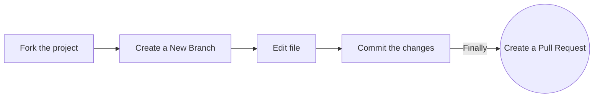

<!-- markdownlint-disable-next-line -->

> **Note** **This repository is _not_ included in the Hacktoberfest event, as it is for practice only!**

We have other [repositories](https://github.com/orgs/EddieHubCommunity/repositories) in the organisation you can contribute to. If you would like to join our GitHub organisation, raise an [issue](https://github.com/EddieHubCommunity/support/issues/new?assignees=&labels=invite+me+to+the+organisation&template=invitation.yml&title=Please+invite+me+to+the+GitHub+Community+Organization) on this repo EddieHubCommunity-Support and you can also join EddieHub [Discord](http://discord.eddiehub.org/) channel.

---

## Hacktoberfest

What is it? Click on the poster below to watch the video for more details 📽

[](https://youtu.be/tjH6txTiC6E)

[](CODE_OF_CONDUCT.md) [](https://gitpod.io/#https://github.com/EddieHubCommunity/hacktoberfest-practice)

## Hacktoberfest Practice Pull Requests

Repository for you to raise a Pull Request to **practice** open-source! 🎉

### Add your name to the alphabetical list and, optionally, a link to your GitHub account (in alphabetical order below your letter too)

### Option 1. Complete this process in Github (in your browser)



1. Fork the project:

- Click the gray `Fork` button in the top right of this page. This creates _your_ copy of the project and saves it as a new repository in your github account

2. Create a New Branch:

- On your new repository's page, click the gray `main` button in the upper left to reveal a dropdown menu.
- Enter the name of your new branch in the text box. (Branch names usually make a reference to what is being changed. Example: `nameAdd`).
- Click on `Create branch <new branch name>` and this will automatically take you to your new branch. You can make edits on the main branch, but this may cause issues down the line. Best practice is to create a new branch for each separate issue you work on. That way your `main` branch remains in sync with Eddie's `main` branch.

3. Edit:

- On the top right of the Readme file, click on the pencil icon to edit the file by adding your name.
- After editing the Readme file, add a commit message and click on the green button saying "Commit Changes". Make sure you have selected the branch you have created.

4. Raise a Pull Request:

- Click `Pull Requests` (which is the third option at the top of this page after the options `Code` and `Issues`).
- Click the green `New Pull Request` button. This will prep the new pull request for you by autofilling the `base repository: base` with 'EddieGitHubCommunity: main' AND autofilling your `head repository: compare` with `your repository: main`
- Click on your head repository's `compare` dropdown, and switch branches from your 'main' branch to `<new branch name>`.
- Finally, click the green `Create Pull Request` button. Great job! You did it!

You can ask questions by raising an [issue](https://github.com/EddieHubCommunity/hacktoberfest-practice/issues/new).

### Option 2. Complete this process on your computer (locally)

- Fork the project:
  Click the gray `Fork` button in the top right of this page. This creates _your_ copy of the project and saves it as a new repository in your github account

- Click on the green `Code` button, then either the HTTPS or SSH option and, click the icon to copy the URL. Now you have a copy of the project. Thus, you can play around with it locally on your computer.

- Run the following commands into a terminal window (Command Prompt, Powershell, Terminal, Bash, ZSH). Do this to download the forked copy of this repository to your computer.

```bash
  git clone https://github.com/YOUR_GITHUB_USERNAME/hacktoberfest-practice.git
```

- Switch to the cloned folder. You can paste this command into the same terminal window.

```bash
  cd hacktoberfest-practice
```

- Make a new branch. Your username would make a good branch because it's unique.

```bash
  git checkout -b <name-of-new-branch>
```

- Open the `README.md` file

- **Add your name to the section that matches your Initial in [this list](https://github.com/EddieHubCommunity/hacktoberfest-practice#hacktoberfest-community), make sure that your name is in alphabetical order. Then save your changes.**

- For example
  `- [Full Name](https://github.com/your-username)`

- Stage your changes.

```bash
  git add README.md
```

or

```bash
  git add .
```

- Commit the changes.

```bash
  git commit -m "Add <your-github-username>"
```

- Check the status of your repository.

```bash
  git status
```

- The response should be like this:

```bash
On branch <name-of-your-branch>
nothing to commit, working tree clean
```

- Pushing your repository to GitHub.

```bash
  git push origin <name-of-your-branch>
```

or

```bash
  git branch -M main
  git push -u origin main
```

> **Warning**: If you get an error message like the one below, you probably forgot to fork the repository before cloning it. It is best to start over and fork the project repository first.

```bash
ERROR: Permission to EddieHubCommunity/hacktoberfest-practice.git denied to <your-github-username>.
fatal: Could not read from remote repository.
Please make sure you have the correct access rights and the repository exists.
```

- On the GitHub website, navigate to your forked repo - on the top of the files section, you'll notice a new section containing a `Compare & Pull Request` button!

- Click on that button, this will load a new page, comparing the local branch in your forked repository against the main branch in the EddieHub Hacktoberfest repository. Accept the default values in the dropdown boxes and click the green `Create Pull Request` button. After creating the PR (Pull Request), our GitHub Actions workflow will add a welcome message to your PR.
  Note: A pull request allows us to merge your changes with the original project repo.

- Your pull request will be reviewed and then eventually merged.

Hurray! You successfully have made your first contribution! 🎉

---

## How can I fix a merge conflict?

A GitHub conflict is when people make changes to the same area or line in a file. This must be fixed before it is merged in order to prevent collision in the main branch.

- **To read more about this, go to [GitHub Docs - About Merge Conflicts](https://docs.github.com/en/github/collaborating-with-pull-requests/addressing-merge-conflicts/about-merge-conflicts)**

- **To find out about how to fix a Git Conflict, go to [GitHub Docs - Resolve Merge Conflict](https://docs.github.com/en/github/collaborating-with-pull-requests/addressing-merge-conflicts/resolving-a-merge-conflict-on-github)**

- You can also ask for help in our [Discord server](http://discord.eddiehub.org) or submit an issue in the [Support repository](https://github.com/EddieHubCommunity/support).

---

## `Hacktoberfest Community`

### **Contents**

| [A](#a) | [B](#b) | [C](#c) | [D](#d) | [E](#e) |
| ------- | ------- | ------- | ------- | ------- |
| [F](#f) | [G](#g) | [H](#h) | [I](#i) | [J](#j) |
| [K](#k) | [L](#l) | [M](#m) | [N](#n) | [O](#o) |
| [P](#p) | [Q](#q) | [R](#r) | [S](#s) | [T](#t) |
| [U](#u) | [V](#v) | [W](#w) | [X](#x) | [Y](#y) |
|         |         | [Z](#z) |

---

- ### **A**

  - [Aakansha Priya](https://github.com/priyaaakansha)
  - [Aakarsh Teja](https://github.com/aakarshteja)
  - [Aakrut Dabhi](https://github.com/Aakrut)
  - [Aarul Mishra](https://github.com/Aarul14)
  - [Aaryaman Shah](https://github.com/AaryamanShah1)
  - [Aashish-cyber](https://github.com/Aashish-cyber)
  - [Aathira](https://github.com/aathirav06)
  - [Aayush Sharma](https://github.com/SuperAayush)
  - [Abbey Santos](https://github.com/AbbeyIT)
  - [Abdeslam Loukili](https://github.com/aslukili)
  - [Abdifatah Ahmed](https://github.com/ibnuahmed)
  - [Abdul Shaik](https://github.com/AbdulShaik786)
  - [Abdullah Sajid](https://github.com/abdullahsajid-ma)
  - [Abdullahi Musa](https://github.com/Abdullahi001)
  - [Abdulmalik Adekunle](https://github.com/Adekunle27)
  - [Abdulmumin Yaqeen](https://github.com/Abdulmumin1)
  - [Abdulrafiu Kehinde Lawal](https://github.com/kennie-larkson)
  - [Abdulramon Jemil](https://github.com/abdulramonjemil)
  - [Abhay Raghuram](https://github.com/AbhayRaghuram)
  - [Abhay Shreevastava](https://github.com/abhay007kr)
  - [Abhay Taras](https://github.com/abhay-h)
  - [Abhigyan Mohanta](https://github.com/ABHIGYAN-MOHANTA)
  - [Abhijeet Rana](https://github.com/TheMainManIND)
  - [Abhijit Singh](https://github.com/apschauhan03)
  - [Abhinav Raman](https://github.com/abhinav-raman)
  - [Abhinav Reddy](https://github.com/AbhinavReddy-Dev)
  - [Abhinav Saraswat](https://github.com/abhinavsaraswatt)
  - [Abhinav Vedmala](https://github.com/mrswagbhinav)
  - [Abhiram P.V.](https://github.com/Abhiram970)
  - [Abhiram Sukala](https://github.com/themelomaniac01)
  - [Abhisek Panda](https://github.com/Panda-Abhisek)
  - [Abhishek Bahukhandi](https://github.com/abrknine)
  - [Abhishek Kumar Roy](https://github.com/Adi-Abhishek)
  - [Abhishek Kumar](https://github.com/abh139)
  - [Abhishek Kumar](https://github.com/Abhishek-569)
  - [Abhishek R](https://github.com/Abhi45765)
  - [Abhishek Shinde](https://github.com/abhishinde24)
  - [Abhishek Soni](https://github.com/abhisheksonii)
  - [Abhisman Sarkar](https://github.com/abs007)
  - [Abiola Farounbi](https://github.com/Abiola-Farounbi)
  - [Abubakar Sadiq](https://github.com/ABuabakarsadiqq)
  - [Abukari Einus](https://github.com/blackdante101)
  - [Abuzer Asif](https://github.com/abuzerasif)
  - [Ace Borja](https://github.com/Sandbox-AceBorja)
  - [Adarsh Navneet Sinha](https://github.com/geeky01adarsh)
  - [Adarsh V](https://github.com/Advarsh)
  - [Adedeji Tobiloba](https://github.com/tobySolutions)
  - [Adedoyin Oluwakemi](https://github.com/KemiDoyin)
  - [Adewale Ogundiran Charles](https://github.com/adewalecharles)
  - [Adil Choudhury](https://github.com/achoudhury4927)
  - [Aditi Goyal](https://github.com/AditiGoyal05)
  - [Aditi Nimbarte](https://github.com/adinimbarte)
  - [Aditya Arpan Sahoo](https://github.com/arpanaditya)
  - [Aditya Bhattad](https://github.com/adityabhattad2021)
  - [Aditya D](https://github.com/ADITYADAS1999)
  - [Aditya Das](https://github.com/ThatOneBlodeKid)
  - [Aditya Joshi](https://github.com/AdityaJoshi304)
  - [Aditya Mangal](https://github.com/adityamangal1)
  - [Aditya Ojha](https://github.com/aditya1ojha)
  - [Aditya Pachauri](https://github.com/AdityyaX)
  - [Aditya Palpattuwar](https://github.com/APalpattuwar7)
  - [Aditya Pandey](https://github.com/adityyaa-10)
  - [Aditya Patel](https://github.com/adityatheoctocatdev)
  - [Aditya Priyadarshi](https://github.com/foxy4096)
  - [Aditya Raute](https://github.com/adityaraute)
  - [Aditya Singla](https://github.com/2802AdityA)
  - [Adrian Goessl](https://github.com/mendax0110)
  - [Advik Gupta](https://github.com/Advik-Gupta)
  - [Adwait Kulkarni](https://github.com/AdwaitKulkarni58)
  - [Aécio Neto](https://github.com/aecio-neto)
  - [Afnan](https://github.com/afuu21)
  - [Afroz Chakure](https://github.com/afrozchakure)
  - [Aftab](https://github.com/aftabashraf003)
  - [Agbabiaka Damilare](https://github.com/AgbaD)
  - [Agnel Selvan](https://github.com/AgnelSelvan)
  - [Agus Richard](https://github.com/agusrichard)
  - [Ahamed Basha N](https://github.com/ahamedbasha-n)
  - [Ahmad Hassan](https://github.com/ahmadhassan7)
  - [Ahmad Lemine](https://github.com/ahmadlemine)
  - [Ahmed Muhammed Galadima](https://github.com/ApolloDev0)
  - [Aj Mendoza](https://github.com/ajmdotdev)
  - [Ajay Anuragi](https://github.com/ajayanuragi)
  - [Ajith P. Kumar](https://github.com/JOSHI-owo)
  - [Akash Rajak](https://github.com/akash435)
  - [Akerejola Emeduduna](https://github.com/Emedudu)
  - [Akhil Bisht](https://github.com/Akhilbisht798)
  - [Akhil Reddy Bollu](https://github.com/Akhil-123478)
  - [Akhil u](https://github.com/akhilullattil)
  - [Akhilesh Waghmare](https://github.com/akhilesh-w)
  - [Akindotuni Ademola](https://github.com/demolaemrick)
  - [Akintokun Pelumi Eyitimonwa](https://github.com/Timonwa)
  - [Akkireddy Muralidhar](https://github.com/Muralidhar22)
  - [Akogun Oyindamola](https://github.com/damoski2)
  - [Akshat Kushwaha](https://github.com/Akshat-02)
  - [Akshay Reddy S](https://github.com/Akshay1718)
  - [Akshaya Kulasekaran](https://github.com/AkshayaKulasekaran)
  - [Akshayan Sinha](https://github.com/hippyaki)
  - [Akshi Vasaniya](https://github.com/Akshi-Vasaniya)
  - [Akshita Gupta](https://github.com/akshitagupta15june)
  - [Alaba Olanrewaju](https://github.com/chryzcodez)
  - [Alabi Olalekan Emmanuel](https://github.com/Lekanjoy)
  - [Aldo Aranda](https://github.com/blackbriar-28)
  - [Aleksandr Morozov](https://github.com/aleksandr-mor)
  - [Aleksey Voko](https://github.com/Aleksey-Voko)
  - [Alex Facius](https://github.com/AlexOde)
  - [Alex Penado](https://github.com/jose-source)
  - [Alex Valdez](https://github.com/arevaldez)
  - [Alexandru Mihalache](https://github.com/AlexMihalache99)
  - [Ali Fahed](https://github.com/AliFahed)
  - [Ali Mirrajei](https://github.com/alimirrajei)
  - [Ali Reza](https://github.com/AliReza1083)
  - [Allen Ponce de Leon](https://github.com/aoponcedeleon)
  - [Alok Kumar Verma](https://github.com/alokVerma749)
  - [Alpadmin](https://github.com/hasthamalp)
  - [Aman Arora](https://github.com/sheisAman)
  - [Aman Kuliyal](https://github.com/Iconic-It-Is)
  - [Aman Kumar](https://github.com/amansr18)
  - [Aman Negi](https://github.com/amannegi)
  - [Aman Shrivastava](https://github.com/aman34503)
  - [Aman Singh](https://github.com/amansingh1999)
  - [Aman Upadhyay](https://github.com/AmanxUpadhyay)
  - [Aman Verma](https://github.com/amanpro1)
  - [Amanjot Singh](https://github.com/AmanGit010)
  - [Amarjeet Kumar](https://github.com/amarjeetk06)
  - [Amay Jain](https://github.com/vrindavan)
  - [Amelia Hill](https://github.com/amehi0index)
  - [Amir Hossain Zarei](https://github.com/Amihozar)
  - [Amit Goyal](https://github.com/JhndaCoder)
  - [Amit Kumar Bera](https://github.com/itzwow)
  - [Amit Turare](https://github.com/amitturare)
  - [Amitesh Anand](https://github.com/Astrodevil)
  - [Amith Sulakhe](https://github.com/amithsulakhe)
  - [Amrutha C.K.](https://github.com/Amrutha1101)
  - [Amzad Hossain](https://github.com/bdamzad)
  - [Ana Carrillo](https://github.com/acarrillo3)
  - [Anadya Nair](https://github.com/AnadyaNair)
  - [Anant Luthra](https://github.com/AnantLuthra)
  - [Ananya Banerjee](https://github.com/aspiringananya)
  - [Anastestia Onyekaba](https://github.com/Ann-design-max)
  - [Anchal Singh](https://github.com/anchalsinghrajput)
  - [Andrew Cunliffe](https://github.com/andrew-cunliffe)
  - [Andrew Southern](https://github.com/whoamihealay)
  - [Angel Dhakal](https://github.com/angeldhakal)
  - [Anh Tran](https://github.com/longqua69)
  - [Aniesh Kumar](https://github.com/anieshak)
  - [Aniket Kumar](https://github.com/aniket-24)
  - [Aniket Kumar Ghosh](https://github.com/ak7550)
  - [Aniket Prabhakar](https://github.com/aniketprabhakar)
  - [Aniket Singh](https://github.com/aniketsingh98571)
  - [Animesh Pathak](https://github.com/sonichigo)
  - [Aniruddha Inge](https://github.com/Aniruddha-Inge)
  - [Anirudh](https://github.com/aspiringDev22)
  - [Anirudh Eyyani](https://github.com/AnirudhEyyani)
  - [Anita de San Miguel](https://github.com/neetnet200)
  - [Anitha subramanian](https://github.com/anithasubramanian19)
  - [Anjali](https://github.com/anjali)
  - [Anjali Goswami](https://github.com/anjaligoswami)
  - [Anjan Diyora](https://github.com/Anjan50)
  - [Ankit Jaiswal](https://github.com/Ankit4j)
  - [Ankit Ojha](https://github.com/ankitojha07)
  - [Ankit Warbhe](https://github.com/ankitwarbhe)
  - [Ankit Zore](https://github.com/ZoreAnkit)
  - [Ankush Tripathi](https://github.com/ankushtripathii)
  - [Anmol Guragain](https://github.com/Anmol2059)
  - [annu](https://github.com/annu12340)
  - [Ansh Dhingra](https://github.com/anshdhinhgra47)
  - [Anshdeep Shrivastav](https://github.com/ansh-d23)
  - [Anshu Pathak](https://github.com/AnshuPathak-88825)
  - [Anshul Singh](https://github.com/anshulsc)
  - [Anthony Beckett](https://github.com/anthonybeckett)
  - [Anthony Chinwe](https://github.com/anthonychinwe)
  - [Anthony Madia](https://github.com/AnthonyMadia)
  - [Anthony Oyakhilome Justice](https://github.com/oyakhilomee)
  - [Anton Samper Rivaya](https://github.com/antonsamper)
  - [Antonio Riccelli](https://github.com/Antonio-Riccelli)
  - [Anubhav Gupta](https://github.com/anubhav06)
  - [Anubhav Purohit](https://github.com/Anubhav-byte)
  - [Anubhav Singhal](https://github.com/anu-sin)
  - [Anuj Bisht](https://github.com/bishtanuj)
  - [Anuj Chourasia](https://github.com/anujchourasia15)
  - [Anuj Kumar](https://github.com/R3v3rb3)
  - [Anuj Tiwari](https://github.com/ANUJTIWARI007)
  - [Anupama Dhir](https://github.com/anupamadh)
  - [Anurag Kumar](https://github.com/halfway-there1)
  - [Anurag Kumar](https://github.com/kranurag7)
  - [Anurag Pathak](https://github.com/AnuragThePathak)
  - [Anurag Sharma](https://github.com/Anurag30112003)
  - [Anurag Singh](https://github.com/AnuragProg)
  - [Anusha Hiremath](https://github.com/AnushaHiremath)
  - [Anusha S](https://github.com/anushas-dev)
  - [Anushka Raj](https://github.com/Anushka-codergirl)
  - [Anushka Shrivastava](https://github.com/anushka00)
  - [Aparna Soneja](https://github.com/aparna2071)
  - [Apoorv Raj Saxena](https://github.com/apoorvraj2000)
  - [Appygal](https://github.com/appygal)
  - [APT96](https://github.com/APT96)
  - [Ar Rakin](https://github.com/virtual-designer)
  - [Arefat](https://github.com/arefathi)
  - [Areola John](https://github.com/johnnyteck)
  - [Arghya Das](https://github.com/itsarghyadas)
  - [Arhen Santiago](https://github.com/rhen99)
  - [Arijit](https://github.com/arijitgupta42)
  - [Arindam Majumder](https://github.com/Arindam200)
  - [Aritra Barik](https://github.com/aritrabarik)
  - [Arjun Hegde](https://github.com/izzarzn)
  - [Arjun Pathak](https://github.com/Arjuniest)
  - [Arka Raha](https://github.com/softdevarka)
  - [Arman Ali Khan](https://github.com/Arman-ali-khan-786)
  - [Arnav Jyotshi](https://github.com/ArnavJyo)
  - [Arnav Sharma](https://github.com/arnav1776)
  - [Aronmwan Dave](https://github.com/d-a-ve)
  - [Arpit Yadav](https://github.com/arpitgenius489)
  - [Arsalan Rashid Khan](https://github.com/ArsalanRashid-K)
  - [Arsenic](https://github.com/Arsenic-ATG)
  - [Arshdeep Singh](https://github.com/Arshdeep-0509)
  - [Arsheel](https://github.com/arsheelsheikh)
  - [Arslaan Shaikh](https://github.com/s-arslaan)
  - [Arun Kumar](https://github.com/ArunKumar-07)
  - [ArunKumar Nadikattu](https://github.com/mastrero)
  - [Aryabhatta](https://github.com/mrbuddhu)
  - [Aryan Deshpande](https://github.com/Aryan-Deshpande)
  - [Aryan Jain](https://github.com/coolAryan)
  - [Aryan Kathawale](https://github.com/kiritocode1)
  - [Aryan Raj](https://github.com/aryaraj132)
  - [Aryan Srivastava](https://github.com/Aryan-Srivastava)
  - [Aryex](https://github.com/Aryex82)
  - [Aseem](https://github.com/AseemsGit)
  - [Ash Mudra](https://github.com/AshMudra)
  - [Ashad](https://github.com/Ashad001)
  - [Asharib Ahmed](https://github.com/Asharib90)
  - [Ashish Chavan](https://github.com/AshishChavan98)
  - [Ashish Gupta](https://github.com/AshishGupta11011)
  - [Ashish Khanagwal](https://github.com/Ashish-khanagwal)
  - [Ashish Prasad](https://github.com/coolashishpt)
  - [Ashwani Kumar Singh](https://github.com/aksingh-codes)
  - [Ashwin B](https://github.com/ahn1305)
  - [Ashwin Kumar Uppala](https://github.com/ashwinexe)
  - [Asmit Kumar Sirohi](https://github.com/asmitsirohi)
  - [Aswin Asok](https://github.com/AswinAsok)
  - [Atharv Bidwe](https://github.com/Atharv-777)
  - [Atharv Bobade](https://github.com/Atharv181)
  - [Atharva Chandwadkar](https://github.com/atharav21-stack)
  - [Atharva Hinge](https://github.com/36atharva)
  - [Atharva Ikhar](https://github.com/iatharva)
  - [Atharva Mogade](https://github.com/atharvamogade)
  - [Atharva Pingale](https://github.com/atharva0300)
  - [Atharva Pise](https://github.com/itsEobard2025)
  - [Atharva Waghchoure](https://github.com/AtharvaWaghchoure)
  - [Athul Suresh](https://github.com/athulmekkoth)
  - [Atif Equbal](https://github.com/I88T77)
  - [Atif Moin](https://github.com/iamatifmoin)
  - [Atul Kumar Awasthi](https://github.com/kumaratul60)
  - [Atulya Singh](https://github.com/oreo-gif)
  - [Audrey Mengue](https://github.com/audreymengue)
  - [Augustin Lima](https://github.com/augustinlima)
  - [Augustine Onyebuchi](https://github.com/Cesargrandeur)
  - [AvidCoder101](https://github.com/AvidCoder101)
  - [Avinash Prasad](https://github.com/avionmission)
  - [Aviral Sharma](https://github.com/aviralsharma07)
  - [Avneesh Agarwal](https://github.com/avneesh0612)
  - [Ayesha Gull](https://github.com/ayeshag7)
  - [Ayondip Jana](https://github.com/detronetdip)
  - [AyoOluwa Israel Adeleke](https://github.com/AyoOluwa-Israel)
  - [Aysha Hakeem](https://github.com/AyshaHakeem)
  - [Ayush Chamoli](https://github.com/AyushChamoli961)
  - [Ayush Chaudhary](https://github.com/YushChaudhary)
  - [Ayush K.S.](https://github.com/ayushdotdev)
  - [Ayush Kumar](https://github.com/Ayush7614)
  - [Ayush Kumar Shaw](https://github.com/Ak-Shaw)
  - [Ayush Lohmod](https://github.com/ayushlohmod)
  - [Ayush Luthra](https://github.com/Ayushluthra2001)
  - [Ayush Mishra](https://github.com/ayush-sleeping)
  - [Ayush Raj](https://github.com/imyoungsparda)
  - [Ayushi Vamne](https://github.com/Ayushi15-Vamne)
  - [Aziz Prabowo](https://github.com/azizp128)

- ### **B**

  - [Babin Bohora](https://github.com/nibab-boo)
  - [Baihaki Tanjung](https://github.com/BaihakiTanjung)
  - [Balaji Sigamani](https://github.com/balajisa09)
  - [Balikis Oyeleye](https://github.com/Qreamville)
  - [Baraa Baba](https://github.com/baraa-baba)
  - [Barkatul Mujauddin](https://github.com/barkatul)
  - [Barphie](https://github.com/barphie)
  - [Benjamin Duffield-Harding](https://github.com/ben-dh3)
  - [Benjamin Rukundo](https://github.com/rukundob451)
  - [Benjamin Ughegbe](https://github.com/Ljr777)
  - [Benson Arafat](https://github.com/realArafatBen)
  - [Bharath](https://github.com/bharathyes)
  - [Bhargav Avinash](https://github.com/bhargav794)
  - [Bhargavi V](https://github.com/Bhar-02)
  - [Bhavanshu Jain](https://github.com/bhavanshu-1112)
  - [Bhavya Giri](https://github.com/bhavya-giri)
  - [Bhuvanesh Hingal](https://github.com/BhuvaneshHingal)
  - [Bhuvnesh Sharma](https://github.com/Bhuvnesh875)
  - [Bikram Ghuku](https://github.com/Bikram-ghuku)
  - [Bineet Naidu](https://github.com/bineetNaidu)
  - [Biresh Biswas](https://github.com/Billa05)
  - [Bisesh Adhikari](https://github.com/Biseshadhikari)
  - [Bishal Das](https://github.com/bishal7679)
  - [Bismeet Singh](https://github.com/BismeetSingh)
  - [bitM1ke](https://github.com/cryptome)
  - [Blake](https://github.com/magic990619)
  - [Blessing Udiong](https://github.com/budiong054)
  - [Boby](https://github.com/bobychaudhary)
  - [Bony](https://github.com/bonysureliya)
  - [Brian Buddhadasa](https://github.com/brianbud)
  - [Brian Kiarie Mwaniki](https://github.com/BrianKiarieMwaniki)
  - [Brian Nduhiu](https://github.com/Brian-Nduhiu)
  - [Brown Chinta](https://github.com/2brownc)
  - [Bryson M.](https://github.com/Bryson69)
  - [Buddhadeb Chhetri](https://github.com/Buddhad)
  - [Bui Bao Long](https://github.com/longbuibao)
  - [Burhanuddin Raja](https://github.com/BurhanRaja)

- ### **C**

  - [Caden Parker](https://github.com/Ne0nWinds)
  - [Cahllagerfeld](https://github.com/Cahllagerfeld)
  - [Carlie Hope](https://github.com/carliemaria)
  - [Carmen Chow](https://github.com/cchow33)
  - [Cayden Burns](https://github.com/SudoCee)
  - [CeeKay](https://github.com/CeeKayTech)
  - [Chamberlain Ezigbo](https://github.com/Chamberezigbo)
  - [Chandula Janith](https://github.com/RedEdge967)
  - [Charlotte Jewer](https://github.com/Charlotte990)
  - [Cherish Sachdeva](https://github.com/csachdeva83)
  - [Chibogu Chisom](https://github.com/raeeceip)
  - [Chinmay Khanna](https://github.com/chinmay3)
  - [Chinmay Mhatre](https://github.com/ChinmayMhatre)
  - [Chinmay Mulay](https://github.com/cmulay)
  - [Chinwendu Enyinna](https://github.com/wendeee)
  - [Chiobi Jason](https://github.com/ChiobiJason)
  - [Chris Imade](https://github.com/Chris-Imade)
  - [Chris Moreton](https://github.com/chris-moreton)
  - [Chris Niedermayer](https://github.com/Chris-N)
  - [Chris Schubert](https://github.com/C-Schubert94)
  - [Clifford Mapesa](https://github.com/droffilc1)
  - [CodesbyUnnati](https://github.com/CodesbyUnnati)
  - [CodingSpecies](https://github.com/CodingSpecies)
  - [Conor O Shea](https://github.com/conoroshea1996)
  - [Crislana Rafael](https://github.com/crislanarafael)
  - [Cux Sabrina](https://github.com/theflucs)
  - [Cynthia Teeters](https://github.com/cynthiateeters)

- ### **D**

  - [Dagim Cherinet Biftu](https://github.com/dagim-cherinet)
  - [Dalpat Rathore](https://github.com/dalpatrathore)
  - [Damilola Oladele](https://github.com/activus-d)
  - [Danella Patrick](https://github.com/danellapatrick)
  - [Daniel Ayia Adamu](https://github.com/ayiaware)
  - [Daniel Hart](https://github.com/thedannydarko)
  - [Daniel Johnson](https://github.com/danjohnson77)
  - [Daniel Lawrence](https://github.com/DanLawrence91)
  - [Dapo Adedire](https://github.com/dapoadedire)
  - [Darsh Gupta](https://github.com/DarshGupta1910)
  - [Darshan Jain](https://github.com/darshanjain-entrepreneur)
  - [Dave Bhandari](https://github.com/Davekibh)
  - [David Centurion](https://github.com/Parzivalcen)
  - [David Clinton](https://github.com/daveclinton)
  - [David Langner](https://github.com/langnerdavid)
  - [David Leal](https://github.com/Panquesito7)
  - [David Okononfua](https://github.com/Vinyl-Davyl)
  - [Davin S](https://github.com/davin2020)
  - [Davis Xuy](https://github.com/toomsie)
  - [Debanjana Sarkar](https://github.com/debanjana-a11y)
  - [Debbie D](https://github.com/hellodeborahuk)
  - [Deborshi Chakrabarti](https://github.com/deborshikun)
  - [Deepak B](https://github.com/sbdeepu09)
  - [Deepak Hagadur Bheemaraju](https://github.com/deepakhb2)
  - [Deepak Kumar](https://github.com/kumar-rocks)
  - [Deepak Sirohiwal](https://github.com/deepaksirohiwal)
  - [Deepanshu](https://github.com/deepanshudaksh77)
  - [Deepanshu Anand](https://github.com/Deepanshu0810)
  - [Deepanshu kumar](https://github.com/deepanshu1334)
  - [Deepanshu Midha](https://github.com/deepanshumidha5140)
  - [Denis Cabrera](https://github.com/denisCabrera)
  - [Dennie Chan](https://github.com/Oculareo)
  - [Dennis Quinlan](https://github.com/denquinlan)
  - [Dev Jain](https://github.com/889-dj)
  - [Devansh Tiwari](https://github.com/Devansh-365)
  - [Devesh RB](https://github.com/Deveshb15)
  - [Devin Droddy](https://github.com/ThePyroTF2)
  - [Devkant Swargiary](https://github.com/Devkant21)
  - [Dhairya Ostwal](https://github.com/dhairyaostwal)
  - [Dhananjay Mahajan](https://github.com/Dhananjaymahajan2001)
  - [Dhanush](https://github.com/ydhanush8)
  - [Dharmik Hingu](https://github.com/dharmik48)
  - [Dhaval Dudhat](https://github.com/dudhatdhavalm)
  - [Dhayal Ram](https://github.com/dhayalramk)
  - [Dheeman Pati](https://github.com/sayan99614)
  - [Dheeraj Khushalani](https://github.com/DheerajKhush)
  - [Dhrumi Shah](https://github.com/dhrumishah)
  - [Dhruv Adavadkar](https://github.com/adavadkardhruv13)
  - [Dhruv Gajjar](https://github.com/Dhruv-Gajjar)
  - [Dhruva Srinivas](https://github.com/carrotfarmer)
  - [Dibyajit Tripathy](https://github.com/DibyajitTripathy)
  - [Diego Nieto](https://github.com/diego-nieto-pena)
  - [Diksha Chaudhari](https://github.com/dikshachaudhari4)
  - [Diksha Rai](https://github.com/diksharai9)
  - [Diksha Tomar](https://github.com/dikshatomarr)
  - [Dimo Ivanov](https://github.com/divanoff)
  - [Dinki Yaduwanshi](https://github.com/anonymousdaisy5)
  - [Dipesh Babu](https://github.com/dipeshbabu)
  - [Disha vig](https://github.com/vigdisha)
  - [Dishon Kadoh](https://github.com/realestdon)
  - [Ditiro Rampate](https://github.com/ditirodt)
  - [Divakar R](https://github.com/rexdivakar)
  - [Divash Gupta](https://github.com/Divxsh)
  - [Divlo](https://github.com/Divlo)
  - [Divya Raichura](https://github.com/divya-raichura)
  - [Divya](https://github.com/d-coder111)
  - [Divyanshu](https://github.com/TilteD24)
  - [Dmitrii Kilishek](https://github.com/mentalclear)
  - [Domeh John Kelvin Tetteh](https://github.com/JhohannesK)
  - [Donkeshwar KavyaSree](https://github.com/kavyasree-2020)
  - [Dorian Emenir](https://github.com/doriandevtech)
  - [Douglas Franklin Idamezhim](https://github.com/Idamezhim)
  - [Drishika Chauhan](https://github.com/drishika2002)
  - [Drishtant Dubey](https://github.com/DRISHTANT-DUBEY)
  - [Durvesh Kumar Pal](https://github.com/DurveshKumarPal)
  - [Dušan Tanasić](https://github.com/Duk4)

- ### **E**

  - [E Asai](https://github.com/easai)
  - [Ebenezer R.](https://github.com/Itsfoss0)
  - [Eddie Jaoude](https://github.com/eddiejaoude)
  - [Edgar Ssensalo](https://github.com/ssensalo)
  - [Edilson Matola](https://github.com/edilsonmatola)
  - [Edson Sooraj Dsouza](https://github.com/edson-sooraj)
  - [Eduard Schwarzkopf](https://github.com/EduardSchwarzkopf)
  - [Edward Vielmetti](https://github.com/vielmetti)
  - [Efereyan Karen Simisola](https://github.com/KarenEfereyan)
  - [Emi Gomez](https://github.com/emigl)
  - [Emmanuel Obiechina](https://github.com/chibuike-19)
  - [Emmy Steven](https://github.com/emmysteven)
  - [Enn Dee](https://github.com/enn-dee)
  - [Eric Thomas D. Cabigting](https://github.com/ecabigting)
  - [Eshan Sharma](https://github.com/Eshan-Sharma)
  - [essarrgee](https://github.com/essarrgee)
  - [Ethan Cox](https://github.com/MasterReach1)
  - [Eugene Song](https://github.com/EugenSong)
  - [Euhid Aman](https://github.com/euhidaman)
  - [Evandro Rodrigues](https://github.com/evnrodr)
  - [Ezinne Anne Emilia](https://github.com/ezinneanne)

- ### **F**

  - [Fahad Masood](https://github.com/fahad-masood)
  - [Fahim Bin Amin](https://github.com/FahimFBA)
  - [Fais Edathil](https://github.com/E-fais)
  - [Farhan Ali](https://github.com/Farhan-Ali2002)
  - [Farjad Ahmed Khan](https://github.com/farjad-akhan)
  - [Farzad Esmaeil Beygi](https://github.com/Farzad-ES)
  - [Fatma](https://github.com/fatmab28)
  - [Fawad Sheikh](https://github.com/fawad-sh)
  - [Fawaz Sullia](https://github.com/fawazsullia)
  - [Fayas Noushad](https://github.com/FayasNoushad)
  - [Fayouz](https://github.com/Fayouzz)
  - [Femi Oluwadamilola](https://github.com/femiOluwadamilola)
  - [Fidal Mathew](https://github.com/FidalMathew)
  - [FitriRibbit](https://github.com/FitriRibbit)
  - [Fiyinfoluwa Fatuase](https://github.com/Fiiyinfoluwa)
  - [Fitri Ribbit](https://github.com/FitriRibbit)
  - [Fran Pérez](https://github.com/franpersanchez)
  - [Fran Pérez F](https://github.com/FranPerezFolgado)
  - [Franklin Ohaegbulam](https://github.com/frankiefab100)
  - [Frazier Odhiambo](https://github.com/frazie)
  - [Furqan Abid](https://github.com/heyyfurqan)

- ### **G**

  - [Gabriel Isuekebho](https://github.com/Conradgabe)
  - [Gabriel Tengey](https://github.com/littygabby)
  - [Gagan Gaur](https://github.com/gagangaur)
  - [Gagan V](https://github.com/gagan95)
  - [Ganapathi Subramanyam Jayam](https://github.com/ganapathi12)
  - [Ganesh Balaji Radhakrishnan](https://github.com/Ganesh-Balaji-Radhakrishnan)
  - [Ganesh Patil](https://github.com/ganeshpatil386386)
  - [Gathin](https://github.com/Gathin23)
  - [Gaurav](https://github.com/itstheanurag)
  - [Gaurav Kulkarni](https://github.com/kulkarnigaurav38)
  - [Gaurav Pandey](https://github.com/gaurtvin)
  - [Gautam Goyal](https://github.com/Gautam1302)
  - [Genesis Gabiola](https://github.com/genesisgabiola)
  - [Geremsa Narzary](https://github.com/BoneNzy)
  - [Geya Sahithi](https://github.com/Geya-Sahithi)
  - [Ghada A.Saleh](https://github.com/ghadasaleh3)
  - [Gideon Idoko](https://github.com/IamGideonIdoko)
  - [Given Kibanza](https://github.com/givenkiban1)
  - [Gizem Andreae](https://github.com/Gigi-theandreae)
  - [Gladson Sethiel](https://github.com/gsonly)
  - [Glyn Knight](https://github.com/GLYNKNIGHT)
  - [Godfred Doe](https://github.com/FredDoe)
  - [Gokulraj Puviyarasu](https://github.com/gokulrajpuviyarasu)
  - [Goodness Ezeh](https://github.com/GoodnessEzeh)
  - [Gourish Narang](https://github.com/gourishnarang)
  - [Gowtham P B](https://github.com/GowthamPB)
  - [Grace Valerie Anyango](https://github.com/ValGrace)
  - [Grawish Sachdeva](https://github.com/grawish)
  - [Gulshan Jakhon](https://github.com/gulshanjakhon)
  - [Gunjan Gupta](https://github.com/gunjan-g)
  - [Gurjeet Singh Virdee](https://github.com/gurjeetsinghvirdee)
  - [Gurpartap Singh](https://github.com/Gurpartap335)
  - [Gustavo Santos](https://github.com/gefgu)

- ### **H**

  - [Haafizz Ismail](https://github.com/haafizzismail)
  - [Habeeb B. Oyesile](https://github.com/badbatunde)
  - [Hammad Azam](https://github.com/hammadhz)
  - [Hamza Jassar](https://github.com/iJassar)
  - [Hamzat EngineerHamziey](https://github.com/EngineerHamziey)
  - [Hana Aliyah Mufidah](https://github.com/aliyanamu)
  - [Hana Shah](https://github.com/hanashah-01)
  - [Hanyel Chamon](https://github.com/hanyelC)
  - [Hardik Ralhan](https://github.com/hardikralhan)
  - [Hardikk kamboj](https://github.com/hady68)
  - [Hari Hara Sudhan S](https://github.com/HariSuriya520)
  - [Hariket Sukesh Kumar Sheth](https://github.com/hariketsheth)
  - [Harish Sheoran](https://github.com/sheoranharis)
  - [Harish Srinivasan](https://github.com/Harish2930)
  - [Harsh Dhariwal](http://github.com/harsh-dhariwal)
  - [Harsh Kumar Jha](https://github.com/Harsh-kumar-jha)
  - [Harshal Yadav](https://github.com/Harshalyadav)
  - [Harshil Bhatia](https://github.com/harshilbhatia7)
  - [Harshil Hirpara](https://github.com/harshil202)
  - [Harshit Aditya](https://github.com/HarshitAditya27)
  - [Harshit Chadha](https://github.com/harshit0571)
  - [Harshit Parwal](https://github.com/harshitparwal)
  - [Hassan Rahim](https://github.com/HassanRahim26)
  - [Hassan Tahir](https://github.com/thehassantahir)
  - [Hebron Panam Praise](https://github.com/panam-py)
  - [Heetesh Kumar Pradhan](https://github.com/HeeteshSimon)
  - [Heloise Viegas](https://github.com/heloise-viegas)
  - [Hemang Ranjan](https://github.com/Hemang417)
  - [Hemant](https://github.com/hemantwasthere)
  - [Hemant Bajaj](https://github.com/ORKO06)
  - [Hemanth Sai Garladinne](https://github.com/HemanthSai7)
  - [Hemant Sharma](https://github.com/hemant-sw)
  - [Hernando Guzmán](https://github.com/hernandoagf)
  - [Himangshu Kalita](https://github.com/himangskalita)
  - [Honey Patel](https://github.com/honeykpatel)
  - [Hrithik Chauhan](https://github.com/Hrithik5)
  - [Huluvu424242](https://github.com/huluvu424242)
  - [Hulya Karakaya](https://github.com/hulyak)

- ### **I**

  - [Ian Luciano](https://github.com/ianskie26)
  - [Ibrahim Raimi](https://github.com/ibrahimraimi)
  - [Ibrahim Ramadhan](https://github.com/ibby360)
  - [Ibrahim Rehman](https://github.com/ibrahimrehman1)
  - [Ibrahim Shittu](https://github.com/Dbest2018)
  - [Ibtihel Ouni](https://github.com/Ibtihel-ouni)
  - [Ignas Kavaliauskas](https://github.com/ignaskavaliauskas)
  - [Ihtisham](https://github.com/ihtishamKhan)
  - [Ikra P](https://github.com/ikraP)
  - [Ilyas Rafiq Filali](https://github.com/Nayetwolf)
  - [Ilyas Rufai](https://github.com/rufilboy)
  - [Imad Bg](https://github.com/imadbg01)
  - [Imtiyaz Ali](https://github.com/imtiyaz786)
  - [Indu Rupi](https://github.com/indurupi)
  - [Ines Guerrero](https://github.com/inesgs12)
  - [Ioana Tiplea](https://github.com/ioanat94)
  - [Iria Elvis](https://github.com/elviscoly)
  - [Isaac Ubani](https://github.com/ubaniIsaac)
  - [Ish Kapoor](https://github.com/ishkapoor2000)
  - [Isha Mehta](https://github.com/isha614)
  - [Ishan Kotian](https://github.com/Ishan-Kotian)
  - [Ishika Ishani](https://github.com/ishani-1255)
  - [Israel Mitolu](https://github.com/israelmitolu)
  - [Ivan Pavicic](https://github.com/ivpavici)
  - [Ivo Iliev](https://github.com/Iwi4a)

- ### **J**

  - [Jacob Dunn](https://github.com/dunnjacoba)
  - [Jacob Lepler](https://github.com/leplerjacob)
  - [Jade Kneen](https://github.com/jadekneen)
  - [Jagan Sekaran](https://github.com/JAG-010)
  - [Jagath S M](https://github.com/JagathSM)
  - [Jaime Jones](https://github.com/jaime-lynn)
  - [Jain Patel](https://github.com/jainpatel25)
  - [Jainish Shah](https://github.com/Jainish-shah)
  - [Jaish M](https://github.com/BooptyBapty)
  - [Jamal Park](https://github.com/mapstonepark)
  - [James Cunningham](https://github.com/JamesCunningham304)
  - [James Midzi](https://github.com/Psypher1)
  - [Janet Dornan](https://github.com/janet-dev)
  - [Jashan Mago](https://github.com/Coding-Hashira)
  - [Jasmeet Singh](https://github.com/jasmeetsinghbhatia)
  - [Jasmin Carter](https://github.com/sleepykanguru22)
  - [Jaswinder Singh](https://github.com/jaswindersingh2601)
  - [Jatin Rao](https://github.com/jatin2003)
  - [Jay Chawla](https://github.com/chawlajay)
  - [Jay Sudani](https://github.com/jaysudani)
  - [Jayvir Rathi](https://github.com/Jayvirrathi)
  - [Jeff Mitchell](https://github.com/sentinel1909)
  - [Jeremy Thomas](https://github.com/saucebox11)
  - [Jerome Lalunio](https://github.com/grrom)
  - [Jessica Salbert](https://github.com/jessicasalbert)
  - [Jessica Teo](https://github.com/jessicateocw)
  - [Jessie Auguste](https://github.com/jessiebelle)
  - [JesusGerardoAguiar](https://github.com/JesusGerardoAguiar)
  - [Jigneshvray](https://github.com/jigneshvray)
  - [Jivthesh](https://github.com/jivthesh)
  - [Joachim Chisom](https://github.com/joachimchisom1)
  - [Joel James](https://github.com/Lyon03)
  - [Johanna](https://github.com/Johanna-hub)
  - [John Daniel](https://github.com/johndanny98)
  - [John Muriu](https://github.com/john-muriu)
  - [John Proodian](https://github.com/johnproodian)
  - [Jome Favourite](https://github.com/jomefavourite)
  - [Jonathan Llemit Jr.](https://github.com/jcljr00)
  - [Jonathan Niklasson Godar](https://github.com/JonathanGodar)
  - [Jose Angel Munoz](https://github.com/imjoseangel)
  - [Joseph Ibochi](https://github.com/JosephJohncross)
  - [Joseph Jose](https://github.com/josephjosedev)
  - [Josh Callahan](https://github.com/joshcallahan)
  - [Joshua Nweze](https://github.com/Joshua-Nweze)
  - [Joykishan Sharma](https://github.com/JoykishanSharma)
  - [João Barreiros](https://github.com/j-barreiros)
  - [João Paulo Pereira](https://github.com/andradjp)
  - [JR Rogacion](https://github.com/jrogaciondev)
  - [Julia Furst Morgado](https://github.com/juliafmorgado)
  - [Justin Braun](https://github.com/justin-braun)
  - [Jyoti KM](https://github.com/JyotiKM29)

- ### **K**

  - [Kabir](https://github.com/kabir0x23)
  - [Kabir Jain](https://github.com/kkkkkabir)
  - [Kader Sarikaya](https://github.com/kadersarikaya)
  - [Kai Bechdel](https://github.com/therealkai)
  - [Kaiwalya Koparkar](https://github.com/kaiwalyakoparkar)
  - [Kajal Jaiswal](https://github.com/kajal1801)
  - [Kaleb P](https://github.com/Devarite)
  - [Kam Cherhesa](https://github.com/KazChe)
  - [Kanhaiya Bhatt](https://github.com/kb-s)
  - [Kanish Bodhwani](https://github.com/kanishbodhwani)
  - [Kanishk Pachauri](https://github.com/Mr-Sunglasses)
  - [Kapil Kumar](https://github.com/KapilKumar7)
  - [Karan Chandekar](https://github.com/KaranChandekar)
  - [Karan Kulshrestha](https://github.com/karankulshrestha)
  - [Karnika Gupta](https://github.com/tokyo3001)
  - [Karthik M](https://github.com/mjkarthik01)
  - [Kartik Suthar](https://github.com/kartikgajjar7)
  - [Kartikey Dubey](https://github.com/KartikeyDubeyKD)
  - [Kartikey Vaish](https://github.com/kartikeyvaish)
  - [Kartikey Verma](https://github.com/kartikver15gr8)
  - [Kashish Lakhara](https://github.com/KashishLakhara04)
  - [Katalyst Kat](https://github.com/katalystkat)
  - [Kaushik Dey](https://github.com/kaushikdey647)
  - [Kawish Qayyum](https://github.com/kawishqayyum)
  - [Keerthishankar Punchithaya](https://github.com/KeerthishankarPunchithaya)
  - [Kehinde Adeleke](https://github.com/adeleke5140)
  - [Kehinde Bobade](https://github.com/BobadeKenny)
  - [Kelvin Nyadzayo](https://github.com/Nyadzayo)
  - [Kelvin Parmar](https://github.com/kelvinparmar)
  - [Kememgne Tchassem Johan](https://github.com/johan237)
  - [Ken Mwangi](https://github.com/kenmwangi)
  - [Ketan Parmar](https://github.com/KetanParmar07)
  - [Khadijah Amusat](https://github.com/Khadeeejah)
  - [Khalid Bayan](https://github.com/khalidbayan)
  - [Khalid Khan](https://github.com/pablochocobae)
  - [Khalid Khan-569](https://github.com/khalid569)
  - [Khawaja Usama Yasir](https://github.com/khusamayasir)
  - [Khushaal Choithramani](https://github.com/khushxxl)
  - [Khushal Sachdeva](https://github.com/CodeKhushal)
  - [Khushi Jain](https://github.com/693KHUSHI)
  - [Khushi Shukla](https://github.com/khushi818)
  - [Kidus Solomon](https://github.com/kidussolo)
  - [Kimberly Rodriguez](https://github.com/kimmiethecoder)
  - [Kirtan Chandak](https://github.com/kirtanchandak)
  - [Kirti Jain](https://github.com/kirtijain627)
  - [Kirtiraj Thakor](https://github.com/kirtiraj22)
  - [Kohei Leung](https://github.com/kohei0802)
  - [Kotaprolu Hemanth](https://github.com/hemanthkotaprolu)
  - [Kotesh Arya](https://github.com/kotesh-arya)
  - [Krish](https://github.com/krishdevdb)
  - [Krish Chopra](https://github.com/krishchopra22)
  - [Krish Gupta](https://github.com/krishguptadev)
  - [Krishna Agarwal](https://github.com/MrKrishnaAgarwal)
  - [Krishna G](https://github.com/krishnagupta1543)
  - [Krishna Gupta](https://github.com/krishnazest)
  - [Krishna Khajuria](https://github.com/krish40786)
  - [Krishna Kumar](https://github.com/Krishnapro)
  - [Krishna R](https://github.com/Krishna-Ravi)
  - [Krishnansh Agarwal](https://github.com/krishnanshagarwal112)
  - [Kriti Gupta](https://github.com/kritigupta45)
  - [Krupali Trivedi](https://github.com/krupalitrivedi)
  - [Kshitiz Mahato](https://github.com/Kshitiz-Mhto)
  - [Kumaran T](https://github.com/synackred)
  - [Kumari Astha Rani](https://github.com/astha2412)
  - [Kumar Shanu](https://github.com/Kr-Shanu)
  - [Kunal Mondal](https://github.com/Im-Kunal-13)
  - [Kunal Patil](https://github.com/Kunal0007)
  - [Kunal Ranjan](https://github.com/kunalranjan19)
  - [Kunal Sangtiani](https://github.com/Kunals131)
  - [Kuwar Kapur](https://github.com/kuwarkapur)

- ### **L**

  - [Lakshay Sachdeva](https://github.com/sachdevlaksh)
  - [Lakshay Tyagi](https://github.com/imlakshay08)
  - [Lalit Dhane](https://github.com/lalitdhane)
  - [Lavakush Biyani](https://github.com/lavakush07)
  - [Lazeeez](https://github.com/Lazeeez)
  - [Lerato Makhasane](https://github.com/leratomakhasane)
  - [Lethu Nsibande](https://github.com/LethuNsibande)
  - [Likhith K](https://github.com/likhith4)
  - [Lishu Gupta](https://github.com/lishugupta652)
  - [Lloyd Lobo](https://github.com/lloydlobo)
  - [Logan Lassiter](https://github.com/lmlassiter)
  - [Lohit Yarra](https://github.com/lohityarra)
  - [Lokeshwaran M](https://github.com/Lokeshwaran-M)
  - [Lordson Fernando](https://github.com/lordsonfernando)
  - [Lovakush](https://github.com/Lovakush)
  - [Lubna Fathima N](https://github.com/lubnafathima)
  - [Luciano Pinheiro](https://github.com/lucianopinheiro)
  - [Luis Felipe Ceballos Caicedo](https://github.com/Felipeceballos12)
  - [Luis Suarez](https://github.com/suarezluis)
  - [Lukasz Przybylka](https://github.com/l-przybylka)
  - [Lundbyit](https://github.com/Lundbyit)

- ### **M**

  - [Maharshi Sinha](https://github.com/maharshi-sinha)
  - [Mahaveer Singh Barhath](https://github.com/its-mavi-dev)
  - [Mahendra Bishnoi](https://github.com/MahendraBishnoi29)
  - [Mahesh Pawar](https://github.com/maheshvpawar)
  - [Mahfuz Ronnie](https://github.com/mahfuztbt)
  - [Mahnoor Anwar](https://github.com/Mahnoor-Anwar)
  - [Maksim Zayakin](https://github.com/hirotasoshu)
  - [Mallika Alai](https://github.com/MallikaAlai)
  - [Manasi Mulay](https://github.com/manasi-mulay)
  - [Maneshwar Mehra](https://github.com/maneshwar-mehra)
  - [Manish Gambhirrao](https://github.com/Manish5121)
  - [Manish Rawat](https://github.com/R11manish)
  - [Manjunath Naik](https://github.com/Manu1ND)
  - [Manmeet kaur](https://github.com/Manmeetkaur1525)
  - [Manoj Kumar](https://github.com/themanoz)
  - [Manu Gupta](https://github.com/ManuGupta9780)
  - [Manu S Rao](https://github.com/MANUSRAO)
  - [Marcial John](https://github.com/John121904)
  - [Marie Sallaberry](https://github.com/MarieTKD)
  - [Marios Georgiou](https://github.com/MariosGeorgiou)
  - [Marisa Brantley](https://github.com/marisabrantley)
  - [Marius Gravningsmyhr](https://github.com/mariusgrHiof)
  - [Mark Murray](https://github.com/mark-d-murray)
  - [Markus Eicher](https://github.com/MarkusEicher)
  - [Martin Parker](https://github.com/RasPiPkr)
  - [Maryam Farshbafi](https://github.com/MaryamFarshbafi)
  - [Masete Nicholas](https://github.com/masete)
  - [Matt Oliver](https://github.com/mattyocode)
  - [Matthias Maier](https://github.com/NukeTheFridge)
  - [Max Base](https://github.com/basemax)
  - [Mayank Gupta](https://github.com/mayank-cse)
  - [Mayank Kumar Sharma](https://github.com/Mayank-KS)
  - [Mayank Mahajan](https://github.com/mayank2002-jpg)
  - [Mayur Gupta](https://github.com/Mayurmg)
  - [Mayuresh Deolekar](https://github.com/deolekarmayuresh)
  - [Mazhar Ansari](https://github.com/MJCoder15)
  - [Meenal Jain](https://github.com/meenal21)
  - [Megalous](https://github.com/megalous-lab)
  - [Melvin Ng](https://github.com/melvincwng)
  - [Michael Akintomo (@MadeByM1KE)](https://github.com/Makintomo04)
  - [Michael Godfrey](https://github.com/michagodfrey)
  - [Michael Liendo](https://github.com/Michael-Liendo)
  - [Michael Muogboh](https://github.com/mobo07)
  - [Michael Otieno](https://github.com/Michael-Otieno)
  - [Micheal Aderinto](https://github.com/ad3rinto)
  - [Miguel VR](https://github.com/MiguelVR)
  - [Mikal Laane](https://github.com/goobric)
  - [Mike Hatch](https://github.com/mikeshatch)
  - [Milind Mishra](https://github.com/thatbeautifuldream)
  - [Mitansh Kayathwal](https://github.com/Mitanshk01)
  - [Mitanshi Kshatriya](https://github.com/MitanshiKshatriya)
  - [Moeen Ul Islam](https://github.com/moeen-ul-islam)
  - [Moeez Mustafa](https://github.com/moezmustafa)
  - [Mohamed A.M](https://github.com/Mohamed1756)
  - [Mohamed Abdul Wajeed](https://github.com/wajid281)
  - [Mohamed Al-Rifay](https://github.com/alrifay)
  - [Mohamed Mehdi Gara](https://github.com/mohamedmehdigara)
  - [Mohamed Naufal A](https://github.com/Naufal2511)
  - [Mohamed Shamir](https://github.com/mshamir11)
  - [Mohammad Ghorbani](https://github.com/ghorbani-mohammad)
  - [Mohammad Reza Salemi](https://github.com/reza-salemi)
  - [Mohammed Arbazuddin Qureshi](https://github.com/mohammedarbaz119)
  - [Mohammed Asadullah Sayeed](https://github.com/asdsyd)
  - [Mohammed Imdad S](https://github.com/MohammedImdadS)
  - [Mohammed Muddassir](https://github.com/mohammed-muddassir)
  - [Mohammed Saif](https://github.com/Mohammed-Saif0)
  - [Mohan Thilak](https://github.com/mohanthilak)
  - [Mohannad Hamdy](https://github.com/MohannadHamdy)
  - [Mohasin Haque](https://github.com/Mohasin-Haque)
  - [Mohd Imran](https://github.com/stark255)
  - [Mohit Chakraverty](https://github.com/mohitchakraverty)
  - [Mohit Chandel](https://github.com/mohitchandel)
  - [Mohit Deshwal](https://github.com/mohit01-beep)
  - [Mohith Gadireddy](https://github.com/Mohith234)
  - [Moizuddin Qureshi](https://github.com/imoizuddin)
  - [Molese](https://github.com/m0lese)
  - [Molly Vanessa](https://github.com/molly460)
  - [Mridul Birla](https://github.com/Mridulbirla13)
  - [Mrinaal Arora](https://github.com/aroramrinaal)
  - [Mrutunjay Singh](https://github.com/Mrityunjay1)
  - [Msizi Mthembu](https://github.com/msizi5-eth)
  - [Mudit Garg](https://github.com/Minkowski104)
  - [Muhammad Abdulaleem](https://github.com/aleemaheer)
  - [Muhammad Adnan Yousaf](https://github.com/ma593y)
  - [Muhammad Iqbal Aulia](https://github.com/mas-iybaz)
  - [Muhammad Raza](https://github.com/illusiveCode)
  - [Muhammed Fayad](https://github.com/Nyctophilus)
  - [Muiruriscode](https://github.com/Muiruriscode)
  - [Mujahid Ali](https://github.com/MujahidAli954)
  - [Mukhtar Abdulfatai](https://github.com/DevMukhtarr)
  - [Mukul Sharma](https://github.com/mukul98s)
  - [Mulyadi](https://github.com/Urcane)
  - [Muneeb Illahi](https://github.com/muneeb-i-khan)
  - [Musa Opaluwa](https://github.com/musaa99)
  - [Musab Habeeb](https://github.com/Musab1258)
  - [Musibau Anifowose Bolaji](https://github.com/adigson)
  - [Muthu Annamalai V.](https://github.com/muthuannamalai12)

- ### **N**

  - [Nabhag Motivaras](https://github.com/Nabhag8848)
  - [Nagulvali Shaik](https://github.com/nagulvali555)
  - [Nainish Rai](https://github.com/nainish-rai)
  - [Naman Garg](https://github.com/naman-ng)
  - [Naman Mittal](https://github.com/Namanmittal0007)
  - [Naman Tiwari](https://github.com/naman-tiwari)
  - [Namya LG](https://github.com/Namyalg)
  - [Nandan Bilagi](https://github.com/nandanpytech)
  - [Nandini](https://github.com/nandini040)
  - [Nathan Byrne](https://github.com/naefun)
  - [Nazeeya Azeem](https://github.com/naz2001)
  - [Nazimudheen TI](https://github.com/nazimudheen267)
  - [Neeraj Kumar Singh](https://github.com/neerajsingh869)
  - [Neetesh Kumar Sharma](https://github.com/Neeteshking21)
  - [Nesar Ahmad Patwary](https://github.com/nesarptr)
  - [Newton Brian Ampomah](https://github.com/CozyBrian)
  - [Ngozi Okwuosa](https://github.com/zeelyha)
  - [Nicholas Pitt](https://githib.com/WelshKaibigan)
  - [Nicolas Matheus](https://github.com/NicolasMatheus)
  - [Nidhi Kumari](https://github.com/Nidhikumari-4)
  - [Nikhil Dhariwal](https://github.com/404Nikhil)
  - [Nikhil Shanbhag](https://github.com/Nikhil-1503)
  - [Nikhil Sharma](https://github.com/NikhilSharma03)
  - [Nikita Babko](https://github.com/nikitababko)
  - [Niku Singh](https://github.com/NIKU-SINGH)
  - [Niranjan](https://github.com/niranjantuty)
  - [Nirav Prajapati](https://github.com/Niravprajapati1)
  - [Nirban Chakraborty](https://github.com/nirban256)
  - [Nirvana](https://github.com/nirvana-vibes)
  - [Nishant Giri](https://github.com/raptor4444)
  - [Nishant Shrivastva](https://github.com/shrinishant)
  - [Nishant Siddh](https://github.com/nishant-siddh)
  - [Nithin](https://github.com/Nithin108)
  - [Nitin Jerome](https://github.com/nitinrjn)
  - [Nitin Sharma](https://github.com/nitin-787)
  - [Nitish Kumar](https://github.com/NitishKumar06)
  - [Nonso Ugbodu](https://github.com/Arndy345)
  - [Noshin Nawar Neha](https://github.com/nehanawar025)
  - [Nouman Syed](https://github.com/noumxn)
  - [Ntandoyenkosi Mendu](https://github.com/ntandoyenkosi1)
  - [Numan Javed](https://github.com/numanjvd82)
  - [Nur Akmal Mohd Nordi](https://github.com/nurakmal920207)
  - [Nworie Chikwado Emmanuel](https://github.com/chikwado17)

- ### **O**

  - [Obakeng Mosadi](https://github.com/obakeng-develops)
  - [Obi Sammy](https://github.com/obi-sammy)
  - [Odin May](https://github.com/odinmay)
  - [Ojas Dubey](https://github.com/ojninja16)
  - [Okechukwu Chukwude](https://github.com/okeychukwude)
  - [Okunoye David](https://github.com/Drex72)
  - [Okute Wonah](https://github.com/okutewonah)
  - [Olaoluwa Ajanaku](https://github.com/0laolu)
  - [Om Kumar](https://github.com/new-thang)
  - [Omariba Collins](https://github.com/Collins-Omariba)
  - [Omaro Grant](https://github.com/ogeeDeveloper)
  - [Omer Maki](https://github.com/omer358)
  - [Omkar Bhoir](https://github.com/omkar787)
  - [Omkar Jadhav](https://github.com/omkar342)
  - [Omkar Kulkarni](https://github.com/Omkar0114)
  - [Omkar Ramishte](https://github.com/omk-coder)
  - [Onkar Dighe](https://github.com/onkardighe)
  - [Orah, Psalm Chiemenam](https://github.com/orahpsalm)
  - [Osae-Addo](https://github.com/OsaeAddo)
  - [Osoraa Nwankwo](https://github.com/Osoraa)

- ### **P**

  - [Pablo Lorenzo](https://github.com/Ll2NZ)
  - [Paritosh Singh](https://github.com/proparitoshsingh)
  - [Parth Gupta](https://github.com/parth-gpt)
  - [Parthiv Sarma](https://github.com/sarmaparthiv)
  - [Patel Prabhu Teja](https://github.com/patelprabhuteja)
  - [Patricia Diaz](https://github.com/devPatricia)
  - [Patrick Reinhold Bergstroem](https://github.com/prb01)
  - [Paula Isabel](https://github.com/paulaxisabel)
  - [Peeyush Guleria](https://github.com/peeyushguleria)
  - [Peter Havlena](https://github.com/phavlena)
  - [Philip Brown](https://github.com/PhilipBDev)
  - [Phurba Gyalzen Sherpa](https://github.com/PhurbaGyalzen)
  - [Piyush Athawale](https://github.com/piyush519)
  - [Piyush Dhir](https://github.com/piyushdhir1)
  - [Piyush Sharma](https://github.com/piyushsh25)
  - [Pooja Thakkar](https://github.com/pathakkar01)
  - [Pradhumn Dave](https://github.com/davedevelopers)
  - [Pradumna Saraf](https://github.com/Pradumnasaraf)
  - [Prajna Pahari](https://github.com/Prajna-Pahari)
  - [Prajwal Jaiswal](https://github.com/prajwalj27)
  - [Prakhar Pandey](https://github.com/prakhar-1005)
  - [Pranav Kotak](https://github.com/pranavkotak8)
  - [Pranav Pratap Singh](https://github.com/Pranav108)
  - [Pranay Gupta](https://github.com/thepranaygupta)
  - [Pranay Kharabe](https://github.com/pranay202)
  - [Pranit Patil](https://github.com/PranitPatil03)
  - [Pranjay Poddar](https://github.com/pranjay-poddar)
  - [Prasad Jivane](https://github.com/prasadjivane)
  - [Prasanna Bisen](https://github.com/prasannabisen)
  - [Prasanna Ramesh](https://github.com/prasannarames)
  - [Prasanta Chettri](https://github.com/prasanta10)
  - [Prashant Shukla](https://github.com/prashantlv)
  - [Prateek Singh](https://github.com/psb27)
  - [Prateek singh](https://github.com/prateek041)
  - [Pratham Chellani](https://github.com/AESiR-0)
  - [Prathamesh Borse](https://github.com/viraldevpb)
  - [Prathamesh Giri](https://github.com/Pratham31)
  - [Prathamesh Thombre](https://github.com/pratham022)
  - [Pratik Biswas](https://github.com/Pratt2762)
  - [Pratik Dey](https://github.com/PratikDey)
  - [Pratik Korgaonkar](https://github.com/pratik2630)
  - [Pratik Kumare](https://github.com/Pratikkumare)
  - [Pratish Shrivastava](https://github.com/PratishShrivastava)
  - [Pratyush Pahari](https://github.com/PRATYUSHPAHARI)
  - [Praveen Kumar Purushothaman](https://github.com/praveenscience)
  - [Preethi S](https://github.com/Preethi-Dev)
  - [Prince Patel](https://github.com/prince02765)
  - [Prit Yadav](https://github.com/Prit33)
  - [Pritam Hore](https://github.com/Pritam1812)
  - [Pritam Panda](https://github.com/Pritam0077)
  - [Pritam Saha](https://github.com/Saha-7)
  - [Pritam Sarbajna](https://github.com/PritamSarbajna)
  - [Prithviraj Biswas](https://github.com/prithvirajbytes)
  - [Priyansh Mehta](https://github.com/Priyansh61)
  - [Priyanshu Ahlawat](https://github.com/PriyanshuAhlawat)
  - [Priyanshu Raj](https://github.com/itsPriyanshuRaj)
  - [Priyanshu Sharma](https://github.com/Priyanshusharmaaa)
  - [Prudhvi Keshav](https://github.com/prudvikeshav)
  - [Pulkit Bhargava](https://github.com/Pulkit007)
  - [Puneeth P Gowda](https://github.com/puneeth-techie)
  - [Puppala Venkata Bhaskar](https://github.com/venkatabhaskar3000)
  - [Purneswar Prasad](https://github.com/PurneswarPrasad)
  - [Pushkar Dave](https://github.com/lynx1902)
  - [Pushkaraj Kulkarni](https://github.com/pushkaraj2007)

- ### **Q**

- ### **R**

  - [R Varshith Kumar](https://github.com/codefromrvk)
  - [Rachita Goyal](https://github.com/rachita2000)
  - [Raghav Kavimandan](https://github.com/Raghav2305)
  - [Raheem Amer](https://github.com/RaheemAmer)
  - [Rahman Haroon](https://github.com/rahmanharoon)
  - [Rahul Aggarwal](https://github.com/rahul-aggarwal000005)
  - [Rahul Karda](https://github.com/rahulkarda)
  - [Rahul Kumar](https://github.com/rahulbaran)
  - [Rahul Kumar(@iamrahul8)](https://github.com/iamrahul8)
  - [Rahul Kumar Roy](https://github.com/mRahulRoy)
  - [Rahul Kumar Yadav](https://github.com/itzrahulyadav)
  - [Rahul Prasad](https://github.com/Rahul-Prasad-07)
  - [Rahul Singh](https://github.com/rahulsingh3526)
  - [Rahul Soni](https://github.com/RahulSoni0)
  - [Rahul Sood](https://github.com/DireWolf707)
  - [Rahul](https://github.com/kohli6010)
  - [Raj Pawan Shukla](https://github.com/RajShukla1)
  - [Raj Vaya](https://github.com/rajvaya)
  - [Raja Muhammad Asher](https://github.com/raja-muhammad-asher)
  - [Rajan Kumar Sharma](https://github.com/SharmaRajan)
  - [Rajat Mehra](https://github.com/rajat-mehra05)
  - [Raju Ghorai](https://github.com/coderj001)
  - [Rakesh Deka](https://github.com/rakeshdeka)
  - [Rakesh Mahato](https://github.com/rakeshmahato)
  - [Rakesh](https://github.com/RakeshPotnuru)
  - [Rakhi shrivastava](https://github.com/Rakhi-Shrivastava)
  - [Ram Pandey](https://github.com/ram2510)
  - [Raman Singh](https://github.com/ramansingh189)
  - [Ramandeep Singh Saini](https://github.com/raman1710)
  - [Ramsha Urooj](https://github.com/Ramsha626)
  - [Ratnesh Puri Goswami](https://github.com/ratneshpuri)
  - [Raveena Bhasin](https://github.com/RaveenaBhasin)
  - [Ravi Babu V C](https://github.com/ravibabuvadde)
  - [Ravi Solanki](https://github.com/rdsol)
  - [Rayan Abid](https://github.com/RayanAbid)
  - [Remco Halman](https://github.com/remcohalman)
  - [Remy Dale](https://github.com/theremyd)
  - [Revati Deshmukh](https://github.com/revati-deshmukh)
  - [Riadh Laabidi](https://github.com/riadh26)
  - [Riccardo Zichittella](https://github.com/zodraccir)
  - [Richard Bacon](https://github.com/RichardJonBacon)
  - [Richard Jeremy Githuba](https://github.com/githubarj)
  - [Rick Flores](https://github.com/RICK-FLORES)
  - [Rico Putra P](https://github.com/ricoputrap)
  - [Ridhima](https://github.com/ridz0326)
  - [Rifki Rahmattullah](https://github.com/Rahmattullah13)
  - [Rik Chatterjee](https://github.com/Bluetoothworks)
  - [Riser Larenss](https://github.com/rcarmen-btc)
  - [Rishabh Dhawad](https://github.com/RishabhDhawad)
  - [Rishabh Rathore](https://github.com/rishabhrathore055)
  - [Rishabh Singhal](https://github.com/rish-singhal)
  - [Rishi Chaudhari](https://github.com/rishi9393)
  - [Rishika Vishnoi](https://github.com/Rishikavishnoi)
  - [Ritam Samanta](https://github.com/RitamSamant)
  - [Ritek Rounak](https://github.com/RITEKROUNAK)
  - [Ritik Bharti](https://github.com/Ritik4388)
  - [Ritika Pandey](https://github.com/Ritika-Pandey01)
  - [Ritvij Kumar Sharma](https://github.com/ritvij14)
  - [Ritvik Shukla](https://github.com/includestdlibrary)
  - [Ritwik Sinha](https://github.com/Ritwik880)
  - [Riya Rai](https://github.com/riya1511)
  - [Robert Kay Jr](https://github.com/RobertKayJr)
  - [Robert Palmer](https://github.com/RJPalmer)
  - [Robertus Bagaskara](https://github.com/robertusbagaskara)
  - [Rodrigo Avila](https://github.com/rodrigo398)
  - [Rohan Hari](https://github.com/rohan-hari)
  - [Rohan Hazari](https://github.com/Rohan-Hazari)
  - [Rohan Nair](https://github.com/rohan9454)
  - [Rohinish K Singh](https://github.com/rohinish404)
  - [Rohit Gurav](https://github.com/realrohitgurav)
  - [Rohit Kumar](https://github.com/rohitverse)
  - [Rohit Multani](https://github.com/rohitmultani)
  - [Rohit Nimangre](https://github.com/rohit465)
  - [Rohit Rajvaidya](https://github.com/RohitRajvaidya5)
  - [Rohit Tewari](https://github.com/rtewari056)
  - [Rohit Vuppuluri](https://github.com/rohitv-dev)
  - [Romel Williams](https://github.com/omerome83)
  - [Ron Jean-Francois](https://github.com/ronthetech)
  - [Ron Waller](https://github.com/RonWaller)
  - [Roshan Sharma](https://github.com/imrosun)
  - [Roshan Singh](https://github.com/roshan2152)
  - [Rotimi Olaoluwa](https://github.com/Rolexero)
  - [Rounak Kumbhakar](https://github.com/Rounak-28)
  - [Ruben Cliford Gomes](https://github.com/cl507iff)
  - [Rui Batista](https://github.com/BellamyPT)
  - [Rupali Haldiya](https://github.com/rupali-codes)
  - [Rupesh Piwal](https://github.com/Rupesh-Piwal)
  - [Russ Perry](https://github.com/rperry99)
  - [Rutam Bhagat](https://github.com/RutamBhagat)
  - [Rutik Bhoyar](https://github.com/Rutikab12)
  - [Rwitesh Bera](https://github.com/rwiteshbera)
  - [Ryga](https://github.com/ryga9)

- ### **S**

  - [Sachin Parihar](https://github.com/sachinparihar)
  - [Sadeedpv](https://github.com/Sadeedpv)
  - [Saeem Ahmed](https://github.com/saeem92)
  - [Safa Abidi](https://github.com/safa-abidi)
  - [Sahil Gajjar](https://github.com/sahilgajjar)
  - [Sahil Jain](https://github.com/imsahiljain)
  - [Sahil Khandelwal](https://github.com/sahilcode17)
  - [Sahil Maheshwari](https://github.com/bluzeey)
  - [Sahil Vaidya](https://github.com/sahilvaidya13)
  - [Sahitya Roy](https://github.com/SahityaRoy)
  - [Sai Durga Kamesh Kota](https://github.com/ksdkamesh99)
  - [Sai Ram Pendyala](https://github.com/ps1854)
  - [Saifur Rahman Tamim](https://github.com/sr-tamim)
  - [Saikalyan Akunuri](https://github.com/saikalyan15)
  - [Saira Abdulla](https://github.com/saira512dev)
  - [Sajad Hussain](https://github.com/sajjadcodes)
  - [Sajid305](https://github.com/Sajid305)
  - [Saketh Kudupudi](https://github.com/SakethKudupudi)
  - [Saksham Sharma](https://github.com/SakshamSharma09)
  - [Sam Sharma](https://github.com/javascript-spec)
  - [Saminda P](https://github.com/zaminda)
  - [Samuel Kalu](https://github.com/eskayML)
  - [Samuel Z. Bouye](https://github.com/zamblebi)
  - [Samuele Simeone](https://github.com/S4muele)
  - [Samwel Chege](https://github.com/samwel-chege)
  - [Samyak Jain](https://github.com/samyakjain10)
  - [Sanchit Arora](https://github.com/sanchitarorra)
  - [Sandeep Kumar](https://github.com/sandeepkhr)
  - [Sandeep Kumar Lenka](https://github.com/sandeeplenka)
  - [Sangamesh s](https://github.com/sangu143)
  - [Sangy K](https://github.com/sansk)
  - [Sanidhya Vijaivargia](https://github.com/Sanidhya0077)
  - [Sanjay K V](https://github.com/sanjay-kv)
  - [Sanjay Sathyanarayanan](https://github.com/Sanjay-S17)
  - [Sanjeeban Mukhopadhyay](https://github.com/sanjeeban5644)
  - [Sanjeev Soni](https://github.com/Sanjeev1z)
  - [Sanskar Khandelwal](https://github.com/Sanskar-khandelwal)
  - [Sanskriti Gupta](https://github.com/sanskritigupta5)
  - [Sanyam Gupta](https://github.com/sanyam19)
  - [Saptarshi Sarkar](https://github.com/SaptarshiSarkar12)
  - [Sarabjeet Sodhi](https://github.com/Sarabjeet108)
  - [Sarthak Dhonchak](https://github.com/SarthakDhonchak)
  - [Sarthak Majorwar](https://github.com/Majorwar)
  - [Sarthak Mallick](https://github.com/Sarthakm17)
  - [Sarthak Rajput](https://github.com/rsarthak)
  - [Sarvesh Kumar Dwivedi](https://github.com/sarvesh4396)
  - [Sarvesh Patil](https://github.com/sarveshspatil111)
  - [Sarwar Ahmed](https://github.com/SarwarAhmed)
  - [Sattyam Samania](https://github.com/SattyamSamania)
  - [Satya Abhishek](https://github.com/kashek85)
  - [Satyadeep](https://github.com/satyaRF)
  - [Satyam Gadekar](https://github.com/07Satyam)
  - [Satyam Kale](https://github.com/satyamkale27)
  - [Saugat Rajbhandari](https://github.com/saugatrajbhandari)
  - [Saujanya Raj](https://github.com/saujanyaraj07)
  - [Saul Gonzalez](https://github.com/xsaul)
  - [Saurabh Kr](https://github.com/seikhchilli)
  - [Saurabh Kumar](https://github.com/Saurabhkr952)
  - [Saurabh Martande](https://github.com/Martande8055)
  - [Saurabh S](https://github.com/Saurabh-Suchak)
  - [Saurabh Sharma](https://github.com/sou127)
  - [Saurabh Yadav](https://github.com/oyeSAURABH)
  - [Sauradip Sengupta](https://github.com/sauradip007)
  - [Saurav Kumar](https://github.com/Saurav1-2)
  - [Saurav Mukherjee](https://github.com/SauravMukherjee44)
  - [Savio Martin](https://github.com/saviomartin)
  - [Sayed Mohammed Nouman](https://github.com/Skyhero-admin)
  - [schmelto](https://github.com/schmelto)
  - [Sean Michael Motale](https://github.com/mainfunktion)
  - [Sebastian Alexander](https://github.com/seb-lex)
  - [Sebastian Moreno Olivera](https://github.com/sebasmoreno-dev)
  - [Sebastian V](https://github.com/fullstackseb)
  - [Sefat Siddiquea Sifa](https://github.com/sifa123)
  - [Sejal Zambare](https://github.com/Sejal-16)
  - [Sergio Ortiz Paz](https://github.com/alucardthefish)
  - [Shabi Kaushal](https://github.com/msbuddhu)
  - [Shadman Ali](https://github.com/shadmanhere)
  - [Shafaq Israil](https://github.com/shafaq-here)
  - [Shahan](https://github.com/shahan007)
  - [Shahid Hussain](https://github.com/shahidhussain07)
  - [Shaik Mohammad Abdullah](https://github.com/ShaikMoAbdullah)
  - [Shaik Shahbaaz Alam](https://github.com/ShahbaazX786)
  - [Shaikh Mohammad Danish](https://github.com/SMD-1)
  - [Shailesh Kumar](https://github.com/shaileshkumar007)
  - [Shambashib Majumdar](https://github.com/shambashib20)
  - [Shanmuganathanb](https://github.com/Shanmuganathanb)
  - [Sharan C M](https://github.com/CM-Sharan)
  - [Shariq](https://github.com/cosmicqbit)
  - [Shashank Bhat G S](https://github.com/shashankbhatgs)
  - [Shatakshi Gupta](https://github.com/Shatakshi0805)
  - [Shaun Fitzgibbon](https://github.com/Sfitzg)
  - [Shaurya Gupta](https:github.com/shauryag2002)
  - [shaurya sharma](https://github.com/shaurya074)
  - [Shawon Krishna Saha](https://github.com/hira-saha)
  - [Sheharyar Khan](https://github.com/Sheharyark)
  - [Sheheer Ali](https://github.com/sheheeralizx)
  - [Sherelle Scott](https://github.com/Sherelle-S)
  - [Shiladitya Bose](https://github.com/shiladityab24)
  - [Shiv Bhadaniya](https://github.com/shiv-bhadaniya)
  - [Shivam Choudhary](https://github.com/Shivam-opensrc2002)
  - [Shivam Katare](https://github.com/Shivam-Katare)
  - [Shivam Sharma](https://github.com/shivam-sharma7)
  - [Shivang Parmar](https://github.com/Shivang143)
  - [Shivankur Singh](https://github.com/Shivankur25)
  - [Shivaraj M](https://github.com/Shivaraj21)
  - [Shivendra K Jha](https://github.com/skjha1)
  - [Shivendu Kumar](https://github.com/IAMSKJha)
  - [Shivesh Ranjan](https://github.com/shivesh-ranjan)
  - [Shorunke Gbenga](https://github.com/ShorunTech)
  - [Shoumyadeep Narayan](https://github.com/CoffeeGeek101)
  - [Shravan Kumar](https://github.com/shravankumar-fs)
  - [Shreyaans Jain](https://github.com/shreyaansjain06)
  - [Shreyam Sarkar](https://github.com/darkhorse-2000)
  - [Shreyash Bhardwaj](https://github.com/letitbesb)
  - [Shreyashi Dabral](https://github.com/shreyashidabral)
  - [Shridhar Kapshikar](https://github.com/shridharkapshikar)
  - [Shrikant Wankhade](https://github.com/Shrikant-Wankhade)
  - [Shrinath Pawar](https://github.com/ShrinathPawar)
  - [Shubham](https://github.com/shivsubh)
  - [Shubham Ayush](https://github.com/shubhamayush12)
  - [Shubham Baghel](https://github.com/shubhambaghel34)
  - [Shubham Gupta](https://github.com/Shubhcs01)
  - [Shubham Hadake](https://github.com/Shubham714)
  - [Shubham Kshetre](https://github.com/shubham-kshetre)
  - [Shubham Kukreti](https://github.com/KukretiShubham)
  - [Shubham Kumar Singh](https://github.com/shubham2-ctrl/)
  - [Shubham Prakash](https://github.com/Shub4am)
  - [Shubham Samanta](https://github.com/Sam8239)
  - [Shubham Sigdar](https://github.com/shubhamsigdar1)
  - [Shubham Singh](https://github.com/shubham-singh-748)
  - [Shubham Vyas](https://github.com/Wishy-S)
  - [Shubhankar Sharma](https://github.com/shubhankarsharma876)
  - [Shubhra Suman](https://github.com/ShubhraSuman)
  - [Shyam](https://github.com/XShyam)
  - [Shyam Sutar](https://github.com/shyamsutar)
  - [Shyamu Yadav](https://github.com/Shyamu431)
  - [Siddartha Pullakhandam](https://github.com/siddartha-10)
  - [Siddhant Khare](https://github.com/Siddhant-K-code)
  - [Siddhant Khisty](https://github.com/SiddhantKhisty)
  - [Siddhant Ota](https://github.com/sid00100)
  - [Siddharth Bihani](https://github.com/siddharthbihani)
  - [Siddharth Sabale](https://github.com/siddharth-sable)
  - [Siddharth Singh Chouhan](https://github.com/Sid672)
  - [Siddharth Singh Tanwar](https://github.com/SiddharthSinghTanwar)
  - [Sideon Kaves](https://github.com/Radiant690)
  - [Sidra Waseem](https://github.com/sidramwaseem)
  - [Sienna Lind](https://github.com/siennalind)
  - [Silas Omurunga](https://github.com/Simbadeveloper)
  - [Simran Biswas](https://github.com/simranbiswas)
  - [Sivuyile Mene](https://github.com/sivuyilemene)
  - [Sk Elaf Ahmed](https://github.com/Elu007)
  - [SMak06](https://github.com/SMak06)
  - [smir45](https://github.com/smir45)
  - [Snehal Senapati](https://github.com/snehalsenapati23)
  - [Soham Purohit](https://github.com/soham117)
  - [Sohan Shetty](https://github.com/sohan9819)
  - [Sojin Samuel](https://github.com/SojinSamuel)
  - [Somnath Golui](https://github.com/somu-code)
  - [Sonu Kumar Kushwaha](https://github.com/flyingsonu122)
  - [Soumava Das](https://github.com/Soumava-221B)
  - [Soumya Banerjee](https://github.com/banerjeesoumya15)
  - [Soumya Kushwaha](https://github.com/Soumya-Kushwaha)
  - [Soumya Sharma](https://github.com/soumyaa1804)
  - [Soundarya K](https://github.com/sounsrk)
  - [Souparna Dutta](https://github.com/souparnadutta)
  - [Sourabh Kumar](https://github.com/sourabhkumar47)
  - [Sourav Kumar](https://github.com/souravsk)
  - [Sourav Samant](https://github.com/souravsam0)
  - [Souvik Mandal](https://github.com/8-bit-souvik)
  - [Spencer Damon](https://github.com/SpencerDamon)
  - [Sreekar Tammana](https://github.com/Sreekar-Tammana)
  - [Sreevidya B](https://github.com/Sreevidya181)
  - [Sri Nivas](https://github.com/sri-nivas1227)
  - [Sri Venkat](https://github.com/srivenkat13)
  - [Srihari S](https://github.com/Liri-s29)
  - [Srihari S (SSHSRN)](https://github.com/SSHSRN)
  - [Srijoy Paul](https://github.com/srijoy-paul)
  - [Srinath](https://github.com/srinath1412001)
  - [Srinika](https://github.com/Srinika99)
  - [Srinivas](https://github.com/Mrdecent08)
  - [Sriparno Roy](https://github.com/Sriparno08)
  - [Srujan Gowda D M](https://github.com/Sruja10)
  - [Stefan Taitano](https://github.com/codewithfan)
  - [Stefano Frontini](https://github.com/StefanoFrontini)
  - [Stephanie Kui](https://github.com/stephanie-kuihg)
  - [Stephen Mount](https://github.com/stemount)
  - [Stevie Gill](https://github.com/caffeinated-pixels)
  - [STILLWATER](https://github.com/ST1LLWATER)
  - [SUBASH THAKUR](https://github.com/Subash212021)
  - [Subhadeep](https://github.com/subhodynamics)
  - [Subhangini](https://github.com/Subhangini)
  - [Subhrajit Dutta](https://github.com/Subhrajit-Dutta)
  - [Sudeepta Giri](https://github.com/SudeeptaGiri)
  - [Sudhansu](https://github.com/the-lazy-learner)
  - [Sudochain](https://github.com/sudochain)
  - [Sugam50](https://github.com/Sugam50)
  - [Suhaas](https://github.com/suhaaskataria)
  - [Suhail Khan](https://github.com/suhail34)
  - [Sujal Goswami](https://github.com/sujal-goswami)
  - [Sujana Kamasany](https://github.com/sujana-kamasany)
  - [Sujansinh Thakor](https://github.com/Sujansinh-thakor)
  - [Sujay Patil](https://github.com/sujay26p)
  - [Suman Ghosh](https://github.com/Sumanbitw)
  - [Suman Sahoo](https://github.com/suman-somu)
  - [Suman Sourabh](https://github.com/Sumansourabh14)
  - [Sumanth Palla](https://github.com/sumanthpalla)
  - [Sumeet Naik](https://github.com/sumeetweb)
  - [Sumeet](https://github.com/LegendSumeet)
  - [Sumit Gaur](https://github.com/Sumit3301)
  - [Sumit Mukharjee](https://github.com/sumitmukharjeeeeee)
  - [Sumit Singh](https://github.com/Sin-Sumit)
  - [Sumit Thakur](https://github.com/Sumit-Thakur1)
  - [Sunil Kurapati](https://github.com/Sunil4510)
  - [Sunrit Jana](https://github.com/janaSunrise)
  - [Supriya Rudroju](https://github.com/supriya855)
  - [Suraj Kumar](https://github.com/skmodi649)
  - [Suraj Sanganbhatla](https://github.com/iamssuraj)
  - [Surbhi Pathak] (https://github.com/surbhiahuja)
  - [Surbhi Pathak](https://github.com/surbhiahuja)
  - [Sushant B](https://github.com/SUSHANT731)
  - [Susmita Dey](https://github.com/Susmita-Dey)
  - [Swapna Devi](https://github.com/Swapna804)
  - [Swapnil Mane](https://github.com/SwapnilMane141)
  - [Swapnil Shekhar](https://github.com/Swapnil-programmer7)
  - [Syed Sibteali Baqar](https://github.com/sibteali786)
  - [syedareehaquasar](https://github.com/syedareehaquasar)

- ### **T**

  - [Tabassum Fatima](https://github.com/tab21)
  - [Tadi](https://github.com/mtrill47)
  - [Taha Latief](https://github.com/iStaha)
  - [Talha Momin](https://github.com/momintlh)
  - [Tamal Das](https://github.com/IAmTamal)
  - [Tamal Kundu](https://github.com/tamal-kundu)
  - [Tanaya Wankar](https://github.com/tanaya123-comp)
  - [Taneem Jan](https://github.com/taneemishere)
  - [Tanish Mishra](https://github.com/Tanish-Mishra)
  - [Tanmay Sankpal](https://github.com/tanmay-S12)
  - [Tannu Daral](https://github.com/tannudaral)
  - [Tanya Powell](https://github.com/tanyapowell)
  - [Tarannum](https://github.com/tarannum-2002)
  - [Tarun Mankar](https://github.com/tarunmankar)
  - [Tawfik Yasser](https://github.com/TawfikYasser)
  - [Taye-Vaughn Jones](https://github.com/tvjones)
  - [Tejas Shah](https://github.com/Hero4440)
  - [Tejas Tank](https://github.com/136tejas)
  - [TenTraicion](https://github.com/TenTraicion)
  - [Thanga Mariappan](https://github.com/thangamariappan19)
  - [Tharaka Bandara](https://github.com/Ttecs)
  - [Thirumalesh Chinna](https://github.com/ThisaruD)
  - [Thisaru Dilshan](https://github.com/ThisaruD)
  - [Tibebe Solomon](https://github.com/sapencio)
  - [Tierra Barrow](https://github.com/tcodes27)
  - [Tikeshwar Sahu](https://github.com/Tiku24)
  - [Tirtharaj Sinha](https://github.com/tirtharajsinha)
  - [Tisha Soumya](https://github.com/Tishasoumya-02)
  - [Tomo Bones](https://github.com/tomobones)
  - [Triman Kaur](https://github.com/Trimankaur)
  - [Tung Pham](https://github.com/TungPhamQ)
  - [Tushar Pathak](https://github.com/tushar54594)

- ### **U**

  - [Udokaku Ugochukwu](https://github.com/UdokaVrede)
  - [Ujjwal Gupta](https://github.com/UG-SEP)
  - [Ujjwal Gupta](https://github.com/ujjwalgupta91250)
  - [Ujjwal Rastogi](https://github.com/UJJWAL-1711)
  - [Umanah David](https://github.com/Davethadev)
  - [Umar Khatab](https://github.com/umaresso)
  - [Umar Sulaiman Mailafiya](https://github.com/reality-farouqk)
  - [Umesh Sharma](https://github.com/Omeshcoding)
  - [Umesh Singh](https://github.com/Umesh-01)
  - [Urmil Rupareliya](https://github.com/urmil89)
  - [Ushna Khan](https://github.com/ushnak-tech)
  - [Usman Tatla](https://github.com/iTatla1)
  - [Utkarsh Maurya](https://github.com/utkarsh1311)
  - [Utkarsh Mishra](https://github.com/Utkarsh1504)
  - [Utkarsh Pathak](https://github.com/utkarsh0308)
  - [Utkarsh Singh](https://github.com/Utkarsh299-tech)
  - [Utkarsh Tomar](https://github.com/Utkarsh736)
  - [Utpal Prajapati](https://github.com/Utpal29)
  - [Uttam Kumar](https://github.com/helper-uttam)

- ### **V**

  - [Vaibhav Malhotra](https://github.com/vaibhavmalhotra002)
  - [Vaibhav Sharma](https://github.com/AlphaVS-76)
  - [Vaibhav Tiwari](https://github.com/vteam27)
  - [Vaibhav Wani](https://github.com/Vaibhavwani11)
  - [Vaibhavi Jha](https://github.com/vaibhavijha)
  - [Vaishnav Shyam](https://github.com/vaishnav-sh)
  - [Vaishnavi Bholane](https://github.com/vaishnavi-bholane)
  - [Vaishnavi Rastogi](https://github.com/Navi68?)
  - [Vallabh Tiwari](https://github.com/vallabhtiwari)
  - [Vamsi Ravi](https://github.com/vamsi963601)
  - [Vandit Singh](https://github.com/Vandit1604)
  - [Vansh Gandhi](https://github.com/vansh2552)
  - [Vanya Rastogi](https://github.com/VanyaRastogi)
  - [Vardaan Aggarwal](https://github.com/VardaanAggarwal)
  - [Varghese Jose](https://github.com/varghesejose2020)
  - [Ved Prakash Nautiyal](https://github.com/vedprakashnautiyal)
  - [Vedanshi Prajapati](https://github.com/Vedanshi555)
  - [Vedant Pandya](https://www.github.com/pandyaved98)
  - [Venkata Mouli](https://github.com/mouli3029)
  - [Venu Kaushik Varrey](https://github.com/vvenukaushik)
  - [Vicky Gupta](https://github.com/viki4545)
  - [Victoria Cheng](https://github.com/victoriacheng15)
  - [Victory Chiamaka Wekwa](https://github.com/VictoryWekwa)
  - [Vijay Kumar](https://github.com/Iamthevk)
  - [Vikas Bhalla](https://github.com/vikasbhalla05)
  - [Vikas Ganiga](https://github.com/vikasganiga05)
  - [Vikas Singh](https://gihub.com/vikasdfghjl)
  - [Vikash Kaushik](https://github.com/vikash232)
  - [Vinayaka Iyer](https://github.com/vinayaka-iyer)
  - [Vinayak Raj](https://github.com/vinayak0127)
  - [Vince Y](https://github.com/vmyu)
  - [Vincent Kashaka](https://github.com/vincekashaka)
  - [Vincent Taneri](https://github.com/tanerijun)
  - [Vinicius Ramos](https://github.com/redrookie)
  - [Viraj Shukla](https://github.com/VirajS00)
  - [Vishal Chaudhary](https://github.com/vishal100)
  - [Vishal Rathore](https://github.com/vishalcoder139)
  - [Vishal Rathore](https://github.com/vishalrathore8oct)
  - [Vishnu](https://github.com/shukl08vk)
  - [Visinigiri Aditya](https://github.com/adityakumar48)
  - [Vittorio Rinaldo](https://github.com/rinaldovittorio)
  - [Vivek Jaiswar](https://github.com/Narcos101)
  - [Vivek Nakkana](https://github.com/VivekNakkana)
  - [Vivek Raj](https://github.com/VivekRajSundar)
  - [Vivek Singh](https://github.com/vivmost)
  - [Vladyslav Kyiashko](https://github.com/vlakyi)
  - [Vrukshali Torawane](https://github.com/Vrukshali-26)
  - [Vurugonda Kalyan](https://github.com/kalyan-vurugonda)

- ### **W**

  - [Waddy Leonvil](https://github.com/WaddyLeonvil)
  - [Wahyu Kusumo](https://github.com/wahyukusumo)
  - [Wahyu Wiyoko](https://github.com/wahyuwiyoko)
  - [Waithaka Waweru](https://github.com/weshy007)
  - [Waqe](https://github.com/waq-e)
  - [Wayne O'Mahony](https://github.com/wayneomahony)
  - [Wilgerth Mouton](https://github.com/l33th)
  - [Willi Hohenstein](https://github.com/willhoh)
  - [William J Priest](https://github.com/WilliamJPriest)

- ### **X**

- ### **Y**

  - [Yahya Khan](https://github.com/yahyakhn)
  - [Yamini Kaushal](https://github.com/Yamini09-code)
  - [Yamini Singh](https://github.com/yamini-singh169)
  - [Yamiqu](https://github.com/Yamiqu)
  - [Yanuka Deneth](https://github.com/yanukadeneth99)
  - [Yash Choudhary](https://github.com/yashc9602)
  - [Yash Dewasthale](https://github.com/yashdev9274)
  - [Yash Khokhaneshiya](https://github.com/ykhokhaneshiya)
  - [Yash Patel](https://github.com/yash-0025)
  - [Yash Pimple](https://github.com/YashPimple)
  - [Yash Sehgal](https://github.com/yashsehgal)
  - [Yash Verma](https://github.com/Recognizeyourself)
  - [Yashasvi Misra](https://github.com/yashasvimisra2798)
  - [Yashesvinee V](https://github.com/Yashesvinee)
  - [Yaswanth Modepalli](https://github.com/Yaswanth14)
  - [Yaswanth Teja](https://github.com/yaswanthteja)
  - [Yoel Morad](https://github.com/yoel0)
  - [Yogesh Raj](https://github.com/YogeshRaj27)
  - [Yogesh Summan](https://github.com/yogeshsumman)
  - [Youganjan Sarki](https://github.com/youganjansarki18)
  - [Yusuke](https://github.com/yk-jp)
  - [Yuval Sharma](https://github.com/Yuval207)
  - [Yuvaraj Singh](https://github.com/YuvarajSingh-0)
  - [Yuvraj Singh Chouhan](https://github.com/Yuvrajhere)
  - [Yuvraj Singh Rana](https://github.com/yuviii99)

- ### **Z**

  - [Zabih Haqqani](https://github.com/zabihhaqqani)
  - [Zahra Shahid](https://github.com/ZahraShahid)
  - [Zaid Khan](https://github.com/ZaidKhan2002)
  - [Zain Mhrez](https://github.com/ZainMhrez)
  - [Zakariya Adil Khwaja](https://github.com/zadilkhwaja)
  - [Zoheb Alli Khan](https://github.com/ZohebMOPO)
